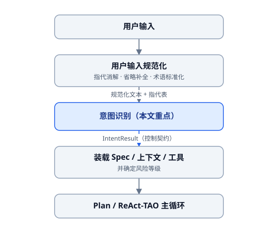
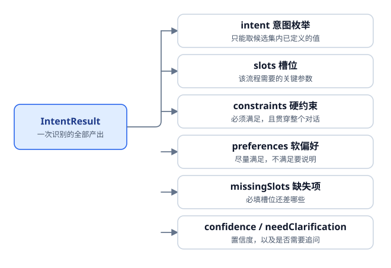
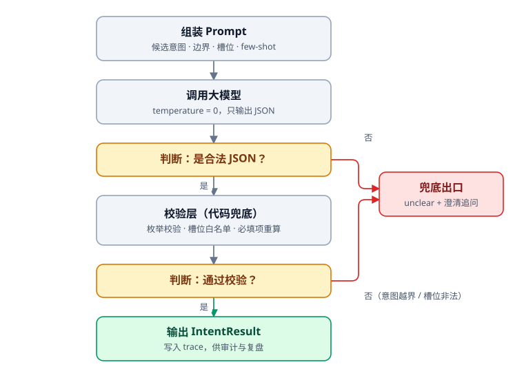
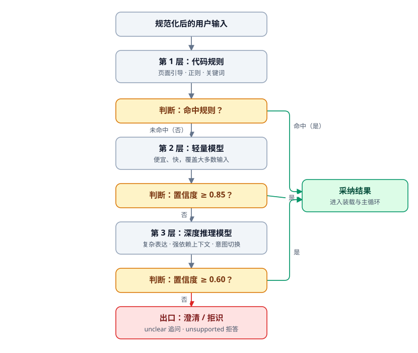
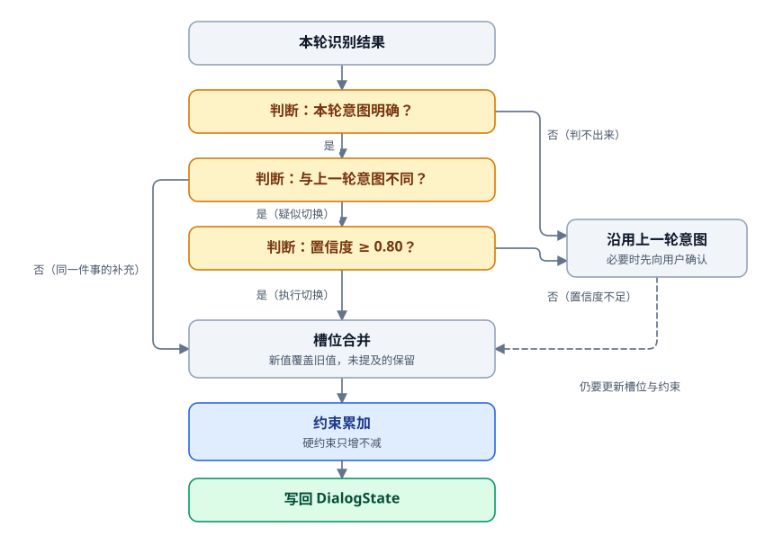
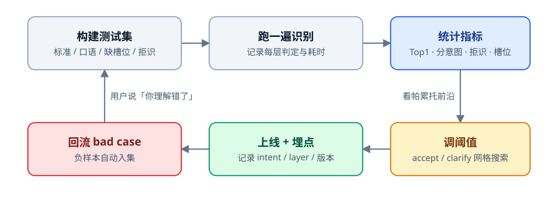
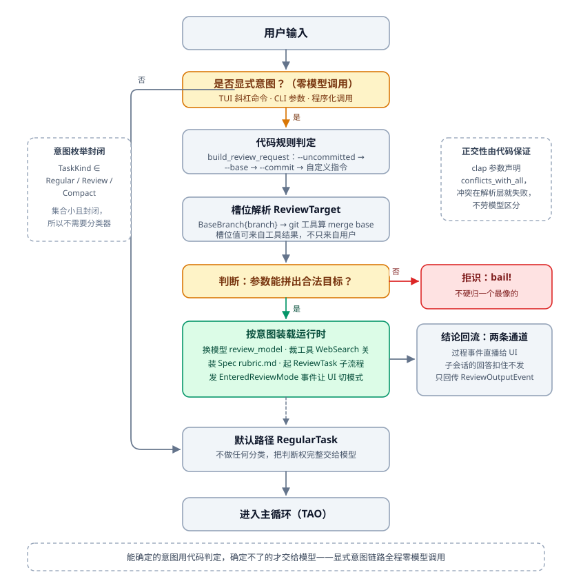

# 意图识别：Agent 的第一道分诊台

很多人聊到意图识别，答案只有一句：**"调一次大模型，让它判断用户想干嘛。"**

这句话没错，但它只适用于玩具系统。Agent 一上线，问题会一排排涌过来：

- 用户随口一句"继续"，你要不要为这两个字再付一次调用、再等一次延迟？
- 意图从 5 个涨到 40 个，Prompt 塞不下；硬塞下了，准确率反而往下掉。
- 上一轮用户说"推荐一台 5000 以内的笔记本"，这一轮说"预算加到 8000，但别太重"。单独看这一句，它根本不是一个完整意图——你拿什么去识别？
- 用户说"帮我生成一个奥特曼动画"，你的候选意图里没有这一项。模型不会说"我不知道"，它会挑一个最像的交差，于是 Agent 开始一本正经地胡说八道。
- 你说准确率 95%。那 5% 错在哪？你是怎么知道的？

这五件事，没有一件能靠"调一次大模型"解决。这一篇就把意图识别当成**一个真正的工程模块**来讲：它站在流水线的哪个位置、对外交出什么、内部怎么实现、又凭什么说它有效。

---

## 一、先定位：它不是分类器，是控制平面的第一个决策



先说它的**标准位置**：用户输入规范化之后，主循环（Plan / ReAct / TAO）之前。实践里还有两种变体，但都不适合当主形态。

一种是跟输入规范化混在一起做，一次调用既消解指代又识别意图。小系统图省事未尝不可，代价是出了错你分不清"没听懂"还是"分错类"——同一个故障有两处可能来源，调试就变成了猜。

另一种是完全不识别，放进主循环让模型自己边做边判断。它灵活，可这个模块从此没有边界、没有独立指标、没有独立灰度，连回滚都找不到下手的地方。

不过有件事得说清楚：变体 2 跟标准形态并不是竞争关系，而是**组合**关系。有些输入天生在入口就解不出来——"我上次去的那个公园附近还有吗"要跨很长的历史去找线索；"现在哪个最便宜"是一个必须查了才知道的外部事实。这类只能留到循环里深度处理。所以真正能上线的形态是**入口做初步处理 + 循环内做深度处理**。

判据也简单：**越是通用、越是面向 C 端的 Agent，规范化和识别越要独立成步**；用户少、领域窄的专属 Agent，才可以合并掉几次调用去换性能。至于最极端的形态——识别完直接按意图分发给不同子 Agent，子 Agent 内部再细分——那已经是"识别即路由"了。

**记住一句话：意图识别要能独立评估、独立灰度、独立回滚，所以它必须是一个独立的步骤。**

### 1.0 它在等什么样的输入

意图识别这份工作，默认前提是"上游已经把输入洗干净了"。可真实用户的输入至少有六类失真，不先处理，识别层做得再精细都是白搭：

| 失真类型 | 例子 | 处理要点 |
| --- | --- | --- |
| 指代 | "第二个适合生产环境吗？" | 消解成具体实体 |
| 缺失 | "市场占有率多少？"（没说哪个市场） | 补全或触发澄清 |
| 表达 | 病句、倒装、临时改口"不是，我说的是另一个" | 重写为规范句 |
| 词义 | RAG / 检索增强 / 知识库；同一缩写在 IT 与医疗行业含义完全不同 | 术语表归一 |
| 主观判断 | "最有性价比""再高级一点" | 量化成可判定标准 |
| 外部事实 | "现在最便宜的是哪个？" | 只能查了才知道，交给循环内处理 |

分工就照这张表来。**前四类在入口处理**：把指代替换成实体、把省略补全、把病句改写成规范句、把黑话归一到术语表，做完这些句子才算"可判定语义"。**后两类天生要跨阶段**：主观判断得先量化成能检核的标准——"最有性价比"到底是同价位性能最强，还是同性能价格最低？这个解释一旦定下来，就要作为关键事实写回上下文，后面每一步都得照着办；外部事实更简单，不查一次谁也不知道答案。

至于跨会话的指代，"我去了你上次推荐的那个公园"——入口这一关是真的解不出来：你得先去历史里把那个公园相关的细节捞回来，才谈得上在循环里把话接上。上面说的"组合关系"就是从这儿来的。指代消解和主观量化的完整做法，放到上下文管理那篇细讲。

### 1.1 它到底决定什么

| 决定项                | 售前域             | 售后域              |
| ------------------ | --------------- | ---------------- |
| 加载哪套 Spec（业务规范配置）/ Prompt | 预算、场景、品牌偏好、性价比  | 订单状态、退款期限、是否人工审核 |
| 上下文窗口装什么           | 用户画像、浏览行为、商品候选集 | 订单、物流、售后政策、退款记录  |
| 暴露哪些工具             | 商品检索、比价、推荐      | 订单查询、售后工单、退款接口   |
| 风险等级与是否人审          | 只读，低风险          | 涉及写操作，需要审批门      |

不做意图识别，后果不是"体验差一点"这么轻。具体的画面是：用户在问退款进度，你给他塞了一堆用户画像和浏览行为，窗口白烧钱；用户在问推荐，你把退款接口摆在他面前，模型哪天手滑调了一下，就是线上事故。**先定往哪走，再决定带多少行李**——方向错了，上下文越丰富反而越危险。

### 1.2 它不决定什么

同样重要。这一步**不要**做：

- 不回答用户的问题（最容易犯的错，模型一兴奋就把答案写出来了）；
- 不调用工具（它只负责"选路"，不负责"走路"）；
- 不生成最终方案，不擅自补充事实。

职责边界写不进代码，就写进提示词的"不能做什么"，再用校验层兜底（见第二节）。

### 1.3 从"标签"升级成"契约"

传统分类器输出一个标签就完了。Agent 里的意图识别输出的是一份**控制契约**——后续每一步都读它：

```text
IntentResult =
    reason              # 判断依据——刻意排在所有结论字段之前，见下方说明
    intent              # 意图枚举，只能取候选集内已定义的值
    slots               # 该流程需要的关键参数（槽位）
    missingSlots        # 必填槽位还差哪些
    clarificationQuestion # 建议的追问话术（可空，模型给的更自然，但要有人工兜底）
    constraints         # 硬约束：必须满足，且贯穿整个对话
    preferences         # 软偏好：尽量满足，不满足要明确告知
    confidence          # 置信度
    needClarification   # 是否需要向用户追问
```



> **名词解释：槽位与 Slot Filling。**"槽位"（slot）这个词来自语言学的框架理论：理解一句话，就像往一张既定的框架里填成分，框架里每个必填的成分就是一个"槽"。对话系统里管这件事叫 **Slot Filling（槽位填充）**。更贴近工程的类比是办事窗口前那张表——**意图决定给你调出哪张表，Slot Filling 决定这张表上一个格一个格填没填满**，空着的格子标出来、开口问。上面例子里的"订单号""预算""用途"都是槽位。这个概念 2.3 节还会展开。

几个容易忽略的点：

- **字段顺序是架构问题，不是代码风格**。大模型是从左到右一个字一个字生成的。你把 `intent`、`confidence` 排在 `reason` 前面，等于要求它还没想清楚就先拍板，再回头替这个已经写死的结论编一个理由——这种事后补出来的 reason 对准确率毫无贡献，还会把审计记录一起污染。把 `reason` 提到最前面，让"想"发生在"下结论"之前，仅这一项改动的经验提升就有 10%~15%。
- **constraints / preferences 要作为一等公民**。用户说"帮我推荐一条裤子，不超过 100 块，最好是牛仔裤"，"不超过 100 块"是硬约束，"最好是牛仔裤"是软偏好。我必须吐槽：**约束识别是当下绝大多数 Agent 做得最差的一块**——你跟 Coding Agent 说"不要改 A 接口"，它转头就改了，用户怒气值瞬间拉满。把约束从意图里独立出来，是投入产出比极高的改进。
- **reason 不是给用户看的**，是给你排查线上 bad case 看的。每一次判断都要能追责。

---

## 二、核心思路一：意图是数据，模型输出是不可信输入



### 2.1 把意图写成配置，而不是写进 Prompt 字符串

```text
IntentSpec =
    id            # 意图标识
    description   # 一句话说明这个意图干什么
    boundary      # 边界：什么时候选它、什么时候不选它
    slots         # 槽位定义：名称 / 是否必填 / 类型 / 枚举取值
    fewShots      # 示例：只放最容易混淆的正反例
    tools         # 命中后才暴露的工具（用于工具裁剪）
    contextKeys   # 命中后才组装的上下文片段
    risk          # 风险等级，决定要不要插审批门
```

把意图写成数据，而不是写进 Prompt 里的一段话，好处是三个很具体的：**能被校验**——模型返回的意图必须落在这张表里，不在就当场拦掉；**能被裁剪**——候选一多就能按表收缩，第四节展开；**能被测试**——一张意图表、一张测试集，两边能逐条对账，哪个意图的边界没写清，看一眼就看得见。

### 2.2 提示词四要素

提示词这件事没有玄学，四样写清楚就够：**候选意图、意图边界、槽位定义、few-shot**（给模型看几个"输入 → 期望输出"的例子，让它照着例子学边界，比看规则描述自己悟靠谱得多）。最容易被人偷懒的是边界。只写一句"商品推荐：用户希望系统推荐商品"，等于什么都没写——下面这三句它要怎么分？

- "3000 以内有什么手机推荐？" → 商品推荐
- "iPhone 16 的电池容量是多少？" → 商品查询
- "iPhone 16 和小米 15 哪个更适合拍视频？" → 商品比较

**意图识别的绝大多数错误，都是边界没写清，而不是模型不够聪明。**三句样本摆在一起，"推荐 / 查询 / 比较"的分界就自己显形了；模型要的就是这种对照，不是一句更长的抽象定义。

few-shot 分两部分来放。固定的那部分专职写死边界样本——`unsupported` 和 `unclear` 到底怎么处理，每题一两例，常年不动；动态的那部分按当前输入检索出来再注入，免得几十条无关样本把模型带偏。

### 2.3 Slot Filling：意图和槽位一次调用一起出

接着 1.3 的名词解释展开：意图分类回答"走哪条流程"，**Slot Filling（槽位填充）回答"这条流程还缺哪些参数"**。四条配合关系：

- **槽位定义挂在意图上，不是全局的**：退款流程要订单号，推荐流程要预算和用途；
- **抽不全就别往下走**：missingSlots 非空就触发澄清，而不是让下游脑补默认值；
- **槽位反哺意图判定**："帮我退了那条裤子"里，"裤子"这个商品槽位是判 `order_refund` 的关键证据——所以**工程上意图与槽位要一次调用联合输出**。拆成两步不仅多花一次调用，还丢掉了两者互相印证的机会；
- **约束也算槽位**："不超过 100 块"是 price 槽位的上界，"别太重"是重量维度的软偏好。

还有一个误解要拆掉：槽位不是只能从用户这一句话里抠。它的来源有四个——**本轮输入**（"预算 8000"）、**上下文与历史轮**（上一轮已经说过"要笔记本"）、**用户画像**（他历史上一直买轻薄本）、**工具调用结果**（"现在最便宜的是哪个"，这句话里根本没有答案，只能查一次把价格写回槽位）。所以填充是一个跨阶段的动作：入口先把能填上的填掉，循环里持续补，直到 missingSlots 空掉为止。

### 2.4 校验层：把模型输出当不可信输入

模型会返回你没定义的意图、会漏掉必填槽位、会把 confidence 写成字符串。所以校验层必须做四件事：

```text
validate(raw):
    1. 枚举校验   intent 不在候选集 => 不崩，降级为 unclear + 澄清
    2. 槽位白名单 只保留该意图声明过的槽位，枚举外的取值直接丢弃
    3. 必填重算   missingSlots 以代码重算为准，不信模型自己填的
    4. 数值归一   confidence 转成 0~1，非法值按 0 处理
```

> 一个通用原则：**能用代码确定性算出来的，就不要让模型猜。** 模型只负责它擅长的语义判断。

校验失败不是终点，要设计完整的处理链：

```text
onValidationFailure(raw, errors):
    自纠错 ≤ 2 次：把精确错误摘要喂回模型
        （"字段 tracking_id 必须为正整数，你填了 'TN123'"）——下一轮大概率能改对
    仍失败 => 降级：核心字段有效则部分采纳 + 非核心用安全默认值；
              核心字段无效则挂起转人工
```

这条链上有三条纪律，都是踩过坑才换回来的。**第一，自纠错不超过两次。**同一个格式错误犯到第三次，说明这不是偶发笔误而是能力边界，再喂回去只是烧钱。**第二，回喂的是结构化错误摘要，不是全量异常堆栈。**一句"字段 tracking_id 必须为正整数，你填了 'TN123'"就够模型改的了；把几十行 ValidationError 原样丢回去，只会挤占窗口、顺便把模型看晕。**第三，"抛异常直接停摆"和"什么都不改就原样重试"都是反模式**——前者把一次输出抖动放大成线上故障，后者钱花了、错照拿。

处理模型输出的总原则，浓缩成一句话：**接收时必须严格，执行时必须保守。**

### 2.5 结构约束选哪一档

"约束模型输出格式"其实有三档，各挡的错不一样：

| 档位 | 机制 | 能挡住 | 挡不住 |
| --- | --- | --- | --- |
| Prompt 约定 / 普通 Function Calling | 概率遵守 | 大部分明显跑偏 | 一切——防线根本没建起来 |
| JSON Mode | 强制合法 JSON | 语法错误、解析崩溃 | 字段名、类型、枚举照样能错 |
| Structured Outputs | Schema 编译成状态机，采样时做 Logits 遮蔽（每一步只允许采样符合语法的字符，把不合法 token 的概率清零） | 字段名/类型/枚举**物理出不了格** | **语义错误** |

前两档等于把校验的责任全留在自己手上；第三档确实把格式错误物理消灭了，代价是带来两个新坑。一个是复杂 Schema 可能触发状态机停滞，甚至请求直接失败。另一个更隐蔽：**格式完美反而掩盖了语义失效**。必填字段就摆在那里，模型为了把表填满，是完全会顺手瞎填一个合法但错误的值的——这比 `json.loads()` 当场崩掉危险得多。崩溃至少把问题暴露了出来，静默的合法错误会一路漂到用户面前。

Schema 设计上有几个可以直接抄的经验值：嵌套超过 3 层，错误率显著上升；非平凡字段必须写 description；单个枚举超过 10 个取值，选择准确率开始下滑；字段总数超过 50，整体质量开始往下掉。

最后一句要单独重申：**开了 Structured Outputs 也不许撤校验层**。前门换成了钢门，不等于后门就可以拆掉。

---

## 三、核心思路二：三层级联 + 置信度闸门

最小版本最大的问题就一个字：贵。每一句"继续""好的"都要付一次调用的钱、再等一次调用的延迟。解法也不神秘——**便宜的先上，搞不定再往上抬**：



- **第 1 层：代码规则。** 页面引导（用户点了哪个按钮，意图就写在那个按钮上）、延续性输入（"继续""下一步"）、命中即确定的强规则。零成本、零延迟、100% 可预测——这三样后两层都给不了。我见过太多系统把"继续"两个字也丢给大模型：它平时答得好好的，偶尔心血来潮判成一个新意图，用户当场懵住。**能用 if 解决的意图，就不要用 token。**一个前提别忘：规则层吃的是**规范化之后**的输入（见 1.0），拿用户原话直接去匹正则，命中率会惨不忍睹。
  - 规则层还有个便宜变体，叫**向量匹配识别器**。专属领域里，用户翻来覆去就是可枚举的那几十种说法，把「历史输入 → 意图」的向量对存成内存字典或者一个小向量库，命中即出，几乎不花钱。它更大的价值在**兜底沉淀**：这一轮没能识别出来的行业黑话和口语表达，事后从多轮对话、投诉排查里挖出来，配成向量对入表；同一批数据还能顺手反哺微调。
- **第 2 层：轻量模型。** 各种 Flash / Mini 档，讲究快和省，扛下绝大多数请求。经验上 80% 以上的输入本来就是明确无误的，轻量模型完全够用——这也回答了"为什么不直接上深度推理模型"：不是不能，是不划算。这里我立场很明确：**用户能接受多等几秒拿到好结果，不能接受快几秒拿到坏结果。**所以级联的排序永远是效果优先、成本其次。
- **第 3 层：深度推理模型。** 只接三类输入：表达绕、强依赖上下文、多轮中途切换意图，或者得先补全隐含信息才谈得上判断。典型如"我刚才那个项目还是太普通了，你能不能按大厂后端的要求，帮我改得更像核心项目，顺便告诉我面试官会怎么追问"——一句话里塞着两个目标，还藏着一套没说出口的"大厂标准"，这种活只有推理模型啃得动。这一层还要求它必须交出 reason：既然花钱买了它一次思考，就把思考的痕迹留下来，事后复盘全靠它。

闸门和仲裁写成伪代码，就是这么点东西：

```text
cascade(输入):
    for layer in [规则层, 轻量层, 深度层]:
        result = layer(输入)
        留痕(trace, layer, result)
        if result == null:                continue   # 这层不发表意见
        if result.confidence >= 0.85:     return result          # 高置信：直接采纳
        if result.confidence >= 0.60:     return 澄清(result)     # 中置信：问一句比赌一把省
        # 低置信：抬一层
    return arbitrate(trace) or 澄清()    # 多识别器加权投票，票数接近就澄清
```

最后必须泼一句冷水：**模型报给你的 confidence 不是校准过的概率，它更像一句自我感觉良好的打分。**它说 0.9，不代表这类输入它真有 90% 的把握。所以 0.85 和 0.60 这两个数必须拿测试集调出来，不能拍脑袋定；判断时也别信它一张嘴，把规则是否命中、向量相似度多少、上一轮意图稳不稳定这些算得出来的信号一起喂进去。

再顺手给 `arbitrate` 打个成熟度标签：多识别器加权投票（各家权重 × 置信度累加，第一名领先不够就转澄清）属于**"值得知道、不建议先做"**的东西——理论意义大于实践收益，多数团队到上线都不会真的启用它。先把三层级联和阈值调优做扎实，回报大得多。

---

## 四、核心思路三：候选太多，先收缩再判断

意图从 5 个涨到 50 个，准确率掉得比谁都快。原因有两条：Prompt 装不下这么多描述；就算硬塞进去了，候选越多、彼此沾边的也越多，混淆和上下文噪声一起往上走。对策按推荐顺序排：

**① 检索收缩候选集（最实用）**

```text
shrinkCatalog(用户输入, topN):
    recalled = 向量检索(用户输入, topN)          # 先粗筛
    候选集 = recalled + [unsupported, unclear]   # 出口永远保留
    # topN 动态化：上下文宽裕时调大；第一次失败重试时，比上次更大
```

**①b 大模型粗筛**（没有向量库时的孪生方案）：先拿一个低延迟、便宜的轻量模型跑一轮粗筛。它只带着目标和极少量上下文，所以窗口里装得下**全部**候选意图；由它筛出 topN，第二轮再做完整识别。说到底收缩有两条路：向量召回靠基础设施，粗筛靠多花一次便宜调用，殊途同归。

但收缩是有天花板的：`shrinkCatalog` 的 Top-N 召回率，直接封顶了最终的 Top1 准确率——正确答案掉在第 N+1 位，后面再准也追不回来。所以 N 宁可取大一点，它多花的只是窗口；取小了赔上的是整个任务。指标口径见第八节。

**② 层次意图**：把意图照菜单一样排成一、二、三级，先判一级再往下钻——本质上就是一棵决策树，有决策树经验的话可以直接迁移过来。好处是每次只从几个里挑一个，难度被摊薄；代价是调用轮次变多、延迟变长。什么时候值得动？经验数字是**候选超过 20 就该开始考虑层级化，30 是硬门槛**。注意这说的是"候选意图总数"，和 2.5 节那条"单个枚举超过 10 个取值"是两个不同对象，阈值不能互相抄。真要层级化，务必让它跟槽位填充混着做——下钻的路上顺手把参数填了，别让两趟遍历各走一遍。

**③ 保证意图正交**：两个意图语义重叠时，先别急着加分支，问自己一句——**这个差异，真的值得建成一个新意图吗？** 动手之前还要先判一下要不要修：如果重叠并不真的让流程走错（"你是想比较，还是想让我推荐"，两种解释用户都能接受），那就留着，不必为它改一遍意图表。

> **不要把所有差异都建模成不同的意图，很多差异应该建模成不同的参数或参数值。**

"商品推荐"和"商品比较"就是这么一对不正交。用户问"iPhone 16 和小米 15 哪个更适合拍视频"，听着是在比较，要的其实还是一个推荐结果。两条路：再拆出第三个"比较后推荐"，把边界越抹越糊；或者**合成一个意图，把差异收进一个参数**——模型只负责判"这是一次购买决策"，代码看那个参数是"比较"还是"直接推荐"，再决定走哪条流程。我更推荐后者：**不确定性高的地方交给模型，规则清楚的地方交给代码**，这通常比再改十版 Prompt 有用得多。

**④ 词汇表：收缩的隐藏前提**。黑话、缩写、多义词要先归一，再进候选集。同一个 `CRM`，在互联网公司指客户关系管理，在医药行业指临床研究管理——词表不解决这件事，候选收缩和 Prompt 会一起失效，因为你连"用户在讲哪个领域"都没定下来。

做法不复杂：系统里养一张词汇表（MySQL 或者向量库存着都行），规范化之前先检索一次，把命中词条的解释注入进去；表分**公共词表 + 个人词表**两级，公共级管行业黑话，个人级留给某个用户自己的习惯说法，比如他管某个内部系统就叫"那个后台"；新词靠离线任务沉淀——把疑似新词计数，达到频次阈值就升级入表（示例阈值：总次数 >100、讨论人数 >3、连续讨论 ≥10，数字请按你的业务重定，机制比数字重要）。

还有个工程红利：词汇表检索、候选意图检索、动态 few-shot 检索用的是同一套检索基础设施，三件事可以并成一件事建。

---

## 五、核心思路四：多轮状态是一等公民

这是意图识别准确率低的**头号工程原因**——不是模型不行，是多轮状态和上下文管理稀烂。看一个再普通不过的对话：第一轮用户说"推荐一台 5000 以内的笔记本"，第二轮说"预算可以加到 8000，但不要太重"。第二句单独拎出来，主语没有、品类也没有，意思全挂在上一轮身上。你把这一句原样丢给识别器，它回一个 unclear 反倒是最诚实的答案。



状态更新规则用伪代码表达就是六条：

```text
applyTurn(上一轮状态, 本轮结果):
    1. 继承     本轮判不出来 且 有上一轮意图 => 沿用上一轮意图，只更新槽位
    2. 保守切换  意图变了 但 置信度 < 0.8 => 保持上一轮，先向用户确认
    3. 槽位合并  新值覆盖旧值，未提及的保留，不要清空
    4. 约束累加  硬约束只增不减——但必须带作用域与失效条件，见下
    5. 取消     "算了不搞了""不查了" => 终止当前意图链并留痕，这不是 unclear，硬澄清很蠢
    6. 恢复     "还是回到刚才那个方案" => 找回此前挂起的意图与槽位快照继续执行
```

这六条里，第 5、6 两条最容易被漏掉。真实的多轮对话中，用户会做的动作有五种：补充信息、修改参数、取消任务、切换任务、恢复任务。绝大多数系统只建模了前两种，于是"算了不搞了"被判成 unclear，然后认真地追问一句"请问您具体想做什么呢"——用户就这么走了。

另一处出事的是第 4 条的后半句：**约束的作用域**。"不要动 A 文件"是永久约束，累加没错；可"修这条 SQL 时不要用参数化查询、用查询构建器"只对当前这个子任务生效。如果你不设计清楚约束"从哪来、存哪里、何时注入、何时销毁"，它会被无脑累加成一条永久规则，污染后面五十轮；更糟的是它还会在一次次渐进压缩里悄悄丢掉，等发现时模型已经照着旧约束改完三个文件了。

约束之所以要每轮重申，还有一层机制上的原因：**注意力分布本来就不均**。窗口首尾权重最高，中间显著衰减（Lost in the Middle，TACL 2024）。对话一长，海量工具返回往中间堆，你第一轮写下的那句约束就被越推越深——**"它在上下文里"和"模型看见了"是两回事**。工程上的手法是首尾三明治：把约束钉在头部的系统区，组装窗口时再在尾部追加一份 constraint reminder，像交卷前提醒一句别忘了写名字。上下文侧的完整方案，放到上下文管理那篇细讲。

---

## 六、识别不出来：拒识与澄清

很多系统的通病是：**不管用户输入什么，都要强行归到某个业务意图上**。可模型在没有出口的时候是不会说"我不知道"的，它只会挑一个最像的交差。正确做法是提前留好两个出口：

- `unsupported`：完全不在候选集里 → **拒识**。老实说"这个我做不了"，比胡说八道体面得多。
- `unclear`：能沾边但分不清，或缺关键参数 → **澄清**。

澄清必须由 missingSlots 驱动，而不是让模型自由发挥追问：

```text
buildClarification(result, spec):
    if result.clarificationQuestion: return 它     # 模型给的更自然，但要有人工兜底
    if result.missingSlots 为空:     return "能再具体说说你想做什么吗？"
    return "还差一点信息：" + 缺失槽位的人工可读描述
```

这里我有一个明确立场：**参数不全时，先问清楚，而不是先猜一个答案糊弄上去。好的回答比快的回答，用户体验更好。**

---

## 七、多意图：能不做就不做，要做就交给 Plan

用户不会一句一句说。他会说："帮我优化一下这个项目，然后顺便告诉我面试官会怎么追问。"于是问题来了——这是一个意图还是两个？

第一步是判真假。"帮我查询上个月的数据，并且导出到 Excel"听着像两件事，其实本质意图只有一个"导出"，"查询"只是通往导出的过程性描述。这种就得在提示词里写明白：忽略过程性描述，只抓最终目标。判真假的价值很大——把它误判成多意图，系统会从"快答"掉进"重规划"。

真的确认是多意图之后，第二条原则是：**不要在意图识别阶段就把依赖关系全算出来**。那件事看着顺手，实际会同时拖垮识别的准确率和延迟。更合适的位置是显式的 Plan 机制：识别层只标记"识别出 [A, B]"，Plan 负责解析依赖、安排顺序、处理步骤级失败。识别层的输出结构可以带一个 relations 字段（形如 `["A->B"]`，必要时附条件），但真正要求模型去做依赖分析，只发生在被抬到深度推理层的那些输入上。relations 还捎带一条工程推论：**两条意图如果完全独立，就意味着可以并发**——起两个主循环各跑各的。这个可能性在单意图的设计里根本不会出现，所以得先把它显式建模出来才拿得到。

老实说，支持多意图有点吃力不讨好：它会破坏第一层规则识别和检索机制（几乎必然走到第三层），上下文膨胀更快，还要引入并发控制。**我的默认建议是不支持多意图**——或者识别出多个意图但一次只做一件，做完问一句"接下来要不要处理 B？"。用户其实不在意你能不能一次解决多件事，在意的是为后面的事干等；先给一个答案再问要不要继续，交互感反而更好，还可能省掉后面几次调用。

---

## 八、评估：先有测试集，再谈准确率



### 8.1 测试集至少覆盖五类

五类样本，一类治一种病：**标准表达**看基线在哪；**口语化表达**看它离开规整句子还认不认得；**槽位缺失**看它是追问还是硬猜一个；**拒识样本**看它敢不敢说不；**易混淆样本**专挑边界上那几对意图下手。有余力再补四类：跨轮补充、约束识别、意图切换、多意图。

说白了，你在传统软件工程里学过的那套用例设计——等价类、边界值、错误推测——到这里全部照用，只是被测对象从一个函数换成了一次判断。

### 8.2 指标

- **Top1 准确率**：主看的指标；
- **Top-K 准确率**：系统一次返回 K 个候选，标准答案在列里就算命中。100 条样本、K=3、85 条命中，Top3 就是 85%。它同时是候选收缩的**天花板**——第四节 `shrinkCatalog(topN)` 的 Top-N 召回率直接封顶最终 Top1，N 取小了后面再准也白搭；
- **分意图准确率**：80% 的请求都是商品推荐时，模型全猜推荐也有 80%——但退款、投诉这些低频高价值意图可能一塌糊涂，必须单独看；
- **拒识与澄清**：拒识准确率；**误拒率**（该识别的正常输入被拒了——把朋友当敌人，伤体验）；**漏拒率**（该拒的超范围输入被硬接了——放敌人进门，伤口碑，通常更危险）；澄清触发准确率；**澄清后收敛率**（追问之后，用户补一轮信息就能定下意图的比例，低了说明问不到点子上）；
- **槽位**：槽位准确率 / 召回率、必填槽位完整率、槽位更新准确率、**约束识别准确率**（当下做得最差的一块）。

几个经验值：专属领域 Agent 的 Top1 做到 99% 以上是正常的；通用 Agent 一般在 80%~90%。顺带一个口径提醒：只支持两三个意图的专属领域，随便调一次模型也能 90%+；通用 Agent 宣称 90% 往往有水分——分母里混着大量本来就该拒识的输入。

### 8.3 阈值要调，不要猜

```text
tuneThresholds(测试集):
    for accept in [0.80, 0.85, 0.90]:
        for clarify in [0.50, 0.60, 0.70]:
            跑一遍测试集 => (Top1, 平均调用层数, 澄清率)
    在三者构成的帕累托前沿上选点
```

另外，线上每天都在生产**免费的负样本**，只是没人去捡。用户说"不是，我不是这个意思""你理解错了"——这一句几乎就等于给上一轮的识别打了个叉，应该自动采集进测试集。再往前一步，可以把评估做成**运行时的常驻步骤**：新一轮进来时，先替上一轮判个分——用户是照你追问的方向补信息，还是开口纠正你，这就是最便宜的标注信号。剩下的交给长期监控，而不是上线前跑一遍测试集就翻篇。

留痕的结构也值得抄细一点。伪代码里那句 `留痕(trace, layer, result)` 在三个月后救不了你的命。至少记成结构化字段：每层的候选集、每层的置信度、是否下推到下一层、是否触发仲裁、最终采纳了哪个以及为什么，再加 Prompt 版本和意图表版本。否则准确率掉了，你根本分不清是模型换了、Prompt 改了，还是意图表悄悄动过。

---

## 九、踩坑清单

1. **意图越拆越碎**：每来一个新需求就加一个意图。先想想能不能建模成参数。
2. **让模型自创意图**：没有枚举校验，等于把系统稳定性交给概率。
3. **把置信度当概率**：没校准过，阈值必须靠测试集调。
4. **忽略多轮状态**：第二轮开始准确率断崖下跌，绝大多数是这个原因。
5. **约束不贯穿**：用户说过的硬约束第三轮就丢了，这是用户最愤怒的失败模式。
6. **强行归类**：没有 unsupported 出口，模型只能硬选一个，然后一本正经地胡说。
7. **意图识别里顺手回答问题**：职责越界，主循环就失控了。
8. **不记版本**：Prompt、意图表改了，准确率变了却查不出原因。
9. **为省事跳过规则层**：把"继续""好的"也丢给大模型，又费钱又不稳。
10. **不评估就上线**：没有测试集，你连"优化了还是劣化了"都不知道。
11. **结论字段排在推理字段之前**：Schema 里 intent/confidence 在 reason 前面，模型先拍板再编理由，准确率被结构吃掉一档。
12. **约束没有作用域**：临时约束被永久累加，五十轮之后还在为第三轮的子任务服务。
13. **开了 Structured Outputs 就撤校验层**：格式被物理约束了，语义垃圾照样进来——前门换成钢门不等于可以拆后门。
14. **把"算了不搞了"当 unclear**：取消和恢复是两种正常状态流转，硬去澄清非常蠢。

---

## 十、扩展阅读：Codex 是如何实现意图识别的

前面讲的都还是"我们自己该怎么搭"。这一节换个角度，看一个真实的大型 Agent 产品怎么落地：OpenAI 的 Codex CLI。结论有点反直觉——**它从头到尾没有调用大模型做意图分类**。但你会发现，它省掉的那一步，恰恰把本文的几条思路一一实现了一遍。



> 版本说明：（开源仓库 openai/codex 的 main 分支，commit `44b857c`，提交日期 2026-09-22）阅读整理。

这一节不按源码文件顺序讲，按**一次真实请求怎么走完**讲：意图在这里长什么样 → 判定发生在哪一行 → 槽位谁来补 → 补完之后系统换掉了什么 → 结论怎么回流。文件路径只在关键处出现一次，完整的入口清单收在 10.6。

### 10.1 意图 = 任务类型，候选集只有三个值

Codex 里没有 `intent_recognizer` 这种模块。跟"意图"最对应的东西是**任务类型**：

```rust
// codex-rs/core/src/state/turn.rs:68
pub(crate) enum TaskKind {
    Regular,   // 普通对话轮
    Review,    // 代码审查
    Compact,   // 手动压缩上下文
}
```

三个值，封闭，彼此不重叠。每种意图是一个实现了 `SessionTask` trait 的结构体（`core/src/tasks/mod.rs:178`），trait 统共四个方法，而"意图"这件事在一份定义里只占其中一行：

```rust
fn kind(&self) -> TaskKind;             // 我属于哪个意图 —— 给遥测和 UI 看
fn span_name(&self) -> &'static str;    // 我的 trace span 叫什么
async fn run(...) -> SessionTaskResult; // ★ 这个意图对应的业务流程
async fn abort(...)                     // 被打断时怎么收尾
```

`RegularTask`（`tasks/regular.rs:32`）、`ReviewTask`（`tasks/review.rs:46`）、`CompactTask`（`tasks/compact.rs:20`）各自报出自己的 kind；`UserShellCommandTask`（`tasks/user_shell.rs:76`）虽然走独立代码，kind 仍算 `Regular`。任务一旦启动，实例连同取消令牌、turn 上下文、计时器一起被装进 `RunningTask`（`state/turn.rs:74`）；而 `spawn_task()`（`tasks/mod.rs:270`）函数体的第一行就是 `abort_all_tasks(TurnAbortReason::Replaced)`——**一个会话同一时刻只允许跑一个意图**，这条约束写在代码里，不靠模型自觉。

看清楚这里发生了什么：**意图不是一个标签，而是"接下来执行哪段代码"。**这正是 1.3 说的"控制契约"的极限形态。也正因为它只有三个候选、且每个都得显式触发，"分类"这步在 Codex 里压根没有必要存在。

### 10.2 判定发生在哪：一条 if-else 链，加一层参数互斥

先看默认路径。用户在终端敲的任何一句话都不做识别——`session/turn_input.rs:362` 直接 `spawn_task(turn_context, task_input, RegularTask::new())`。没有分类，也没有兜底分类，因为默认值本身就是答案。

想落到别的意图上，必须走显式入口。以"代码审查"为例，三个入口最终汇进同一条通道：

| 入口 | 判定发生的地方 |
| --- | --- |
| 终端 `/review` 斜杠命令与审查弹窗 | `AppCommand::Review { target }`（`tui/src/app_command.rs:185`），由 `tui/src/app/thread_routing.rs:922` 路由出去 |
| CLI 子命令 `codex review` | `ReviewArgs`（`exec/src/cli.rs:274`）→ `build_review_request()`（`exec/src/lib.rs:2305`）→ `ClientRequest::ReviewStart`（`exec/src/lib.rs:1177`） |
| app-server 的程序化调用 | `review_start_inner()`（`app-server/src/request_processors/turn_processor.rs:1543`） |

三条都提交同一个核心操作 `Op::Review { review_request }`，由 `session/handlers.rs:588` 接住、转进 `review()`（`:374`）。**入口可以有很多个，判定只有一处**——这句话值得直接抄进你的设计文档。

判定本体朴素得让人意外（`exec/src/lib.rs:2305`，为篇幅略压）：

```rust
let target = if args.uncommitted {
    ReviewTarget::UncommittedChanges
} else if let Some(branch) = args.base.clone() {
    ReviewTarget::BaseBranch { branch }
} else if let Some(sha) = args.commit.clone() {
    ReviewTarget::Commit { sha, title: args.commit_title.clone() }
} else if let Some(prompt_arg) = args.prompt.clone() {
    ReviewTarget::Custom { instructions: prompt }   // 中间有一步 trim 后非空校验
} else {
    anyhow::bail!("Specify --uncommitted, --base, --commit, or provide custom review instructions");
};
```

一条按优先级排好的 if-else，就是一次意图分类。里面有两个细节值得单独拎出来：

- **正交性是参数声明给的，不是靠模型守的。**`--uncommitted` 在 clap 里就写了 `conflicts_with_all = ["base", "commit", "prompt"]`（`exec/src/cli.rs:279`）。同时传两个，命令行解析阶段就失败了，"那到底该判成哪个意图"这个问题根本不会被问出来。第四节讲"意图要保持正交"，Codex 的做法是**把正交性下沉进入参定义**，让编译器替你守边界。
- **一个都填不出来就直接报错**（`:2324` 的 `bail!`），而不是挑一个最像的 target 让下游接着跑。这就是 `unsupported` 出口的实体形态。

顺带一个本文没讲到的维度：审查还分**投送方式**。`ReviewDelivery::Inline` 走上面这条 `Op::Review` 链路；`Detached` 则完全不进链路，改成拼一句"用 `$review-agent` 技能做这次审查"的自然语言 prompt，交给普通轮次去处理（`turn_processor.rs:1574`）。同一个意图，重流程用结构化操作，轻流程用技能引用——**分类之外还有第二根轴可以用来分配复杂度**，这一点在 10.5 还会回来。

### 10.3 槽位填充：`ReviewTarget` 就是"意图枚举 + 槽位"

`ReviewTarget`（`protocol/src/protocol.rs:3441`）四个变体各带自己的槽位，跟 2.1 那份 `IntentSpec.slots` 是一个东西：`UncommittedChanges` 无槽位、`BaseBranch { branch }`、`Commit { sha, title }`、`Custom { instructions }`。

补齐与渲染集中在 `prompts/src/review_request.rs`：`resolve_review_request()`（`:42`）拿到 target 后交给 `review_prompt()`（`:59`）按变体渲染模板，产出 `ResolvedReviewRequest { target, prompt, user_facing_hint }`（`:12`）。三个字段各司其职——`target` 是判成的意图（给代码读），`prompt` 是渲染好的指令（给模型读），`user_facing_hint` 是人话版（给用户界面读）。**一份输出，三种消费者，一次成型。**

`BaseBranch` 这一支最有意思，它把 2.3 那句话直接写成了代码：**槽位的值可以来自工具调用结果，而不只来自用户那句话。**（节选）

```rust
ReviewTarget::BaseBranch { branch } => {
    if let Some(commit) = merge_base_with_head(cwd, branch)? {      // 先自己去算 merge base
        Ok(render(&BASE_BRANCH_PROMPT_TEMPLATE,
                  [("base_branch", branch), ("merge_base_sha", commit)]))
    } else {                                                        // 算不出来，换一条模板
        Ok(render(&BASE_BRANCH_PROMPT_BACKUP_TEMPLATE, [("branch", branch)]))
    }
}
```

两条模板的差别只有"谁来求 merge base"：主模板（`:21`）把算好的 SHA 直接写进提示词，模型只要执行 `git diff <sha>`；兜底模板（`:20`）里没有 SHA，改成教模型自己去跑一条 `git merge-base HEAD ...`。所以这里是**双层降级**：能算的绝不留给模型猜；确实算不出来，就把责任显式交出去，并且把"这一步要你自己算"写进提示词——而不是假装它知道。

还有一处纪律容易被忽略：`resolve_review_request` 失败时，`review()` 走的是 Err 分支，给客户端发一条 `EventMsg::Error`（`session/handlers.rs:397`），会话本身继续活着。校验失败不等于崩溃——这就是 2.4 那条原则的落地。

### 10.4 命中之后换掉的不是一句话，是整个运行时

1.1 那张"意图决定什么"的表，在 Codex 里能一格一格对上。`spawn_review_thread()`（`core/src/session/review.rs:8`）做的事情是**重新造一个审查专用的 `TurnContext`**（`:152`），而不是往旧上下文里追加几句提示词：

| 1.1 的决定项 | Codex 的实际动作 | 位置 |
| --- | --- | --- |
| 换哪个模型 | 优先 `config.review_model`，没配才沿用当前模型 | `:15` |
| 暴露哪些工具 | 关掉 `WebSearchRequest` / `WebSearchCached` / `Goals` 三个 feature；`web_search_mode` 设成 `Disabled`，若被约束层拒绝则只 warn 不强改 | `:34`、`:71` |
| 推理档位 | 审查模型不支持当前 effort 时，取它支持列表的**中间那一档**（`(len-1)/2`），再兜底到默认档 | `:57` |
| 装载哪套 Spec | 子 agent 的 `base_instructions` 整段换成审查规范 `templates/review/rubric.md`，编译期 `include_str!` 进二进制 | `tasks/review.rs:119` |
| 风险等级与审批 | 子 agent 的审批策略被 `Constrained::allow_only(AskForApproval::Never)` 锁死——审查期间它连"申请提权"这条路都没有 | `tasks/review.rs:121` |
| 起独立业务流程 | `run_codex_thread_one_shot(...)` 拉起一个**完整的子 Codex 会话**，父会话只留一个事件接收端 | `tasks/review.rs:128` |
| UI 切模式 | 发 `TurnItem::EnteredReviewMode`，带上 `target` 和 `user_facing_hint` | `:224` |

注意推理档位那一行：它不是"配个更好的模型"，而是**模型换了就得重算预算**——当前 effort 在新模型的支持列表里没有，就退到中间档。这类"一个决策牵动另一个决策"的连锁，是意图识别值得独立成步的真正理由。

倒数第二行才是重点：**审查不是一个 prompt，是另一个 Agent。**它有自己的循环、自己的工具集、自己的沙箱和审批口径。父会话这边由 `process_review_events()`（`tasks/review.rs:145`）守着事件通道做三件事：把子会话的过程事件转发给客户端；**把子会话的自然语言回答扣住不发**（`AgentMessage` 和内容增量都被吞掉）；直到 `TurnComplete` 才把最后一条消息解析成结构化的 `ReviewOutputEvent`（不是 JSON 就再从文本里抠出第一个 JSON 对象）。翻译成工程语言：**过程以事件直播，结论以数据回传，两条通道互不污染。**这比"让子 Agent 输出一段话、父 Agent 再读一遍"省掉了一整次理解误差。

至于渲染好的审查 prompt，它是作为子 turn 的**首条用户消息**注入的（`session/review.rs:199`）——跟真实用户输入走同一条入口，没有为"合成指令"开特例通道。这个克制也值得抄：机制越少，越不容易出现"真人走 A 路、系统自己走 B 路"的行为分叉。

### 10.5 全链路串一遍，然后分清哪些能抄

把前面四节接起来，一次 `codex review --base main` 的完整旅程是：

> 参数解析（`--base` 与 `--uncommitted`/`--commit`/`prompt` 互斥，冲突在这一步就失败）→ `build_review_request` 判定出 `BaseBranch { branch }` → `ReviewStart` 请求 → 核心侧 `Op::Review` → `resolve_review_request` 算 merge base、渲染 prompt，算不出则换兜底模板 → 失败发 `EventMsg::Error`，不崩 → `spawn_review_thread` 重建一整套审查运行时 → `spawn_task(ReviewTask)` → 拉起子 Codex 会话 → 过程事件直播、结论以 `ReviewOutputEvent` 回传 → `EnteredReviewMode` / 退出事件通知 UI。
>
> 而如果用户只是打了普通一句话：`RegularTask`，一次判断都不做。

对照本文，有四条经验是可以直接搬进方案的：**意图集合小到封闭就不需要模型分类**（枚举表本身就是答案）；**能确定的意图一律用代码判定**（对应三层级联的第一层）；**槽位靠结构化参数 + 工具结果补齐**（对应 Slot Filling）；**只有默认路径把判断权交给模型**。

但更该抄的是下面这张表——特别是最后那一列：

| 本文结论 | Codex 的做法 | 照搬之前先确认的前提 |
| --- | --- | --- |
| 三层级联 + 置信度闸门 | 只有第 1 层，且它覆盖全部显式入口 | 你的意图表能不能压到个位数；压不下来，三层还是得有 |
| 意图要正交，差异建模成参数 | `conflicts_with_all` + 四个互斥 target | 只在"边界能被参数语法精确描述"时成立；自然语言入口做不到 |
| 识别不出来就拒识 | `bail!` + `EventMsg::Error`，会话不死 | 无前提，这条谁都能抄 |
| 槽位可以来自工具结果 | `merge_base_with_head` 派生 SHA，失败降级到另一条模板 | 派生动作要真的可执行、可失败、可留痕 |
| 多轮状态是一等公民 | 它压根不做分类，状态由 `TaskKind` 和独立子会话承担 | 别把它的"没有"读成"不需要"——它的前提是候选只有三个 |
| 命中之后换运行时 | 换模型 / 裁工具 / 换 Spec / 锁审批 / 起子会话 | 不同业务流程的差异要真的大到值得一套独立配置 |

一句话概括 Codex：**能确定的意图一律用代码，确定不了的整个交给模型，中间地带它不留。**所以如果你的意图表已经涨到 40 个，这一节给你的不是"我也写成 if-else"，而是反过来问自己一句：这 40 个里有多少其实该合并成参数，或者干脆升格成一个独立子 Agent。

最后补一个能印证第四节"收缩"思想的产品细节：Codex 的 Skills 采用渐进披露——先只把技能名、描述、路径放进上下文，模型决定用某个技能时才加载完整说明。**先挂 handle、按需展开**，跟候选收缩、P3 索引化是同一套工程直觉。10.2 结尾那个 `Detached` 审查就是个活例：它没有新增一条意图链路，只是挂了一个技能 handle 上去。

### 10.6 想自己走一遍：入口清单

按调用顺序排，正文里出现的每个环节都能在这里定位到具体文件。

**意图与任务类型**

- `codex-rs/core/src/state/turn.rs`：`TaskKind`（`:68`）、`RunningTask`（`:74`）
- `codex-rs/core/src/tasks/mod.rs`：`SessionTask` trait（`:178`）、`spawn_task`（`:270`）
- `codex-rs/core/src/tasks/`：`regular.rs`、`review.rs`、`compact.rs`、`user_shell.rs` 四种实现

**判定与入参**

- `codex-rs/tui/src/app_command.rs:185`（`AppCommand::Review`）、`codex-rs/tui/src/app/thread_routing.rs:922`（路由）
- `codex-rs/exec/src/cli.rs:274`（`ReviewArgs`）、`codex-rs/exec/src/lib.rs:2305`（`build_review_request`）
- `codex-rs/app-server/src/request_processors/turn_processor.rs:1543`（`review_start_inner`）、`:1574`（`Detached` 分支）
- `codex-rs/core/src/session/handlers.rs:588`（接住 `Op::Review`）、`:374`（`review()`）、`:397`（错误分支）
- `codex-rs/core/src/session/turn_input.rs:362`（默认路径 `RegularTask`）

**槽位与提示词渲染**

- `codex-rs/protocol/src/protocol.rs:3441`（`ReviewTarget`）
- `codex-rs/prompts/src/review_request.rs`：`ResolvedReviewRequest`（`:12`）、两条分支模板（`:20`、`:21`）、`resolve_review_request`（`:42`）、`review_prompt`（`:59`）
- `codex-rs/prompts/templates/review/rubric.md`（审查规范本体，`include_str!` 进二进制）

**按意图装载运行时、结果回流**

- `codex-rs/core/src/session/review.rs`：`spawn_review_thread`（`:8`）、能力裁剪（`:34`）、推理档位重算（`:57`）、`TurnContext` 重建（`:152`）、注入首条消息（`:199`）、`spawn_task`（`:220`）、`EnteredReviewMode`（`:224`）
- `codex-rs/core/src/tasks/review.rs`：`ReviewTask::run`、`start_review_conversation`（`:99`）、`process_review_events`（`:145`）

**官方文档与版本**

- 仓库 `https://github.com/openai/codex`（README 与 `docs/`），版本号以 `https://github.com/openai/codex/releases` 为准（仓库 `CHANGELOG.md` 也注明 changelog 在 releases 页面）

---

## 总结

回到开头的问题："意图识别怎么做？"如果只能说一句话，我希望是：

> **意图识别不是为了给用户输入贴标签，而是为了决定 Agent 后面该怎么想、加载什么上下文、调用什么工具、进入哪个业务流程——它产出的是一份可执行、可审计的控制契约。**

落到工程上，一个能长期演进的意图识别模块长这样：

- **意图是数据**，输出是**契约**（意图 + 槽位 + 硬约束 + 软偏好 + 缺失项 + 置信度）；
- **模型输出是不可信输入**，能由代码确定性算的绝不交给概率；
- **三层级联 + 置信度闸门**，规则层兜住确定性输入，轻量层扛大流量，深度层啃硬骨头；
- **候选集先收缩再判断**，意图保持正交，差异尽量建模成参数；
- **多轮状态是一等公民**，约束贯穿整个对话；
- **留好拒识与澄清两个出口**；
- **有测试集、有指标、有版本、有埋点**，否则一切优化都是玄学。

做好这些，你的 Agent 未必变聪明，但一定不会再"听不懂人话"。而对用户来说，后者往往更致命。

---

## 思考题

1. 你现在的 Agent 里，意图识别在哪一步做？如果把它从主循环里抽出来独立成一步，哪些 bad case 会变得可观测？
2. 挑出你系统里最容易混淆的两个意图，试着把它们的差异改写成"一个意图 + 一个参数"，看看准确率有没有变化。
3. 用户说过的硬约束，你的系统能记住几轮？如果答案是"看模型心情"，那 constraints 这个字段值得你今天就加上。
4. 对照 1.0 的六类失真清单：你的系统目前对哪一类完全没有防线？
