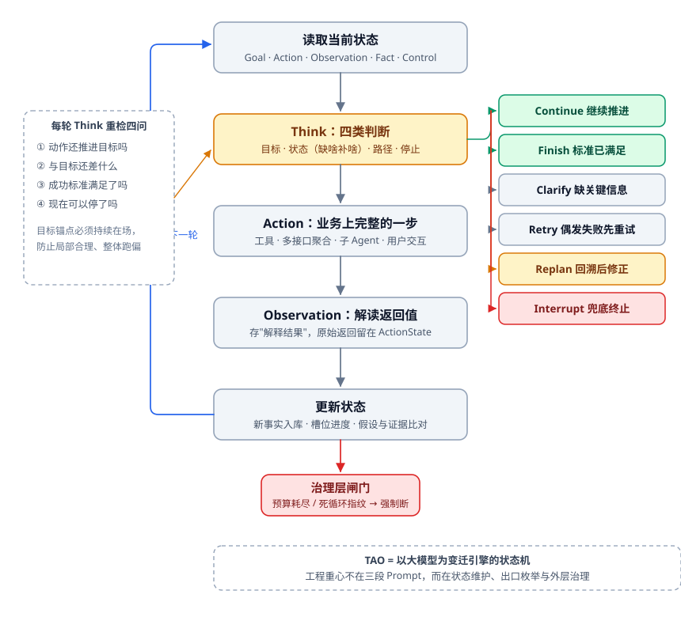
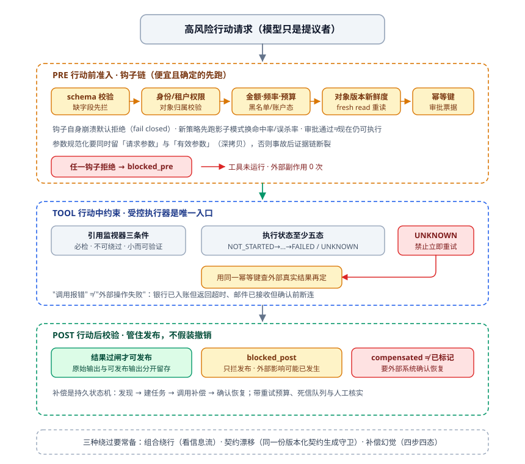
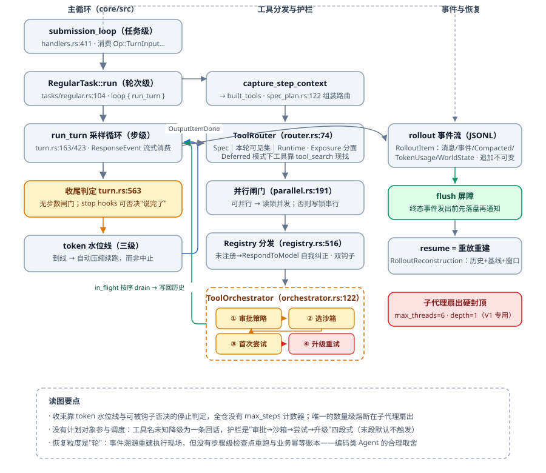

# 执行核心：把"边想边做"装进可恢复的循环

很多人讲 Agent 的执行，最后能落成一句话：**"模型想一步、做一步、看一步，循环到完成。"**

玩具系统确实能这么跑。可一进生产，五个问题就摆在面前：

- 第 10 步发现第 3 步的前提假设是错的——全重跑？那第 3 步到第 9 步攒下的产物怎么办？
- ReAct 循环转了 847 圈，每一圈日志都是绿的，账单却爆了。谁有权让它停？
- 113 个工具摆在模型面前，它挑了 `run_test` 去干 `run_etl` 的活。这算 Prompt 没写好，还是架构本来就有问题？
- 模型宣布"任务已完成"，你去账上一看，钱出了两次。
- 进程半夜崩了。重启之后，Agent 还记不记得自己跑到哪一步？

这一篇把执行核心拆成三层：**Plan 是执行前写下的契约，TAO 循环是运行时的状态机，治理是套在两者外面的预算与护栏**。每层都有自己那套工程做法，缺任何一层，"智能"都会以你意想不到的方式烧钱或者闯祸。

---

## 一、Plan 的本质：不是步骤清单，是运行时对象

先立一个判断标准：**一个 Plan 如果不能在运行时被检查、被纠正、被恢复，它就只是一段给模型自己看的独白。**

### 1.1 坏 Plan 长什么样

「分析需求 → 收集信息 → 执行任务 → 总结输出」——这类四步清单你八成见过，也八成写过。它只回答了"接下来做什么"，五个更要命的问题一个没碰：这活儿怎么算干完了？现在已经知道什么、还缺什么？哪些事绝对不能干？为什么这一步排在这个位置？万一失败了怎么办？

Plan 存在的唯一理由，就是在动手之前把这五类不确定性压缩掉一部分。压不掉的那部分，就得留到运行时处理。

| 不确定性 | 不处理的后果 |
| --- | --- |
| 目标 | 方向不清，越努力越偏 |
| 上下文 | "那个项目"指哪个、哪些事实已确认，全靠模型猜 |
| 路径 | 多种方式都能达成，为什么选这条——排障时最需要"为什么" |
| 过程 | 运行期是否合规，没有方案，只能事后认栽 |
| 失败 | 失败形态无穷，不预先决定"重试还是追问还是重来"，现场必然慌乱 |

### 1.2 Plan 与 Workflow 的分界线

不是所有任务都需要 Plan。判断标准就一条：**Workflow 的分支在任务开始前就能穷举完；真正需要 Plan / 循环的理由，是存在大量"只有运行时拿到观察结果才能确定"的决策。**

还是拿"推荐商品"这件事说。用户丢进来一句「帮我挑个能拍娃的相机，预算五千」，天真实现会把它编译成一条固定流程：查画像 → 检索 → 排序 → 返回。上线第一天就撞墙——画像完整的老用户能跑通，新用户画像一片空白怎么办？接口超时又怎么办？你可以一路加 if-else，但加到第五个分支就会发现这些岔路画不完：画像完整就直接检索；画像不全但用户肯回答，就先问两句；用户不肯补信息，就用历史偏好出一版保守候选；检索接口挂了，切缓存顶着。决策点要跑到那一步才看得见结果长什么样，这就是 Plan 的地盘。

所以实践里的取向很朴素：**非必要时优先线性 Plan**——简单、可靠、排查快；分支能提前枚举清楚的，直接落成 Workflow 更快。两者是"进可攻退可守"的搭配，不是信仰之争。

### 1.3 G4C：一个合格 Plan 的五要素

| 要素 | 解决什么 | 缺失的直接后果 |
| --- | --- | --- |
| **Goal** 目标 | 要去哪、什么叫成功 | 目标漂移 |
| **Context** 现状 | 现在世界是什么状况 | 凭空规划、幻觉 |
| **Choice** 路径 | 怎么走、还有哪些路可走 | 步骤机械，无法因地制宜 |
| **Checkpoint** 检查点 | 怎么知道走偏了 | 偏了也发现不了，发现也只能整体重来 |
| **Correction** 纠偏 | 偏了怎么拉回 | 运行期没有纠错能力 |

几个容易忽略的写作判据：

- **Goal 要带标准**。用户说一句"把页面优化得好一点"，这个"好"字谁来定义？不能让模型自己发挥——要么你写死（首屏加载 < 2s、LCP 评分 ≥ 90），要么要求它先把"好"翻译成可检验的形容词再开工。很多不稳定输出和幻觉，刨到底是 Prompt 里躺着一个没定义的形容词。专属 Agent 在这上有优势：分级标准可以预置，标准不够用时再接检索去补。
- **Context 里要区分事实 / 假设 / 缺失信息**，分开列，并且标清楚哪几条是用户确认过的。
- **约束单独维护**。硬约束（"不许动生产库"）和软偏好（"尽量快"）分列两张表，每次模型调用都重新注入到系统提示词的位置——长上下文里，只有被持续重申的约束还保有影响力，写过一次就忘的约束等于没写。约束可以被用户的新输入更新，但每条变更都必须以用户输入为证据，模型不许自己改。
- **Choice 要把理由写下来**。除了 `selected_path + steps`，给每个 step 补一个 `reason`，排障和价值评估都靠它。走哪条路本身没那么重要，"当初为什么走这条"才撑得起事后分析。
- **Checkpoint 按三条规则布点**：业务状态推进到新阶段（里程碑）；关键中间产物影响下游的那一处；历史上容易出错的步骤之后。数量上有个朴素起点：**检查点数约为步骤数的 1/3**，也就是平均每三步回看一次。布太密烧钱，布太疏失察。每条检查结果都要带证据（检查点名 / 结论 / 逐条依据），后面做根因分析时直接消费。
- **Correction 有五种手段**：Retry（当前步重试 / 局部重试 / 从头再来）、Replan（认定计划本身有问题）、Clarify（问用户）、Rollback（回到某检查点之前）、Interrupt（明确终止交人）。拿不准的时候宁可 Clarify，也别拿着一个错误回答往下烧 token——错的回答不只浪费钱，它还会污染后续步骤的世界观。失败场景多了别一股脑塞进 Prompt，按上下文从知识库里选择性注入。

## 二、Plan 的生成与评估：先给计划做一次 Code Review

### 2.1 生成侧

想让模型真的"先规划后回答"，靠的不是在 Prompt 里补一句"请先规划"，而是把 G4C 变成硬性要求一条条压上去：目标带形容词标准、约束分两表、路径带理由、检查点按规则布、纠偏手段按场景枚举。哪一条写松了，模型就往那条上滑。

更进一步是**迭代式生成**：Plan 出来后先别执行，过一遍结构化审查，不合格就打回重写，同时设好最大轮数——经验上多数一次就收敛。把平均审查轮数做成监控指标，这个均值一旦往上走，说明你的生成机制在退化，而不只是模型今天状态不好。说白了就是给计划补一次 Code Review：作者往往看不见自己的毛病。

### 2.2 评估侧：一串乘法在等着你

先记一笔可靠性算术：**单步 95% 正确率串成链，3 步 ≈ 85.7%，10 步 ≈ 59.9%，19 步 ≈ 37.7%**。每多串一步，就在给成功率打折。想把单步从 95% 抠到 99%，成本指数级往上涨；可如果把 19 步的链压到 4 步，直接就是 ≈ 81.5%，几乎不花钱。**缩短链路长度比提升单步精度便宜一两个数量级**——这是执行核心里性价比最高的一条经验，没有之一。

由此推出一个关键设计点：**决定失败概率的不是总步数，而是关键路径长度**——那些必须排队等前一步的最长串行链。三个查询互相没有依赖，就该并发发出去，别让它们在图上串成一列。DAG 建起来后求最长路径（无依赖者深度记 1，否则 1+max(前置深度)），拿到的才是真实链长，也才知道该往哪儿动手。

离线评估可以换一个模型来挑刺，让它围绕 G4C 出诊断报告：总评分、各要素的问题清单、改进建议。两条判据能直接量化，别放过：有没有违反硬约束、检查点够不够。线上盯五项指标：**Plan 完成率、步骤成功率、Replan 触发率**（这三个常规埋点就能拿到）、**用户纠正率**（用户说"不是这个意思"的频率，最难采集也最诚实）、**最终任务成功率**。三个层次必须分开看：Plan 完成 ≠ 任务成功 ≠ 用户目标达成。

还有个常被跳过的环节：给候选 Plan 发一张四维体检单，加权打分后分档放行。

- **结构分**：关键路径、并行度；
- **风险分**：不可逆步骤数、外部依赖数；
- **兜底分**：人审点、补偿覆盖、降级路径；
- **成本分**：token、调用数、耗时。

低分拒绝执行，中间档可以跑但必须加兜底，高分直接放行。但判决不是纯阈值：结构分低于底线一票否决，拓扑硬伤没救；风险高但兜底配齐的放行，但要加审计。**审查器不改计划，它只负责说真话。**

## 三、DAG Plan：把计划变成数据结构

三步清单给人看是够了，可你只要问它四个问题，它立刻哑口无言：第二步依赖谁？第一步算不算真完成？第二步失败以后，第三步是等还是跳过？进程重启后从哪儿续接？这四个问题都得机器答，所以生产环境的 Plan 必须落成带状态机的节点表。

### 3.1 节点的最小字段集

```
PlanStep {
  step_id            # 稳定身份：恢复时认出"还是原来那一步"
  action, params     # 做什么
  depends_on[]       # 依赖
  -- 运行时
  status             # TODO / DOING / DONE / FAILED / BLOCKED / SKIPPED / OBSOLETE / UNKNOWN
  output_ref         # 产物引用：下游据此复用，不必重跑
  error
  -- 审计
  version_created
  replaces_step_id   # 新步骤声明它替代谁
}
```

生成顺序别弄反：先让模型识别步骤之间的依赖，再由依赖关系构图。Prompt 里要补三样东西——依赖识别规则（写多细都不过分）、本业务的反常规例子（哪几步看着能并行、其实并行就出事）、一次循环依赖自查。但模型自查完，**代码必须再查一遍**：查环这种活它又慢又容易漏。节点表达首选 `nodes: [{id, depends_on}]`；只有当依赖本身要挂属性时，才升级成 `edges`。

### 3.2 执行与失败传播

就绪集的计算只有一行话：`status == TODO 且所有依赖均为 DONE` 的节点集合，一次性并发跑掉。主循环的退出条件有两条，缺一不可：最大步数，以及 BLOCKED。

某节点失败了，处理办法是**沿反向邻接做 BFS，把所有未完成的下游标成 OBSOLETE**。听着就是个遍历，决定成色的是三条细节：

1. 失败节点自身保持 FAILED（它是审计信号），不是直接标 OBSOLETE。
2. **已完成节点不标 OBSOLETE，但要继续向下遍历**——它的下游可能还是 `TODO`。已完成节点的产物是工程资产，必须复用。
3. Replan 生成的补丁要过四条不变量：只能替换受影响范围内的步骤；DONE 步骤不得被覆盖；指向范围外节点的依赖不得被删除；新增步骤必须可从失败子图到达且数量封顶。合并前再做一次环检测。这条最容易翻车的场景是：模型改到第 6 步，忽然"顺手"提一句"我觉得 S1 也有问题，一起换掉吧"——S1 明明已经跑完了。这时候正确的动作只有两个：直接拒绝这个越界补丁，或者把被替换者显式打成 OBSOLETE。绝不能让同一个职责在图里同时挂着两个有效节点，否则下游引用哪一个全看运气。

优化手段做多了，最后沉淀下来的其实就三件事：**把线上正确执行过的 Plan 抽成模板库**，新任务先生成再执行，等于给可靠性一个基线；把失败 Trace 聚成"结构指纹"，回流成审查规则；给关键写操作配上 `idempotency_key`，每 3~4 个串行步骤插一次状态落盘。还有一条贯穿始终：规则计算、字段转换、事实查询这类步骤，优先交给确定性代码，别丢给模型。

## 四、Replan：失败点不等于根因点

Replan 这个定义里有三个词要抠：**执行过程中、基于新信息、受控修正**。它不是"把旧计划丢了重来"，而是 Correction 的一种实现——少了"受控"两个字，它就退化成重新开始。

### 4.1 触发时机有三类，第三类最容易漏

1. 工具调用失败。任何一次失败都意味着原计划至少在这一段推不下去了。
2. 上下文变化。用户中途新增或者改了约束。
3. **计划所依赖的假设被违反**。这类最阴：所有工具都返回成功，每一步都没报错，但因为底层数据或状态早就变了，整个计划其实已经站不住。只能靠检查点主动撞出来——你不查，它就一路装作没事跑到结束。

有一条纪律要单独强调：**"要不要 Replan"和"怎么 Replan"必须拆成至少两步**。塞进同一次模型调用，两件事会一起变笨——模型一边判断一边改方案，两头都做不细。前一步甚至可以先让代码过滤：按异常类型分类，if-else 或者责任链都行，代码判得稳、便宜、快，多数场景根本轮不到模型出手。真要判断"这个错误值不值得 Replan"，问两句就够：换条路径能不能绕开（有没有替代工具或替代算法）？替代方案用完了没有（没有可行替代，就是无路可走）？

### 4.2 四个点必须严格区分

| 概念 | 定义 | 例 |
| --- | --- | --- |
| 失败点 | 错误**暴露**的位置 | 第 6 步调用售后接口被拒 |
| 根因点 | 最初引入错误事实/假设的位置，可能离失败点很远 | 第 2 步查到"未发货"，第 4 步执行时其实已出库 |
| 回滚点 | 状态要恢复到的位置（通常是某个检查点） | 回到检查点 1 之后 |
| Replan 起点 | 从哪个节点重新生成计划 | 可与回滚点重合，也可更早 |

把失败点直接当根因点，是 Replan 反复失败的头号原因。上面表格里那笔退款就值得拆开看。用户说一句「这单我要退款」，链路里出问题的其实是连续的几步：**第 2 步**查订单状态，读到"未发货"，于是判定可以走极速退款；**第 4 步**执行中间动作，就在这期间仓库把货发了出去；**第 5 步**再查一次，这一次确实读到了新状态——已出库；轮到**第 6 步**发起退款，它沿用的还是第 2 步那个旧结论，接口直接拒了。

天真实现看到第 6 步报错，只有两种反应：把它换成"走普通退款流程"再跑一次，或者干脆整条计划 Replan 一遍。前一种是在过期的前提上换个姿势再错一次，后一种把第 2、5 步本来正确的结果白白重算。真正的根因不在第 6 步，而在"**第 6 步引用了一条已经过期的结论**"。

解法不玄乎，但要提前埋：**给每一步记录决策当时的状态快照**。第 6 步用的不该是"订单状态"这个变量，而是"第 2 步读到的状态 = 未发货"这份带版本的记录。有了快照，第 5 步读到新版本时，系统自己就能发现下游还在引用旧版本，不用等人来查。没有快照呢？事后排查你只会得出"第 6 步参数传错了"，然后改一版 Prompt，下周再犯一次。快照的价值就在这儿：让"结论过期"从人要靠猜，变成机器能查。

### 4.3 回溯的尺度

回溯的层级从浅到深五档，一档比一档贵：

1. **动作级**：超时、格式错、网络抖动。先重试，Prompt 里要明写"重试优先于回溯"。
2. **步骤级**：本步选的路径不对，但前序结果还可信，换一个等价实现。
3. **阶段级**：本阶段的输入整体失效，回到阶段入口重规划，阶段由检查点圈出来。
4. **全局**：中间结果一个都不能信，全部否定。
5. **跨轮次**：好几轮之前被错记的一条事实，被后面一路沿用下来。要定位它最早是哪一轮写进去的、污染了哪些摘要、画像、事实表，代价极高，必要时只能清空重建。

操作方法固定四步：记录每步的关键信息（输入 / 输出 / 依据的事实与证据 / 所依赖的假设 / 检查点结果）→ 给中间结果标可信状态 → 从失败点沿依赖反向排查 → 回到最近的可信检查点。可信状态最少三档就能开工，做全是五档：

```
Verified（已验证且仍可信） / Available（可用但未充分验证，孤证默认态）
Suspicious（存疑待复查） / Invalid（确认错误） / Dirty（自身未必错，但依赖了 Invalid）
```

挂上"依赖了谁"这件事看着小，它决定了整条链能不能反查：上游一切 Invalid，下游就级联标 Dirty，根因顺着指针就能找回来。反向排查的问题清单是可以长期养的：当前步执行错了吗 → 输入对吗 → 上游中间结果还可信吗 → 上游事实对吗 → 原计划的假设成立吗 → 用户目标和约束变了吗。两个提醒：**检查点也会被骗**——好几个错误恰好互相掩盖时，检查点只是"在当时的上下文下"通过而已，它没撒谎，但结论是假的；以及**别盲信复用**——模型为了让新计划说得圆，会忽略甚至顺手扭曲一个错误的中间结果。

取向就一句话：**宁可早一步，不可晚一步**——留着错误结果继续跑，比重跑几步贵得多。手法照异常处理那套来：先试最便宜、影响最小的恢复，无效再每次向上一个检查点扩大范围。规模一大，逐档试就太慢了，可以走"跳跃式"：把历史故障的（问题 → 回溯位置 → 新计划）沉淀成案例库，用向量库承载，下次遇到相似问题直接定位到该退哪儿。

恢复机制好不好，看五个数就够：

- **根因定位准确率**：地方找对没有，垂直领域做到 80%+ 是可行的；
- **Replan 起点准确率**：退太晚留着错误，退太早浪费正确结果，两个方向的偏差都算错；
- **已有结果复用率**：能捡回来的成果捡回了几成；
- **Replan 恢复成功率**：触发 100 次只成 20 次，那就是纯烧钱；
- **Replan 振荡率**：在两个相似计划之间来回横跳。典型成因就三条——没记录失败路径、失败原因不明确、Prompt 里缺控制信息。

### 4.4 让岔路口保留在计划里

还有一个更省的办法：别等失败才重新思考。Choice 节点里就把 `candidates` 留着（路径 / 状态 / 理由），某条路走死后回到当初那个岔路口，选下一条**未尝试**的路径，省掉一次完整重新规划。代价是必须同时记录已尝试路径及其失败原因，不记就会"A 失败 → 又选 A → 再失败"原地打转；规则要写死：只有失败原因被确认修复，才允许重选。

副作用重的场景，Replan 可以先"试错再 commit"，也就是 TCC 三阶段（Try-Confirm-Cancel，从分布式长事务借来的补偿模式：先试探性预留，确认了才提交，否则撤销）：

- **Try**：不是把新计划整个跑一遍，而是挑计划里**最重要、最不确定、失败代价最高**的那一小块做最小验证——严重依赖外部接口的，先试接口通不通；DAG 里被五个后续步骤依赖的单点，先碰一下。两条硬要求：低成本、无副作用（查询代替写入、dry-run 输出 SQL 而不执行）。
- **Confirm**：按计划正式执行，同时把 Try 的结果写回上下文供复用，别重复探测。
- **Cancel**：清理 Try 的临时状态（Try 数据放独立临时空间，别混进正式上下文）；把失败的假设与不可用的工具打上标记，让下一次规划绕开；然后再 Replan 或中断。

普通任务用不着 TCC，高失败成本、高外部依赖、高副作用这三样凑齐的场景才值得付这个复杂度。

最后把代码和模型的分工钉死，这条原则贯穿全篇：**能用代码做的判断就别交给模型**。模型负责语义（这个错误现象对应哪类业务根因、目标变没变、生成候选路径）；代码负责确定性的活（遍历 DAG、找上下游、标 Dirty、定位最近检查点、查环、控制重试与 Replan 次数、执行回滚与补偿）。ReAct 之所以难以恢复，本质就是这些确定性的活全被塞进模型一段临时的思维独白里，生成完就不再存在——第三步失败的系统，在它的世界里根本没有"第二步"这个概念。**把计划变成带版本号和状态机的数据结构，Replan 才能从"推倒重来"变成"局部作废 + 换道"。**

## 五、TAO 循环：以大模型为变迁引擎的状态机

ReAct（Reasoning + Acting，2022 年提出）的运行形态大家都会背：输入、思考、执行、取结果、再思考。TAO（Think / Action / Observation）说的是同一件事，只是把它落进工程时的叫法。能力边界先给出来：**ReAct 在 6 步以内的多跳任务上表现很好；拿它裸跑复杂长程工程任务，就是"蒙眼狂奔"。**

**TAO 的本质是一个状态机，只是变迁引擎换成了大模型。**普通状态机的迁移由代码写死，TAO 由模型现场决定。只是换了驱动方，工程重心却整个挪了位置：不在那三段 Prompt 怎么写漂亮，在这个循环的状态怎么维护得住——读取当前状态 → Think → 选 Action → 执行 → 生成 Observation → 更新状态 → 判断继续还是停止。



### 5.1 状态清单：先把"世界"结构化

一个最小可用的 TAO Runtime 至少要维护这些状态（多数只是同一份数据的另一种组织，按需取用）：

```
GoalState        final_goal / current_goal / success_criteria
                 —— Think 是局部决策，必须有持续存在的目标锚点；
                    每轮重检四问：当前动作推进目标吗？还差什么？成功标准满足了吗？可以停了吗？
ActionState      动作类型、工具、参数、结果；可加重试数、可回滚标记
                 —— 落库（热数据进缓存、冷数据进关系库），及时归档防膨胀
ObservationState 存"对返回值的解释"，不是原始返回（原始返回留在 ActionState）
FactState        已确认事实 / 用户明确认可的事实 / 未验证推测 / 已否定内容 / 当前缺口
                 —— 关键事实绝不能只靠对话摘要存：会压缩就会丢细节，
                    要单独提取、单独存储、每轮在 Prompt 里单独成块重申
ControlState     最大循环次数、已执行次数、预算余量 —— 唯一不能省的状态
```

可选扩展：PlanState（当前计划与版本）、EvidenceState（观点↔多证据绑定，合规类场景值得独立）、GapState、CheckpointState。

### 5.2 Think：四类判断，六个出口

Think 每轮干的活，说白了就是"缺啥补啥"四个字，分四类：目标判断、状态判断（事实够不够、槽位缺不缺、假设破了没有、事实之间打不打架）、路径判断（候选里挑哪条）、停止判断（能不能收）。按业务需要再加一类风险判断。

每轮 Think 的输出必须是六个出口之一：

| 出口 | 触发条件 |
| --- | --- |
| Continue | 目标未完成且有可推进动作 |
| Finish | 成功标准已满足 |
| Clarify | 缺关键信息，继续猜会违反硬约束或产生高风险 |
| Retry | 路径没问题，偶发失败（超时、临时异常、格式错） |
| Replan | 路径/假设/工具选择本身有问题，需要回溯 |
| Error / Interrupt | 明确做不下去（关键工具不可用）——这个兜底必须有，否则模型不知道如何收尾会一直想 |

**停止条件是循环里最难的一块**，两头都是坑。停太早，多半因为判定标准写得含糊，或者一味追求"快"；停不下来，是模型一轮轮搜索、反思，为一丁点质量增益烧掉大量 token。工程解法很土但有效：在设计阶段就把"成功"写成可验证的标准。在此之上再加三条判断：关键信息够不够（可以叠一层槽位填充）、再跑下去能不能明显提高质量（这条最难，只能长期沉淀规则）、预算是不是已经见底。还有一条最常被忽略：**是不是该先返回一个阶段性结果**——用户拿到一半答案往往就满足了，后面那几步纯属自我感动。

### 5.3 Action 与 Observation

先把三个词分开：Action ≠ 工具 ≠ 接口。Action 是**业务上独立完整的一步**的二次封装，内部可以聚合好几个接口、做多路降级，甚至整个塞一个子 Agent 进去。还有一件容易被忘掉的事：**用户交互本身也是一种 Action**——"请放好证件""请确认授权"，跟调接口没有本质区别。

Observation 的职责是存储 + 解读，而**解读远比存储重要**。拿到返回值先别急着塞进上下文，把这几个问题过一遍：真的成功了吗（200 不代表成功）？得到了哪些新事实、证据是什么？跟执行前的预期对得上吗？还缺什么？有没有异常、有没有违反约束？推翻了哪个假设（推翻假设通常换条路就行，违反约束的破坏性大得多）？世界状态被改变了什么？这次调用让任务实质往前动了没有？

最后一条最难，最简的落地办法是**按槽位填充计进展**：填上一个槽位算一步，别靠感觉。另外，纯让模型做"存储"不可取，它会漏、会改写；务实形态是代码存、模型做语义解读。

两个结构性强化：

- **双层循环**。内层管"下一步怎么走"，外层管"这条路整体还走得对不对"——目标有没有漂、约束有没有被破。外层可以异步跑，也可以内层每 N 轮、或者每落到一个检查点时同步触发一次。为什么值得多这一层？因为长任务的杀手从来不是某一步偶然出错，而是每一步都"看着挺合理"的小偏差一路累积，最后攒成一个谁都不认识的结果。
- **Prompt 拓扑**。极简 Agent 一个 Prompt 包打天下也行得通；认真做的形态是 Think、Action 选择、Observation 解读各用一个 Prompt（工具多到一定程度，Action 选择还要再拆成粗筛 + 精筛）。Think 那个 Prompt 喂的内容，就是 5.1 里列的那些状态。

评估一个 TAO 循环，分四层看指标：

- **Think**：动作选择准确率（这四层里最该盯住的一个）、参数准确率、缺口识别准确率、约束违反率、停止判断准确率。这些基本只能离线跑加抽样人工核对。
- **Action**：执行成功率、延迟——传统工程指标那套，直接采。
- **Observation**：事实提取准确率、证据绑定准确率、结果误读率、异常识别率。
- **整体**：任务成功率、平均轮数、平均工具调用数、token 消耗。混用多个模型时一定要分模型统计，首字延迟和总延迟分开看。

轮数和质量是纠缠在一起的，别只看一个：轮数降下来质量也跟着掉，那不叫优化。还有个现实要提前说清——绝大多数 TAO 指标得靠另一个模型来评，只有极少数能代码直接采。这条评估流水线怎么搭，是下一篇文章的主题。

## 六、循环治理：预算、熔断、恢复

这一节的总纲一句话：**可靠的智能体 = 概率模型 + 确定性循环 + 持久化状态 + 故障恢复。**朴素 ReAct 只凑得齐前两项，而且还各是半成品。把带副作用的执行权交给一个概率模型之后，自动化不会掩盖你的缺陷，它只会以十倍效率放大缺陷——日志全绿、每步都有输出、耗时正常，账上照样能出款两次。区别只在于这次是你自己按的按钮。

### 6.1 预算与熔断

- **硬预算四件套**：最大轮数、最大时长、最大 token、最大金额。每轮第一件事就是查它，越权必断；外面再套一层单日总预算闸门，防的是十个会话各自守规矩、加起来把一天跑穿。
- **死循环识别两招**：动作指纹去重——把 `{name, params}` 规范化排序后哈希计数，同一组参数重复超过 5 次就判你在打转；幽灵循环检测——滑动窗口里上下文哈希连续不变，说明模型在空转。这两招和 4.4 那条"记录已尝试路径与失败原因"防的是同一件事。
- **终止权外置（Maker/Checker 分离）**：模型说"做完了"不算，系统验证才算。微观是一个 `goal_achieved(run)` 校验函数，宏观是换一个校验模型点头、循环才允许终止。但要警惕新风险：执行方伪造"看似成功的证据"骗过校验方——所以校验得吃**硬证据**（外部回执、确定性验证器），不吃自然语言结论。
- **提议与执行分离**：模型只是提议者，循环才是决策者。一次调用从"模型吐出工具名"到"真的执行"，中间必须过四道：注册表强校验（未注册 = 不执行，这同时是防工具幻觉的白名单）、参数类型与取值匹配、权限上下文强注入（模型不知道当前用户的权限边界，不给它就会"忠诚地越权"）、高风险动作命中即转人工审批。子 Agent 报的"已完成"一律不采信，同样得过校验节点。
- **per-tool 熔断**：状态机 CLOSED→OPEN（连续失败 3 次）→HALF_OPEN（60 秒后放行一次探测）→ 探测成功回 CLOSED，否则回 OPEN。关键收益是：**熔断中的工具直接从候选集里移除**——模型看不见它，就不会反复重试空转 token。但别把工具级熔断和全局挂起混为一谈：一个工具坏了，不该拖垮整个 Agent。
- **超时语义要给"红绿灯"**：给模型的报错，可操作性比详细度重要得多。红灯=永久失败，别重试，顺手给出替代动作；黄灯=等 N 秒再试；绿灯=成功。重试策略定成一次初始 + 最多三次退避：黄灯走退避重试，红灯直接告知模型换策略。两种失败态必须分开：`rejected`（副作用未开始）和 `failed`（已执行且异常）。最后这条请单独记住：**网络超时不代表远端没执行**。

### 6.2 恢复：事件溯源 + 双账本

先说态度：拒绝隐式 `while True`。要显式状态机（`RUNNING / SUSPENDED / COMPLETED / FAILED / CANCELLED`）加显式阶段（`PREPARE → THINK → DECIDE → EXECUTE → DONE`）——状态不显式，可观测和调试都无从谈起。`PREPARE` 阶段按"系统指令 > 当前状态 > 知识 > 历史"分层装配上下文，其中系统区永不压缩：最关键的规则不能被长历史冲走。

断点恢复的标准配方是**事件溯源 + 定期快照**：`PlanCreated / StepStarted / StepCompleted / StepFailed / PlanReplanned` 这几类事件逐条追加写，带上单调序号和计划版本号，写完不再改。恢复等于加载最近的检查点，再把后面的增量事件重放一遍——跟数据库的 WAL + Checkpoint 是一个道理。**但检查点不是聊天记录**：它得能完整还原执行现场（当前计划、已完成步骤及其产物引用、预算余量、崩溃现场），而且写入必须原子。每轮 EXECUTE 结束自动落点；粒度多细，恢复就多准。

只恢复流程还不够，还得防重复副作用，所以要**双账本**：检查点记"流程确认到哪了"，管续跑；幂等账记"外部动作发生过几次"，管副作用。分开记是因为会分岔。最凶险的窗口就是"外部已入账、本地还没来得及写 DONE 就崩了"——重启回来，这一步账面上还挂着 DOING，接着跑完，钱就出第二次。正确做法是先进 UNKNOWN/VERIFYING，拿同一个幂等键去问外部系统的真实结果：确认成功就补记，确认失败才允许重跑。另外在幂等表里存一份请求摘要，用来拦"同一个键、不同参数"——同一笔任务，不能第一次出 100、重放的时候出 200。

并发纪律也一句话：**只读动作可受控并发（墙钟 = 最慢一路），写入与删除按序串行，共享资源加锁**。多实例并行时拿工作树或分支隔开，顺手还能防止评估方的基准被生产方污染。

## 七、工具与行动：候选集是架构问题

### 7.1 Action 的设计判据

粒度按业务完整性来定（一个 Action = 独立完整的一步），同时职责尽量正交。麻烦在于这两条会打架："退货并退款"和"仅退款"天然共享退款那一段，你切不出两个正交的 Action。做不到完全正交，那至少把**边界写进描述**。这条规律建议早点记住：**Action 边界模糊时，哪怕只放少量，准确率也明显掉；边界清晰时多放几个问题不大。**工具数量涨上去以后，可以有意识地往粗粒度设计（内部按参数分派、再二次筛选），但心里要清楚这是无奈之举。

描述字段的最低配置是 `name / description / applicable_scenarios / inapplicable_scenarios / required_params`，可选 `preconditions / cost / risk / reversible`。写的时候三条铁律：

1. **参数越少、越易得越好**。某个参数得推理半天才拿到？把那段推理内嵌回代码里，别丢给模型现推。前置条件满足没满足也交代码判断——这件事让模型判，判反的概率不低。
2. **返回值最小化**，调用方需要什么就返什么。一个输出字段有几十种取值、还得配一段说明教模型怎么读，这不是模型的问题，是该拆接口了。
3. **cost 与 risk 只是决胜项**：两个动作难分高下时，低风险那个胜出；想靠 risk 标记劝模型放弃它认为最合适的动作，不现实。

责任归属要说清：每个 Action 的高可用由提供方自己兜——内部重试（耗尽后把重试轨迹返回给模型）、内部降级（取不到新数据就先用老数据）、把互为替代的接口封进同一个 Action（切换在内部完成）。模型肩上的负担轻一分，它选错的概率就小一分。

### 7.2 六大契约：把执行权从概率手里拿回来

工具设计的本质不是把功能实现出来，而是**划定能做什么、不能做什么、做错怎么兜底**。六个环节各有一条契约，哪条没做，事故就从哪条出来：

| 契约 | 核心要求 |
| --- | --- |
| 设计 | 原子化 + 正交，禁止"瑞士军刀"工具——权限拦截挂在工具名粒度上 |
| 决策 | 描述六要素：一句话用途 / 使用场景 / 与邻居的区别 / 参数语义 / 重要约束 / 示例。实现完美但描述模糊的工具，对模型等于隐形。**时间要按"80% 打磨描述、20% 写实现"来花** |
| 拦截 | 元数据自描述安全指纹：副作用等级（LOW/MEDIUM/HIGH）、是否强制幂等、预估延迟（超时上限 = 3 倍）、是否只读——把性质判断从自然语言猜测下沉为强类型声明。模型会看错，代码不能看错 |
| 执行 | 副作用工具必须幂等且服务端无状态；幂等键由循环注入（如 `{run_id}:{turn}:{call_index}`）、由服务端原子"检查+执行"去重；跨工具长事务用 Saga 补偿（另一式分布式长事务模式：每步配一个逆操作，失败时按反序逐步撤销） |
| 反馈 | 严格超时 + 红绿灯语义；第三方协议的错误码要有翻译层 |
| 资源 | Token 经济：返回体硬上限（如 4KB）、游标分页、limit 封顶，返回 `next_cursor / has_more / hint` |

契约不是理论，真出过的事故讲起来都很朴素：一个根本查不到的订单，被同一个工具连续调了 847 次——没有熔断，模型每次都觉得"再试一次就该有了"；一次超时叠加自动重试，撞上不做防重的邮件服务，同一个客户收到 50 封通知；还有一次工具老老实实返回了 10MB 日志，把上下文直接撑爆，后续对话全丢。三条的成因都在上面那张表里。

### 7.3 注意力稀释：候选集治理是数学题

把一次推理的注意力预算归一化成 1，事情就清楚了：10 个工具，每个摊到约 10%；200 个工具，每个只剩 0.5%。窗口成本也一样——工具 schema 平均 200~600 token，113 个工具 ≈ 4 万 token，活儿一件没干，窗口的一半和注意力的一整层先没了。

某次生产事故的完整链条就是这么凑齐的：要在 113 个工具里挑一个去迁数据，而 `run_test` 和 `run_etl` 的描述几乎逐字相同，模型每个工具只分到 1/113 的注意力，真就分不出那两行字的差别，于是选了 `run_test`，误迁了 340 万条记录。复盘时最省事的结论是"模型不行"，可换个模型也一样——问题在候选集。

三条对策：

1. **任何一次推理，可见工具数 ≤ 20**。越过这条不是 Prompt 写得不够好，是撞上数学约束了，改文案改不回来。
2. **分层懒加载 + 角色路由**：L1 常驻 5~8 个基础只读工具；L2 按角色注入 10~15 个领域工具；L3 那种几十到几百个的冷门库，按需检索 Top-K、用完即焚。每层都要过滤掉熔断中的工具，末尾再来一次硬截断。这套的关键思想只有一句：**把"系统有多少工具"和"本轮模型看见多少工具"拆开**。
3. **检索用多维加权，别靠向量硬判**。工具名是形式化地址，不是自然语言，语义相似度在这儿帮不上忙：`restart_pod` 和 `restart_service` 向量近得几乎重合，副作用完全不同。改成"名称分词精确 > 子串 > 全名归一 + 描述词边界匹配 + 领域标签精确"三维加权取 Top-K，权重按业务域滑动——运维域把名称维度拉满，客服域抬高描述维度。

描述模板也照"可召回、可区分"两个目标来组织：一句话用途（动词+对象）→ 触发条件（用户说什么话时用得上它，这才是召回锚点）→ 互斥声明（和哪个工具排他、边界词是什么）→ 约束 → **不适用场景**。别小看最后一条，负面示例的区分度比正面高。反面教材就是"更新 XX 系统的 XX 信息"这种功能堆砌——它没说错什么，但在 200 个工具里等于没写。

### 7.4 选错工具的排查：五段定位法

选错工具了，先别急着改 Prompt。把一次"工具调用"拆成四个动作看：**发现**（从全库搜出来）→ **建前沿**（组成本轮候选集）→ **选择**（模型挑一个）→ **准入**（系统批准这次执行）。再记三条"不等于"，方便你对号入座：**工具库 ≠ 本轮可见集；语义选对 ≠ 本次已获准入；这次调用被拒 ≠ 原始目标完成。**

```
没搜到            → 发现层问题（描述、索引、触发条件）
库里都有但没进候选 → 前沿问题（路由、权限过滤、检索阈值）
候选都有但选错了   → 选择层问题（描述双胞胎、候选超量、缺本轮校验）
选对了不能执行     → 准入问题（注册表/配额/新鲜度/审批四关）
放行后结果错       → Handler 或副作用控制问题
```

排查顺序就按这张表一级级走：先确认是不是"描述双胞胎 / 边界不清"（补适用与不适用场景、补互斥声明）；再看候选集是否过大、有没有被角色路由正确降维；再看有没有做**本轮候选集校验**——模型经常从上下文残留里挑一个"库里存在、但本轮没提供给它"的动作，所以校验必须问"它属不属于本轮候选"，只问"在不在库里"是漏的；最后看有没有排除"已尝试且失败"的项。指标要配套分层，别只报一个总准确率：发现召回率、前沿召回率与大小、候选选择准确率、准入拒绝原因分布、重复副作用数、补偿债务年龄。

两件进阶的东西值得抄。一是筛选标准可以从"最可能完成任务"**改写为"信息增益最大"**——缺信息时强制优先补信息，模型就不会在信息不足的情况下硬下结论。二是准入链的标配四关：**注册表（拦幻觉工具）→ 配额（会话/工具/参数三个维度）→ 状态新鲜度（写入前重读一次最新业务状态）→ 审批**。顺带一条架构原则，判断点与执行点要分离：策略判断可以中心化成服务，执行必须贴着 handler。

## 八、推理模式：这件事该消耗多少"想"

推理这件事已经从"提示词技巧"变成了一种**要被分配、约束、验证、停止的计算资源**。开工前先把五个问题答了，这就是推理契约：要不要深入思考？用什么拓扑（单链 / 并行 / 迭代）？给多少预算？拿什么验证？什么时候停？预算包写出来大概长这样：思考 token 上限 8000、端到端 12 秒、模型调用 4 次、工具调用 8 次、并行路径 3 条——答案一稳定就立即停手。

### 8.1 复杂度路由：先分诊，再看病

别把一句模糊的请求整体推进推理。先拆成原子任务（对象、动作、上游依赖三件事），再逐条分诊，看四个信号：**意图、证据状态、执行对象状态、动作风险**。三条纪律：

- 证据不是 ready（缺失/过期/冲突/未知）就不得进入自动决策或自动写入——**证据缺口不能用更大的模型来补**。
- 关键执行对象未确认，一票否决。
- **难度和风险是两回事**。"把基数改回上个月的"，很短，可它是写入，改错了要命；"统计五千人十二个月的分布"，很长，但人家只读。风险不得搭复杂度的便车。

路由的输出不是一个"简单 / 复杂"的标签，而是一份**带版本号、可审计的控制单**：车道（直答 / 只读分析 / 结构化推理 / 规划执行 / 澄清人审）+ 思考模式 + 预算 + 人工闸口 + 阻塞项。车道管业务边界和写权限，模式管思考的形状，这两件事不许焊死在一起。路由本身分三层：工作流路由**永远放在模型外面**——模型不能自己决定"我可以改薪资"；模型路由；强度路由（同一个家族里调思考深度，这招正在部分取代换模型）。核心指标是**首次路由命中率**，两个失配方向要分开治：低估难度，就收紧升级前的预判；过度推理，就收紧"判复杂"的触发条件。前提是每一次路由和最终归宿都进了 Trace，否则你连失配在哪都找不到。

### 8.2 思维链：为验证器留一条可检查的路

先把三件事分清：模型内部推理（可能压根不暴露给你）、系统组织起来的外部慎思、以及留给审计的决策记录。**不要把"有条理的自然语言"当成模型真实计算过程的证明**。工程化的 CoT 只服务第三种：一步只表达一个可验证的命题，每步挂"主张 / 依赖 / 证据引用（带版本）/ 验证器 / 结果"。写完用三问检验：这步有没有一个明确命题？它能不能被工具、规则、数据库或人独立检查？这步错了会波及下游哪些？把观察、计算、查证一股脑塞进一步，系统既不知道该拿什么工具去验它，也不知道它错了影响谁。

差别一句话就能说清：普通 CoT 说"我认为这个结果合理"；生产级 CoT 说"第 6 步依赖 3/4/5，3 来自差异计算器，4 来自政策 v7，5 已过审批验证器，放行"。过闸看三道：

- **证据闸门**：存在性、来源权威、版本、有效期、归属。归属这条最容易忽略也最要命——跨租户误用证据，比推理错一步危险得多。
- **确定性验证闸门**：金额交计算器，生效性交规则引擎，权限交权限系统。模型可以解释验证结果，但不得替代验证器。
- **升级闸门**：证据互相冲突、同一事实被反复改写、工具返回和模型的解释对不上——这三种情况一律升级到并行 / 迭代 / 人工。

最后是存储：记下"决定了什么"，别把整段独白原样留下，也别全量长期存原始 CoT。

### 8.3 并行探索与扇出聚合：用多样性换可靠性

单链不可信，是因为难题的答案在解空间里是散开的，单跑一次只采到一个点。但先别急着上多路，**三件事必须分开**：并行探索，是同一个目标多路竞争候选解；扇出聚合，是任务天然可分片，多路各查一块、按维度收回来；层级委派，本质是责任拆分（属于协作的话题）。

并行探索最先要防的是假多样。同一个 prompt 采 10 次，如果 10 次都默认同一套业务口径，那你拿到的不是 10 个独立视角，是同一个前提复读 10 遍——**执行型系统要的是业务口径的多样性，不是随机噪声的多样性**。所以口径要当业务资产来管：注册表里存出处、适用条件、所需证据、默认验证器、风险等级；模型可以提议新口径，但必须说明来源、过人审。

跑的时候各路上下文隔离，中途不共享中间结果——互相污染只会造出虚假置信度；每路产出一份结构化的 PathResult（口径、主张、证据、验证器状态、自评置信、成本）。聚合分级来：全一致，自动出结果；多数一致但有人反对，只读结果可以弱通过、把异议标注带上，高风险写入必须过人审；平票、关键路失败、证据缺失，转人审或者回炉。记住**自评置信只是弱信号，放行的权力属于证据与验证器**。还有一种分歧不该被聚合掉：制度性分歧（三套法规各自合法），正确动作是把三套依据摊开来交人选择——如实报告不确定性不算失败，用一次投票把它假装消化掉才是。

扇出聚合最容易犯的错，是**把维度折叠成布尔值**：三路子代理各查一个维度，回来两路的结论"看着差不多"，就被折算成同一票，报出一个 2/3 的假多数，第三路那点差异信息还顺手丢了。三个不同维度查出来的三件事，本来就不构成"同一命题"，投什么票？底线记牢：**收回来不等于拼起来。**

聚合器固定五步：

1. **盘点缺席**：按分片 ID 算 missing，缺一个维度就判证据不足，绝不让主模型凭常识把缺的那块补上；已成功的数量不得掩盖"还有输入没处理"这件事。
2. **归一口径**：术语、实体、金额与币种、月与结算周期，这几样不能混着算。
3. **去重**：分清"独立来源支持同一结论"和"同一来源被反复引用"。
4. **处理冲突**：只有同时满足"同一命题、同一对象版本、同一取值语义、各路足够独立"，才允许投票。
5. **检查接缝**：跨分片的不变量——总额越界、同一对象重复出现、版本互不兼容。这类问题不属于任何一路，只有在聚合层才看得见。

三个收益各归各位，别互相冒充：省墙钟（并行 ≈ 最慢一路 + 调度）、扩大证据面（不等于增加票数）、把局部失败显式化。判断标准就一句：**三份同源判断，不会因为来自三个会话就变成三份独立证据。**

### 8.4 迭代假设验证：像做科学一样排查

排查"根因很深"的问题，三个关键词就够：**可证伪、外部证据、可停机**。每轮带一个能被推翻的命题走进真实环境，别只问"有什么证据支持我"，多问一句"什么证据能证明我错"。后面三种反应提前定好：命题被推翻 → 换方向；只解释了一部分 → 把已解释的锁住，去追剩下的缺口；连续几轮都没有新增解释 → 停止自动迭代，交给人。

角色要拆成三个，目的是压确认偏误——同一个模型自己生成假设再自己验证，它一定会围着初始假设找补：假设生成器负责打开空间、给优先级，不负责证明；验证执行器负责把假设翻译成"查哪个指标、读哪段日志、拉哪个 diff"，只拿证据不偏袒；证据评估器给出 verified / falsified / partial / needs_more_evidence / human_required。

靠前的几个假设全被证伪，是这套流程的正常状态，不是失败——**初始概率只决定验证顺序，不决定真相**。真正该警觉的是另一种时刻：冒出一条改变因果结构的新事实，比如"有人远程改过参数"。这时候正确动作不是在旧假设树上微调权重，而是生成一份交接工件（当前症状 / 已证伪假设 / 剩余假设 / 关键新证据 / 成本 / 下一步目标），然后**把假设树重建一遍**。

停机设三道闸：预算上限；收敛判据，每轮老实回答"缺口解释了多少、还剩多少"；反思哨兵，连续两轮证据增量 ≈ 0、只是换了说法没有新数据，就提前拉停。这套机制失控有个专门的病理名字，**推理动量**：第二轮不再为了证伪，而是去找支持；第三轮在找补的基础上继续往下推；越推越自信，也越推越偏。

真到了停不下来的时候，正确动作不是再迭代一轮，而是交出一个"缩小过范围的半成品"：已经解释了哪些（每条对应什么证据）、还剩多少、试过并且证伪了哪些、现在卡在哪、建议人先从哪儿看起。防漂移靠轨迹不靠记性：每轮记下假设 → 验证方式 → 工具与结果 → 锁定的事实。已验证的事实成为锁定项，后面哪条假设跟它冲突，立刻报警。

## 九、行动护栏：段间契约与三明治

### 9.1 提示链 = 工件 + 闸门

按顺序调用几个 prompt 只是线性串接；真正的工程接口是"工件 + 闸门"。

最典型的事故形态是：**一个格式完全合法、但事实错误的中间结果，畅通无阻地进了下游**。对账链路里，上游那段返回字段齐全、类型全对，状态写着"已对账、差额 0"，只有总额被悄悄换成了另一个数。闸门是只管格式的，它全过了；下游也没算错任何东西——它只是忠实地使用了上游的错误。

上面这个例子缺的就是后两层闸门。**语法**（能不能解析）→ **结构**（字段 / 类型 / 枚举）→ **语义**（业务不变量：金额非负、借贷平衡、状态迁移合法）→ **事实与来源**（与可信世界一致：数据库版本、签名、来源链），四层递进。执行时机是硬规定：必须在工件进入下游上下文之前跑完，没通过不许入链，重新生成的也要再过同一道闸门。

工件也不是临时对话。它得有类型、有 schema 版本、有币种和最小单位、有来源引用。你要是只回一句"对账完成没问题"，下游就只能从自然语言里猜字段、猜单位。链段设计拿六问过一遍：角色、任务（只做一件事）、输入、输出契约、约束、证据。六问答不上来，说明交付物和验收方式都还没想清楚，这种链拆开只会平白增加延迟。

三条纪律。**重试必须带来新的信息**：至少改变下面一项——把闸门的结构化失败原因带回去、重读一次可信源、缩小范围、换模型或改用确定性算法、回退到某个能重建事实的上游段、转人工；原样重跑不算重试，那只是再抽一次样。**整条链要算账**：一次通过率 ≈ 各段通过率连乘，七段各 95% 也只剩约 70%，成本和延迟还是逐段累加，所以规则计算、字段转换、事实查询这些段优先交代码。**两种反向故障都要防**：信息饥饿（后段只看了前段摘要，关键证据丢了 → 允许按 step_id 引用全部已成功工件）与上下文污染（为了保险把全部历史原文塞进每段 → 完整工件存工件库，链上只传引用）。反面清单也记一下：任务短、输出只给人看、步骤高度耦合到定不出中间契约，这三种情况一次调用更好。

### 9.2 护栏三明治：PRE → TOOL → POST

一次高风险调用要做成三阶段协议。有个容易被忽略却极关键的区分：**同一条规则，放在副作用之前和放在之后，是两种完全不同的保护**。前置拒绝，工具根本没运行；后置拒绝只是不让结果发布出去——它撤不回已经发生的事。



- **PRE（行动前准入）**：跑一条固定顺序——结构校验 → 身份/租户/对象权限 → 金额、频率、风险预算 → 黑名单与账户状态 → 对象版本新鲜度 → 幂等键 → 审批票据与当前参数是否仍一致。每个钩子往往只查一个字段，这种"点"必须压成链，而且**先跑便宜、确定、最容易发现问题的**：结构 → 本地权限 → 参数阈值 → 对象版本 → 外部名单 → 人工审批 → 真执行。几个细节是教训换来的：金额阈值钩子在字段缺失时会直接放行，所以它前面必须再压一道 schema 检查；钩子自己崩了默认拒绝（fail closed：判断不了就不能当成通过）；新策略上线前先跑**影子模式**——完整执行但不真拦，只记录"若生效会拦谁"，自己崩了也不阻断，拿命中率、误杀率、耗时三样数据换上线资格。PRE 里做参数规范化（字符串金额转整数、输入映射成稳定业务 ID）时，"请求参数"和"有效参数"要同步存两份，嵌套对象必须深拷贝；不拷的话，事故之后你翻轨迹看到的参数和真正执行的参数不是同一份，证据链当场断掉。最后一句：**审批通过 ≠ 现在仍可执行**——等审批的半小时里余额可能已经变了，放行前必须重查依赖实时状态的那几道守卫。
- **TOOL（行动中约束）**：受控执行器必须是原始工具的**唯一入口**——每次敏感访问都过它检查，绕不过去，而且机制小到可验证。这里要记住"调用报错"不等于"外部操作失败"：银行那边已经入账了、只是返回超时；邮件已经收了、只是在确认之前断连。所以执行状态至少五态：`NOT_STARTED / STARTED / SUCCEEDED / FAILED / UNKNOWN`，其中 **UNKNOWN 不得立即重试**，先拿同一个幂等键去查外部真实结果：确认成功就补记，确认失败才重跑，查不清转人工。
- **POST（行动后校验）**：它管的是发布，别假装能撤销。三个状态必须分开：`blocked_pre`（工具没运行）、`blocked_post`（原始结果不再发布，但外部影响可能已发生）、`compensated`（外部系统确认补偿成功）——"已标记需回滚"这个布尔值不会让钱退回来。原始输出与可发布输出分别留存。补偿至少四步：发现 → 创建持久补偿任务 → 调用补偿工具 → **确认外部系统已恢复**，四个状态不可混同；即使退款接口返回成功，也该再查一次支付平台的最终状态。最危险的一幕不是补偿失败，而是补偿失败之后连补偿记录本身都被删了——业务仍是已支付，系统却忘了自己还欠一次退款。所以补偿必须是带重试预算、死信队列和人工核实的**持久状态机**。

三种绕过方式建议背下来。**组合绕行**最隐蔽：读资料、写邮件、发邮件，每一步单看都合法，可把刚读到的敏感资料写进外发邮件就已经越界了——所以要盯信息在整条行动链上的流动，在最终出口前拦截 / 冻结 / 升级审批。**契约漂移**：工具升了版、新增字段，守卫还按旧契约检查；解法不是提醒同事，而是让工具接口、文档、守卫从同一份版本化契约生成，声明支持的 schema 区间，未知版本直接拒。**补偿幻觉**就是上面那条。哪些动作算高风险，各业务清单不一样，但共性跑不掉：资金与退款、不可逆外部提交、账号权限变更、敏感信息外发、删除记录、跨租户数据复用、被多路依赖的单点操作——统一要求"稳定幂等键 + 执行前重读 + 外部回执 + 补偿流程 + 人审门"，并且**按副作用等级而非工具名决定控制强度**。

把五层防线叠起来，嵌套次序是：**规划执行选当前步骤 → 提示链生成并核验工件 → 最简工具集算本轮可见能力 → 工具调度做本次准入 → 护栏三明治包住高风险 handler**。别指望某一层单独承担全部安全保证，它扛不住，也不该由它扛。

## 十、踩坑清单

1. 把"分析→执行→总结"四步清单当 Plan：没有目标标准、没有约束表、没有检查点，等于没写。
2. Prompt 里留着未定义的形容词，然后抱怨输出不稳定。
3. 硬约束只写进首轮对话，之后不再重申——长上下文里它会被冲走。
4. 只数总步数不数关键路径：并发的步骤被你排成了串行。
5. 把失败点当根因点，Replan 起点选浅了，错误结果被一路复用。
6. 中间结果不带"依赖了谁"，上游切 Invalid 时下游无法级联标脏。
7. 不记录已尝试路径与失败原因，计划在两个烂方案间振荡。
8. "要不要 Replan"和"怎么 Replan"塞进同一次模型调用。
9. 用 `while True` 裸循环，模型自己既当运动员又当裁判，没人给它喊停。
10. Checkpoint 存成聊天记录：能"接着聊"，不能"接着跑"。
11. 外部调用无幂等键、本地无动作账：恢复重放一次，副作用翻倍。
12. 工具描述当说明书写的，没写触发条件和互斥边界——113 个工具时模型只能瞎选。
13. 以为候选集治理靠 Prompt：可见工具数超过模型的注意力预算，这是数学，不是玄学。
14. 校验失败的出路只有"重试"或"抛异常"，没有降级链——最后变成人肉重试。
15. 后置护栏报了错就以为"撤销了"：POST 只能拦发布，撤不回外部世界。
16. 把"模型自评置信度"当放行依据；把三份同源判断当三份独立证据。
17. 复杂任务一把梭单链推理，或简单任务硬塞多路并行——两头都是钱。
18. 超时 = 没执行。这是分布式系统第一课，也是 Agent 事故榜常客。

## 十一、扩展阅读：Codex 是如何实现执行核心的

OpenAI 的 Codex CLI（开源仓库 `openai/codex`，Rust 实现）是一个没有"显式 Plan 对象"的生产级 Agent 执行核心——它把工程功夫全花在了**循环结构、工具分发、预算护栏与事件恢复**上，恰好是本篇观点的反面印证与正面示范。以下基于 main 分支 commit `44b857c`（2026-09-22）阅读整理，路径以 `codex-rs/` 为根。



### 11.1 三层循环：任务 / 轮次 / 步，外加一个容易被漏掉的外环

先给一句话地图：**`submission_loop` 收操作 → `RegularTask` 的外层 loop → `run_turn` 的采样 loop → 工具并行执行**。四段各有各的生命周期。

最外层其实是事件分发，不算循环。`submission_loop()`（`core/src/session/handlers.rs:411`）就是一个 `while let Ok(sub) = rx_sub.recv()`，按 `Op` 枚举（`protocol/src/protocol.rs:584`）分发；源码在 `:416` 特意留了注释：除了 `Op::Shutdown`，没有任何操作能跳出这条循环。换句话说，**会话没有"正常结束"，只有被关掉**。

中间那一层 `RegularTask` 自己还带一个 loop，这点几乎每篇讲 Codex 的文章都漏了。`run()`（`core/src/tasks/regular.rs:40`）在 `:104` 处反复调 `run_turn`，条件是输入队列里还有排队内容——而且从第二次起 `TurnInput` 被置成空 `Vec`（`:123`）。它的实用含义是：**用户中途插话、子 Agent 的邮件到了，都不必重开一次提交，模型下一轮自然看得到。**这里还有一条很克制的判断：`ctx.terminal_error` 有值时**故意不重开**这一轮（`:117`）——已经判死的行为，不再喂第二口上下文。

最内层才是通常意义上的 TAO 循环：`run_turn()`（`core/src/session/turn.rs:163`），主 loop 在 `:423`。

三层各自冻结的东西不一样，这才是本节最想让你抄的部分：`RunningTask`（`state/turn.rs:74`）持取消令牌和 `AbortOnDropHandle`，管"这个任务怎么被砍掉"；`TurnContext` 管"这一轮的模型、预算、权限配置"；`StepContext` 由 `capture_step_context_with_required_mcp_servers()`（`turn.rs:258`）在每次采样前生成，是当步的不可变快照——环境、MCP、工具路由全在里面。**要改配置就重新捕获一个，而不是原地改。**于是"复现某一轮的输入"退化成一件事：拿出那一步的快照。

工具执行是流水线并行的。响应流还没结束，`handle_output_item_done()`（`stream_events_utils.rs:300`）就已经把工具 future 塞进 `in_flight: FuturesOrdered`（`turn.rs:2502`），流结束后按完成顺序 drain 写回历史；`build_prompt()`（`turn.rs:1564`）里的 `parallel_tool_calls: true` 是**硬编码常量**，没有配置项。真正的串行化发生在 11.3 要讲的并行闸门上。

对照本篇：**这是一个没有计划对象的 TAO**。"下一步"完全由模型这一轮输出决定，而 G4C 里 Correction 那一格，被摊进了上面三层上下文的生命周期管理里。

### 11.2 循环怎么停：没有步数熔断，全部押在 token 水位线上

先说一个会让人不太舒服的事实：**Codex 的循环没有最大轮数，也没有最大工具调用次数。**全仓搜 `max_turns` / `max_tool_calls` / `max_iterations`，在 `core/src` 与 `protocol/src` 里零命中；`TurnState::tool_calls` 只在 `registry.rs:532` 做了一次 `saturating_add(1)`，唯一的读者是 `tasks/mod.rs:668`——取出来打点，不参与任何判断。

那作者怎么看待死循环？源码注释原话（`turn.rs:609`）：

> as long as compaction works well in getting us way below the token limit, we shouldn't worry about being in an infinite loop.

**它把"防打转"整个押在了压缩的有效性上。**这不是疏忽，是一次明确的取舍：写死步数会误杀长任务，而窗口物理装不下时必然触发压缩，等于免费送一个收敛保证。你要照抄，就得接受那个耦合——**压缩一旦失效，循环立刻失控。**

真正的收束机制有三类。

**① token 水位线：唯一的硬约束。** `context_window.rs` 一次算两条天花板：`full_context_window_limit = context_window × effective_context_window_percent / 100`（`:84`，默认百分比 **95**，见 `protocol/src/openai_models.rs:389`），以及 `auto_compact_token_limit = min(窗口 × 9/10, 配置值)`（`:525`）。口径还分两档（`:62`）：`Total` 算全量，`BodyAfterPrefix` 先扣掉 `prefill_input_tokens` 这条基线。到线之后是**先压缩、不中止**：`needs_follow_up = model_needs_follow_up || has_pending_input`（`:563`），`should_roll_over = needs_follow_up && (有新窗口请求 || token_limit_reached)`（`:598`）→ 走 `run_auto_compact` 再 `continue`。所以"继续跑"和"压缩后继续跑"根本是同一个分支出口。

**② 停止判定可以被外部否决。** 模型这一轮不再发工具调用，只等于 `needs_follow_up == false`；收尾前还要过一遍 `run_turn_stop_hooks`——钩子既能注入提示强制续跑（`stop_hook_active`），也能强制终止。本篇 6.1 讲的 Maker/Checker 分离，在这里是最轻的那种形态：**执行者自己说"我做完了"，不等于系统认可。**另有两块一次性闸门：`guardian_budget_compacted`（`:422`、`:750`，预算压缩只许发生一次）和 `ExhaustedReviewBudget::{Detected, Compacting}`（`guardian/request_budget.rs:22`）。

**③ 传输层自愈，且失败分类很讲究。** `DEFAULT_STREAM_MAX_RETRIES = 5`、硬上限 100（`model-provider-info/src/lib.rs:64`、`:70`）；`ContextWindowExceeded` 与 `UsageLimitReached` **不重试，直接返回**（`turn.rs:1659`、`:1663`）——这两类重试只是烧钱；WebSocket→HTTPS 回退成功时 `retries` 被**清零**（`responses_retry.rs:109`），等于重新领了一整个预算；`exec` 单条命令默认超时 10 秒（`exec.rs:63`）。

中断是两级砍。`abort_all_tasks` 先 `cancellation_token.cancel()`，然后 `select!` 等任务自己收尾，但只给 **100 毫秒**（`GRACEFULL_INTERRUPTION_TIMEOUT_MS`，`tasks/mod.rs:69`），到点就 `handle.abort()` 硬砍（`handle_task_abort`，`:904` 起），随后写 interrupted 标记、`flush_rollout()`、发 `TurnAborted`。先礼后兵——**"礼"只有一秒的十分之一。**

最后单拎一条对比：**只有扇出才有硬计数上限。**子代理默认最多 6 个线程、最深 1 层（`config/mod.rs:251` 的 `DEFAULT_AGENT_MAX_THREADS = Some(6)`、`:261` 的 `DEFAULT_AGENT_MAX_DEPTH = 1`），超了抛 `AgentLimitReached { max_threads }`（`protocol/src/error.rs:107`）。合起来的教训是：**单条链用预算收敛，多路扇出用计数封顶。**两根护栏不要混用——拿计数管单链会误杀长任务，拿预算管扇出会漏掉指数爆炸。

### 11.3 工具分发：六档暴露面，以及"搜索不激活任何东西"这个反直觉

`ToolRouter`（`core/src/tools/router.rs:74`）把三件事分开持有：`ToolSpec`（模型可见 schema，`tools/src/tool_spec.rs:22`）、`model_visible_specs`（本轮真正露面那份）、`CoreToolRuntime`（执行体，`core/src/tools/registry.rs:56`）。第四个维度是正交的 `ToolExposure`（`tools/src/tool_executor.rs:51`）——**六个档位，不是常见的三档**：

| 档位 | 进初始清单 | 可被 tool_search 搜到 | 可进 code mode |
| --- | --- | --- | --- |
| `Direct` | 进 | — | 能 |
| `DirectModelOnly` | 进 | — | 不能 |
| `Deferred` | 不进 | 能 | 能 |
| `DeferredModelOnly` | 不进 | 能 | 不能 |
| `CodeModeOnly` | 不进 | 不能 | 只给嵌套 code mode |
| `Hidden` | 不进 | 不能 | 不能（只注册，不分发） |

三条谓词把这张表变成实际开关：`is_direct()` = {Direct, DirectModelOnly}（`:83`）、`is_deferred()` = {Deferred, DeferredModelOnly}（`:88`）、`is_available_in_code_mode()` = {Direct, Deferred, CodeModeOnly}（`:93`）。装配清单的地方在 `build_model_visible_specs()`（`spec_plan.rs:528`），核心就一行：`if !exposure.is_direct() { continue; }`（`:538`）——**后四档一律不会出现在模型看到的工具列表里。**

`tool_search` 也不是天生就有。要同时满足两条才挂（`spec_plan.rs:369-404`）：`search_tool_enabled = model_info.supports_search_tool && namespace_tools_enabled`（`:624`），**并且**注册表里至少存在一个 `is_deferred()` 且带 `search_info()` 的工具。谁会被成批改成 Deferred？MCP 工具——`search_tool_enabled` 为真时它们整体转 Deferred（`core/src/mcp_tool_exposure.rs:89`）。这正是本篇 7.3 那句话的产品级实现：**系统里有多少工具 ≠ 模型本轮看得见多少工具。**

打分用 BM25，来自外部 crate（`bm25 = "2.3.2"`，`Cargo.toml:335`），调用点是 `SearchEngineBuilder::<usize>::with_documents(Language::English, documents)`（`core/src/tools/handlers/tool_search.rs:158`）。两个细节值得注意：

- **全仓没有任何一处 k1 / b 调参**（grep 零命中），吃的是 crate 默认值。所以谁写教程时告诉你"Codex 用 k1=1.2、b=0.75"，那是编的。有意思的是 skill 侧确实手写了一套 BM25F（`K1 = 1.2`、`B = 0.75`、字段权重 `[8.0, 4.0, 1.0]`，见 `ext/skills/src/dynamic_skill_selector/fielded_bm25.rs:14-16`），但那套**只跑在影子模式**，不改变模型可见目录——两套 BM25 的成熟度天差地别。
- **语料是精心挑过的**：`tool.name` 原样进一遍，再把下划线换成空格进一遍（`:150`，等于每个名字双写），加上 `description`、schema 里各层 `description`、`properties` 键名、`items`、`any_of`，全部用空格 join；**`required` 列表不参与**（`:155-173` 里没有这一支）。默认只返回 `TOOL_SEARCH_DEFAULT_LIMIT = 8` 条（`tools/src/tool_discovery.rs:7`）。

然后是本节最反直觉的一条：**`tool_search` 并不"激活"任何工具。**命中之后它做的事情只有一件——把命中的 schema 作为 `ResponseInputItem::ToolSearchOutput` 塞回历史（`core/src/tools/context.rs:240`），下一轮模型自然知道怎么调。为什么这就够？因为 `ToolRegistry::tool()` 的查表（`registry.rs:480`）**从来不看 exposure**，Deferred 工具一直都能被分发。所以暴露面控制的只是"**模型知不知道有这东西**"，而不是"**系统允不允许它执行**"。把这两件事分开建模，是工具治理里非常值得抄的一笔：**文档按需给，权限另外管。**

分发链与双钩子：`build_tool_call()`（`router.rs:244`）→ `ToolCallRuntime::handle_tool_call()`（`parallel.rs:76`）→ 并行闸门（`parallel.rs:191`：可并行的取 `read()`，否则取 `write()`；"可不可并行"是**每个工具自带的布尔属性**，`registry.rs:509` 还额外规定 `Hidden` 一律不并行）→ `ToolRegistry::dispatch_any_with_state()`（`registry.rs:516`）：先计数，再查表，未注册的名字返回 `RespondToModel("unsupported call")`（`:537`）→ pre hooks（可 Block、可改写参数）→ handler → post hooks（可否决结果、可注入反馈）。

错误处理只有一根轴。`FunctionCallError` 总共两个变体（`tools/src/function_call_error.rs:5`）：`RespondToModel(String)` 把错误当成一条工具输出写回历史，让模型自己纠正（`parallel.rs:108`）；`Fatal(String)` 让错误冒泡、终止这一轮（`:107`）。**把模型输出当不可信输入，但仍然给它一次改对的机会**——本篇反复讲的那条原则，在这里被压成了一个枚举。

### 11.4 护栏编排：链条确实存在，但最后一步在默认配置下走不到

`ToolOrchestrator::run()`（`core/src/tools/orchestrator.rs:122`）的文件头注释就是流程图本身：`approval → select sandbox → attempt → retry with an escalated sandbox strategy on denial (no re-approval thanks to caching)`。逐段看真实判据，会发现有半句注释其实做不到。

**第一道：要不要审批。** 判据集中在 `default_exec_approval_requirement()`（`core/src/tools/sandboxing.rs:195`），一个三行 match：`Never` → 不审；`OnRequest | Granular` → **当且仅当**文件系统沙箱是 `Restricted` 才审；`UnlessTrusted` → 永远审。结果三态由 `ExecApprovalRequirement`（`:153`）表达：`Skip` / `NeedsApproval{reason}` / `Forbidden{reason}`，其中 `Forbidden` 立刻变成 `ToolError::Rejected` 返回（`orchestrator.rs:200`）。还有一处容易漏读的加固：`strict_auto_review` 打开时，**即使判成 `Skip` 也照样要审**（`:169-191`）——"免审批"这种便利是可以被更强策略收回的。

顺便纠正一个流传很广的说法：`AskForApproval`（`protocol/src/protocol.rs:969`）现在是**四个**变体——`UnlessTrusted`（serde 名 `untrusted`）、`OnRequest`（`#[default]`）、`Granular(GranularApprovalConfig)`、`Never`。老文章里常见的 `on-failure` **已经不是一个变体，只是 `OnRequest` 的 serde 别名**（`:977`）。`Granular` 里面是 5 个独立开关：`sandbox_approval` / `rules` / `skill_approval` / `request_permissions` / `mcp_elicitations`（`:995`）。

**第二道：选哪种沙箱。** `should_sandbox()`（`sandboxing/src/manager.rs:322`）先按 `Forbid` / `Require` / `Auto` 三值决定要不要包起来，再由 `select_initial` 定出 `SandboxType`（`None | MacosSeatbelt | LinuxSeccomp | WindowsRestrictedToken | WindowsMxc`，`protocol/src/sandbox.rs:10`）。执行器自己管沙箱、或者压根不需要沙箱时，直接给 `SandboxType::None`。

**第三、四道：尝试与升级。** 第一次尝试在 `orchestrator.rs:315`。**只有 `ToolError::Codex(SandboxErr::Denied{..})` 才会进升级分支**（`:326-343`），其它错误一律原样返回。就算进了升级分支，还要连过四道判断（`:351`、`:361`、`:374`、`:396`），任何一道不过就带着原来的 denial 收场。第三道是决定性的：`wants_no_sandbox_approval(policy)`（`sandboxing.rs:331`）——`UnlessTrusted` → true，而 **`OnRequest` 和 `Never` 都是 false**。

于是得到一个反直觉的结论：**在默认的 `OnRequest` 策略下，沙箱拒绝不会被自动"免沙箱重试"，denial 直接原样回给模型。**所谓"失败后自动升权重跑"只在 `UnlessTrusted`（或 `Granular{sandbox_approval: true}`）下成立。很多二手资料把这条链描述成"必然二次尝试"，就是没读到 `:374` 那几行。工程含义很实在：**Codex 把"提权"当成需要用户显式让渡的能力，而不是失败后的默认补救。**

尝试次数封顶 2 次：第一次带沙箱、第二次按判定免沙箱（`:449-493`），**没有第三次，也没有指数退避**。审批复用的判据是 `should_bypass_approval(policy, already_approved)`（`sandboxing.rs:316`，已批过即返回 true，对应注释里那句 "no re-approval thanks to caching"），但 `strict_auto_review` 下重试**必须重审**（`orchestrator.rs:416-417` 的注释明写）。

还有一处默认值值得抄。`ReviewDecision` 八个变体（`protocol.rs:4136`）：`Approved` / `ApprovedExecpolicyAmendment` / `ApprovedForSession` / `ApprovedMcpPolicyAmendment` / `NetworkPolicyAmendment` / `Denied{rejection}` / `TimedOut` / `Abort`；而它的 `Default` 实现给的是 **`Denied{rejection: "denied"}`**（`:4173`）。**默认拒绝在这里不是一句口号，是一行 `impl Default`。**

风险判断走三源合流：静态危险命令词法表（`shell-command/src/command_safety/is_dangerous_command.rs`）+ Starlark 规则引擎 `execpolicy`（`Decision = Allow | Prompt | Forbidden`，`execpolicy/src/decision.rs:9`）+ 可选的 Guardian 子代理评审（`guardian/`，产出 `SecurityRiskScore` 落盘）。跟本篇"廉价规则先兜住、拿不准才问人/问模型"的级联完全同构。

### 11.5 rollout：把"模型看过什么"变成能重建的事实

执行历史不是聊天记录，是一份 `RolloutItem` 事件流（`history/src/lib.rs:158`，十几个变体）：`SessionMeta` / `ResponseItem` / `InterAgentCommunication` / `Compacted` / `TurnContext` / `TokenUsageRecord` / `WorldState` / `SecurityRiskScore` / `RetainedContext` / `EventMsg` / `RealtimeItem`。落到磁盘是追加写的 JSONL，路径 `<codex_home>/sessions/YYYY/MM/DD/rollout-<时间戳>-<thread_id>.jsonl`（`rollout/src/recorder.rs:1727-1741`；目录名常量 `SESSIONS_SUBDIR` 在 `rollout/src/lib.rs:84`）。

**写入是非阻塞的，但屏障是显式的。** `record_canonical_items()`（`recorder.rs:1035`）只把 `RolloutCmd::AddItems` 投给后台 writer task；真要确认落盘得用 `persist()` / `flush()`（`:1053`、`:1074`），各带一个 `oneshot` ack。还有一条很细的取舍：materialize 失败时**内存队列保留、可重试**（`:1050-1052` 的注释）——宁可重复也不丢。恢复侧对应的纪律是：`TurnComplete` / `TurnAborted` 这类终态事件发出**之前**必须先 `flush_rollout`，注释写得很直白，因为客户端可能立刻同步回读。

**压缩不是打一个截断标记，而是塞进一份完整快照。** `CompactedItem`（`history/src/lib.rs:230`）有 11 个字段，最关键的是 `replacement_history: Option<Vec<ResponseItemEnvelope>>`——**压缩之后的整份新历史，直接内联进这一条 JSONL**（写点 `core/src/session/mod.rs:4024`）。旁边还挂着 `retained_context`、`window_number` 与 `first/previous/current` 三个 window id、`compaction_response_id`、以及 `latest_token_usage_record`（注释 `:242-246` 说明它的用途：让 `thread/resume` 不必远扫历史就能恢复 token 总量）。

这个设计立刻换来一个实打实的性能红利：重建可以**倒序扫描并提前停**。`reconstruct_history_from_rollout()`（`core/src/session/rollout_reconstruction.rs:134`）用 `.rev()`（`:172`）从后往前找，注释 `:103-105` 就是理由：

> A surviving replacement-history checkpoint is a complete history base. Once we know the newest surviving one, older rollout items do not affect rebuilt history.

检查点本身即完整历史，所以只要确认最新那一个就够了。代价也写在代码里：一旦碰上缺 `window_number` 或缺 `replacement_history` 的 legacy 压缩记录，有界扫描当场失效，必须一路扫回文件头（`rollout/src/model_context.rs:88-92` 的 `must_scan_to_start`）。**新格式买到的性能，旧格式会一次性吃回去**——兼容分支要尽早砍，这话在 Codex 里是有行号支撑的。

恢复的返回结构是 `RolloutReconstruction`（`rollout_reconstruction.rs:12`），10 个字段：history、retained_context、guardian_history、previous_turn_settings、reference_context_item、world_state_baseline、window_number 与三个 window id。注意它在做什么——不是"把日志读回来"，而是把**模型历史、宿主事实、窗口身份**三样分别归位。崩溃场景另有 `Op::RecoverTurn`（`protocol/src/protocol.rs:619`）：把"输入已经记录在案的单环境任务"捕获重放，而不是让用户从头再说一遍。

对照本篇第五节：**TAO 循环要落的那份"状态"，在 Codex 里是一份事件日志加一组窗口 id，而不是一个可变的会话对象。**恢复的正确姿势也因此是"重放 + 取最新检查点"，而不是"读回一个 JSON"。

### 11.6 对照小结

| 本篇观点 | Codex 的实现证据 | 照搬之前先确认 |
| --- | --- | --- |
| Plan 可以是展示层产物而非控制契约 | 没有计划对象参与调度，`update_plan` 只是展示工具（`tools/handlers/plan.rs`） | 你的失败要不要"计划级回滚"；要，就必须真有一个计划对象 |
| 循环要有显式状态与可审计终止 | 任务/轮/步三层上下文 + stop hooks + 事件溯源 | 三层各自冻结了什么，说不清就只是分了三个 struct |
| 预算优先于计数器 | 无步数闸门，token 到线即压缩（`turn.rs:598`，取舍理由写在 `:609` 的注释里） | 你能否保证压缩一定收敛；不能，就还是留一个计数器兜底 |
| 候选集是架构问题 | 六档 `ToolExposure`，MCP 工具整体转 Deferred（`mcp_tool_exposure.rs:89`） | 记住"搜索只补说明书，不放开权限"（`registry.rs:480`） |
| 提议-准入分离 | 注册表 + 双钩子 + Orchestrator 四段 | 四段最后一段在默认策略下走不到（`sandboxing.rs:331`） |
| 例外要沉淀成结构 | 审批可回写 execpolicy 规则；`ApprovedForSession` 是会话级授权 | 你的授权复用范围能不能被审计出来 |
| 扇出必须硬封顶 | `DEFAULT_AGENT_MAX_THREADS = 6`、`DEFAULT_AGENT_MAX_DEPTH = 1`（`config/mod.rs:251`、`:261`） | 计数封顶只用来管扇出，别拿去管单条链 |
| 恢复 = 重放事件而非回填消息 | `RolloutItem` 流 + `CompactedItem.replacement_history` + 倒序早停 | 内联快照换来的是存储翻倍，先算清这笔账 |

它没做的同样有信息量：没有显式 DAG，也没有步骤级检查点重跑——失败恢复的粒度是"轮"，不是"步"；没有业务幂等账本——写操作的后果靠沙箱和审批来兜，而不是靠幂等键。这两块空白不是遗漏，是场景给的底气：编码动作大多能在 git 工作区里重做一次，出款命令不行。

如果你的 Agent 落在后一类场景，本节那几条"纠偏"就要反过来用：**给循环留一个计数兜底，给重试留一条显式幂等路径，给升级留一个真的会生效的提权分支。**

## 总结

回到开头的问题，现在都有答案了：

- **第 10 步发现第 3 步错了**：区分失败点与根因点，沿依赖反向标脏，回到最近可信检查点做最小 Replan——前提是计划本来就是数据结构（三、四节）。
- **847 圈烧穿账单**：硬预算四件套 + 动作指纹检测 + 终止权外置。循环的收束不靠模型自觉，靠水位线与验证器（五、六节）。
- **113 个工具选错**：候选集治理是架构问题，L1/L2/L3 分层 + 描述工程 + 五段定位法逐层归因（七节）。
- **谎报完成**：模型只是提议者；完成要过硬证据。Codex 甚至把"停止"做成了可被钩子否决的评审点（十一节）。
- **崩了接着跑**：事件日志 + 快照 + 双账本，恢复是重放，不是回填（六节）。

一句话收束本篇的立场：**模型是引擎，循环才是整车。把"边想边做"翻译成状态、事件、闸门与账本，Agent 才从 demo 变成服务。**

## 思考题

1. 你手头最近一个 Agent 任务，如果按 G4C 检查它的计划：成功标准写了没有？约束有没有每轮重申？检查点密度是多少？缺哪一项最先出事？
2. 一条 12 步的链，每步准确率 97%。写出你的两个改进方案：一个把单步提到 99%，一个把关键路径压到 5 步。分别要花什么、能赚多少？
3. 给"用户中途追加一条只对当前子任务生效的约束"设计存储：它放在哪个状态里、每轮怎么注入、什么时候销毁？（对照 6.2 与 01 篇的约束表）
4. Codex 不做步数熔断、只靠 token 水位线收束。如果你的 Agent 跑的是按调用计费的第三方工具，这个取舍还成立吗？你需要补哪一道闸门？
