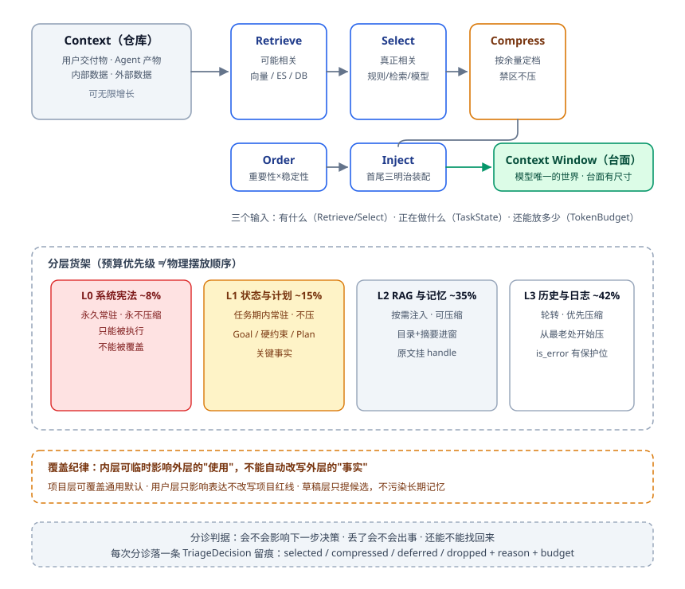
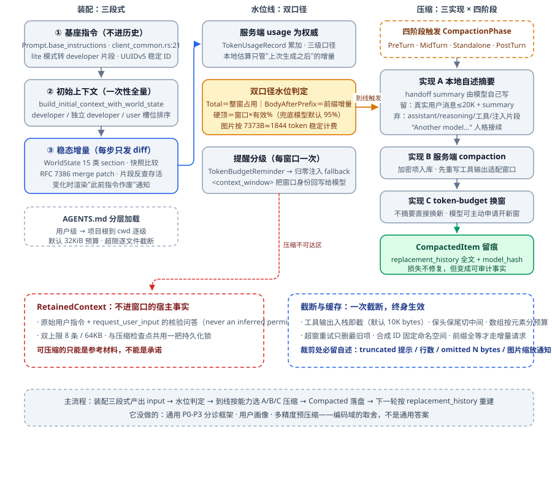

# 上下文管理：把"模型看见什么"做成一个函数

上一篇讲执行循环时说过：模型只是提议者，循环才是决策者。这一篇讲提议者的另一面——**模型的全部世界观，就是这一次喂给它的那块上下文**。它不在真实世界里推理，只在你给它的工作集里推理。窗口里没有的事实，对它而言不是"暂时想不起来"，是压根不存在。

这个事实会一路问出下面这些问题：

- 模型支持 128K 窗口，你打算放满吗？放满了谁吃亏？
- 用户第 3 轮说的"不要动 A 文件"，第 40 轮它还看得见吗？
- 200 家租户、每家 30 万 token 的知识库，一次客服对话该装什么？
- 摘要压掉的那 90% 里，如果恰好有一条"已排除的方案"，Agent 会不会把老坑再踩一遍？
- 用户三个月前说"喜欢拿铁"、上周说"最近在喝美式"，画像该信谁、存在哪、什么时候失效？

它们看着各说各的事，其实是同一个结构：**什么内容、在什么时间、以什么形式和顺序，进入当前窗口**。这一篇就把它做成一个函数来治理。

---

## 一、全景：先把三个词钉死

三个词先钉死，它们决定后面每次争吵在哪里止损：

- **Context**：Agent 当前可获取的全部信息空间——注意，不等于"已经塞进 Prompt 的内容"。
- **Context Window**：从全部 Context 里经过筛选、压缩、排序后，喂给模型的**可见工作集**。Context 是仓库，Window 是手边的工作台：仓库里堆多少不算数，台面上摆着哪几样才算。
- **Memory**：只是部分 Context 的拟人化别名，图个省事，绕开"模型无状态"这个事实。短期记忆一半是用完即弃的临时数据，一半是长期记忆的缓存。神化 Memory，人就会放弃更底层的 Context 抽象——可 **万物皆 Context，Agent 是一台随上下文位移的状态机**，所有异常都能翻译成它的语言。

### 1.1 Context 从哪来、有哪几类

先按产生方式分四类来源：**用户侧交付物**（贴进来的堆栈、上传的文档）、**Agent 自身产物**（提示词、模型输入输出、对结果的解读）、**内部数据**（业务系统、数据库、ES）、**外部数据**（接口、工具、MCP）。

再按用途分类，这是沟通口径，不必穷举：

- **Instruction**：系统提示词、业务规范、行业标准——限定怎么想、能做什么。
- **Goal**：最终目标与子目标。它是一把尺子，每步都得量一次。
- **User**：用户画像与历史决策。
- **Task**：当前任务与步骤。
- **Tool**：工具描述与调用历史。
- **Constraint**：硬约束与软偏好。

还有两条正交的描述轴，专治"这条数据到底存哪"这类能吵一小时的问题。**存储轴**讲同一份数据往往有多份副本：画像在 MySQL 一份、Redis 缓存一份，缓存那份还兼着会话记忆。**时效轴**讲它管多久：只作用本轮、作用本会话，还是一周一个月有效。

每一类 Context 都得回答三个问题：**怎么获得、怎么存储（是否持久化、什么结构）、怎么查询**。第一问和第三问不是一回事：获得是写入路径，查询是读取路径，细节召回全靠在读取路径上下功夫。写进去取不出来，等于没写。

### 1.2 一条 Context 的生命周期

一条信息从进来到死掉走的是这条路：

```
产生（输入/工具返回/检索命中/模型推断/规则文件）
→ 规范化落型（消解表、量化结果作为关键事实进入）
→ 定属性（type / source / scope / 权威性 / 置信度 / TTL（Time-To-Live，存活时限）/ token 成本 / 版本）
→ 写入路由（先进草稿层，任务收束后决定升不升层）
→ 检索 → 筛选 → 压缩 → 排序 → 注入
→ 使用中（可被降级、被覆盖、被索引化）
→ 失效（TTL 到期 / 长期无新证据降级 / 冲突裁决落败 / 归档转出）
→ 销毁或软删除（软删窗口内被召回命中可复活——留作开放题）
```

### 1.3 独立模块，还是散在各处？

生产级系统里不存在"没有分诊"的 Agent，区别只在它发生在哪：人写规则、算法排序、主循环裁剪、运行时 schema、hooks 中间件，总得占一样。你不显式做，它只是变隐式，不会消失。

主张把它独立成一个模块，理由挺硬：模型只在喂进去的那块上下文里推理，**感知决定推理上限**，这是架构级问题，和数据建模、容量规划同量级；而"什么绝对不能丢"你比模型清楚，就该写进代码，而不是指望模型临场自判。反例遍地都是：把理解问题全交给模型、没有独立信息流治理层的系统，两连问之后主语和实体双双丢失。这种事故别记成"模型不行"——那是上下文管理、细节召回、关键事实管理**三项同时失效**。

一个边界提示：感知管**空间**（这一轮看到什么），记忆管**时间**（窗口关掉后什么留下来）。两组确有交叉，但分开想更清楚。

## 二、分层与统一抽象：Context Window = f(Context)



### 2.1 f 到底是什么函数

```text
Window = Inject( Order( Compress( Select( Retrieve(Context), TaskState ), TokenBudget ) ) )
```

Retrieve 偏"可能相关"，Select 偏"真正相关"，Compress 管粒度（给原文、给摘要还是给索引），Order 管位置（决定它落在注意力高地还是无人区），Inject 管最终装配。三个输入分别是：**有什么、正在做什么、还能放多少**。说到底就一句话：找准内容、放进窗口、交给模型。

### 2.2 货架怎么搭：六种分层可以混用

| 分层依据 | 示例 |
| --- | --- |
| 生命周期 | 工作 / 会话 / 长期 / 归档 |
| 作用范围 | 步骤 / 阶段 / 任务 / 会话 / 用户 / 系统 |
| 信息形态 | 原始层 / 结构化事实层 / 摘要层 / **索引层**（只存"去哪找"） |
| 权威性 | 强规则（不可覆盖）/ 已确认事实 / 有证据推断 / 待确认假设（不得当事实）/ 已否定 |
| 冷热 | 热（内存直读）/ 温（需检索）/ 冷（归档追溯） |
| 预算优先级 | L0 系统宪法（常驻、约 8%、永不压缩）/ L1 当前状态与计划（约 15%、不压）/ L2 RAG 与记忆片段（约 35%、可压）/ L3 历史对话与工具日志（约 42%、可压） |

先记一件事：L0-L3 是**预算优先级**，不是物理摆放顺序。读成"从前往后依次放进窗口"，预算八成会分错。

另一处容易偷懒的是判据：分层不按访问频率分，而按五个坐标——**作用域、应活多久、权威来源、有无证据、占多少预算**。冷热分层为什么不够用？它答不了你真正会被问住的三件事：公司红线能否被覆盖、偏好会不会串租户、草稿判断能否进长期记忆。

### 2.3 比层数更重要的：覆盖关系

分层的全部意义不在切了几层，而在边界规则那一句：**内层可以临时影响外层的"使用"，但不能自动改写外层的"事实"**。

展开就是四条。系统层只能被执行，不能被覆盖；项目层可以覆盖通用默认；用户层只影响表达和个性化，改不动项目硬规则；草稿层只能提候选，不许直接污染长期记忆。

三类越界事故都是没守住这条线，过程都差不多：用户只说了一句话，窗口里最后装的却是一条永久事实。

- 用户说了句"今天想看便宜点"。天真实现把它写进长期偏好，往后三个月只推低价货。这句本该只作用本轮、最多作用本会话；想进长期得按 7.4 慢慢熬。
- 临时 debug 把 mock 地址写进了项目规则，它就住下来了，发布当天线上还在读 mock。这条本该带 TTL，或者只留在草稿层，任务一收束就清掉。
- 某家租户谈下一个特殊折扣，系统把它记成全局价格规则，所有租户跟着遭殃。病根不在模型糊涂，在作用域这个字段没人写：它被当成全局事实存了，而它只属于那一家。

层数要与产品实际作用域对齐：个人助手可能三层就够，企业系统要更细。两个反模式：一是**分层存了又全量读回**，仓库分了区，出门还背着整个仓库；二是**层数堆太多**，每加一层就多一套晋升加淘汰规则，治理成本反超收益。分层的目的是提高"本次推理所需工作集的命中率"，不是架构好看。

### 2.4 重复、版本与"只进不出"

同一份数据多副本是常态：DB 加 Redis 各一份，原文、摘要、索引三种精度共存。要管的是**版本与失效**，工具就三件：Item 带 version；事实走图谱 upsert（update+insert：已有则更新、没有则插入，旧状态自动退场）；软记忆带 superseded 标记。

冲突的头号根因说破了挺难看：**只进不出**。用户先说"这个客户预算 500"，过阵子改口"预算改成 800"。天真实现就是再写一条进去：两条都在库里，检索时双双命中，窗口里新旧平权共存——最后模型只能靠概率猜一个。这不是"记忆多了乱"，这是**没有遗忘机制**。

遗忘是写入、召回之外的第三个动作，而且更精细。时间衰减管得了"老不老"，管不了"对不对"。"对不对"只能靠**冲突整合**——新记忆写入前先检索相似的旧记忆，判这两条是细化还是矛盾。"部门每周一会、小组每周两会"是细化，范围更小而已，合并就行；"预算 500 改成 800"是矛盾，同一主体的同一属性对不上，必须裁决。这个判断不能指望检索顺手做掉。

有个能省大力气的推论：语义冲突只发生在高度相似的记忆之间，所以找冲突靠检索，不靠全库穷举。

还有一句要说死：偏好没有 TTL——它只可能因冲突而死，不会因年久色衰。

另一类重复更隐蔽：用自由文本存记忆，同一件事半年后长出十种写法，检索召不全、更新对不上号。长期层应当像数据库资产那样管理（schema、版本、来源、置信度、有效期），而不是聊天记录的自然语言沉淀。

## 三、分诊与优先级：窗口是急诊室，不是数据库

### 3.1 P0-P3：控制信息与模型的距离

分诊不是删材料——材料一样都没少，全在 Context 里待着。它调的是**这些信息离模型有多近**。

- **P0**：下一步推理不能缺的证据，贴到眼前，必须看到（安全策略、当前输入、身份归属）；
- **P1**：直接进窗口、优先使用（当前任务上下文、最近对话）；
- **P2**：有价值但不需要原文，压缩后进（手册目录+章节摘要、相似案例）；
- **P3**：可能有用但当前不展开，只挂 handle/路径/查询入口（每个约 30 token），按需再取。

压缩时的通用判据记一条就够：**结论、证据（关键字段/行号/时间点）、索引（原始材料在哪、怎么取回）三件必留**。

有个误判得吐槽：把 top_k=50 当成"更保险"。听着有理——多召回总比漏召回强。可实际上线，50 条里混着旧版政策和无关 FAQ，模型不是能力不够，是被扔进了一个很脏的信息现场。**塞得更全不是更安全，只是让模型站在噪声里做判断。**

真实预算长什么样？多租户客服：200 家租户、单家知识库约 30 万 token，合计 6000 万——任何窗口都装不下。真跑起来这么分：

- **P0，每会话 5-8K**：平台通用 system prompt + 安全策略 + 租户与用户身份 + 当前消息。身份只占几十 token，但缺了会串数据。
- **P1，20-30K**：租户配置快照、当前工单、上次会话尾部。
- **P2，10-20K**：手册目录与摘要、近三个月相似问题。
- **P3**：不预加载，挂 handle 按需读。

真正常驻的只有几十 K：**P0 保安全边界、P1 保语境、P2 保方向感、P3 按需展开。**

### 3.2 硬约束必须代码校验

`tenant_id` 是 P0 中的 P0，不能交给模型。天真实现是这样的：检索按语义相似度召回，A 租户问"退款多久到账"，B 租户那篇《退款时效说明》写得比 A 自己的还清楚、分数还高——它就进窗口了。模型接下来干什么，全凭运气。

规则要写死：任何资源加载前用代码校验归属，不一致**直接拒绝，不交给模型判断**；再让 handle 自带租户前缀，把"取错数据"在命名层就压低。代价只是多一次校验、handle 名字长一点。

同理，系统指令和工具返回不能混在同一个消息列表里。分区要在代码层做，不让日志有机会挤掉指令——混在一起，等于把"哪句是规矩"外包给模型判断。

### 3.3 Lost in the Middle：为什么"在"不等于"看见"

"只要信息在上下文里，模型就会看到并遵守"——这个直觉是错的，而且是一切上下文灾难的起点。实测规律（Stanford，TACL 2024）说的是：**注意力权重首尾最高、中间显著衰减，与中间写了什么无关**。窗口越长，核心约束被海量工具返回推到中间的概率越高，等于在注意力分布里不存在。模型不是忘了，是**看不见**。

两个病例。删库那个："严禁删库"那行字写在系统提示词里，没被截断、没被覆盖，第 30 轮照样执行了 `DROP TABLE`——中间这 30 轮塞满工具返回，那行字被挤到正中，位置本身就等于失效。另一个更常见：某个工具一口气返回 8MB JSON，你没管，之后每轮拖着它推理，token 涨 40 倍进度为零。**长窗口不自动解决问题，常常只是把"没检索到"变成"检索到了但没用上"。**

工程对策是一套组合拳：

1. **首尾三明治**：宪法层钉在最前缀（内容极少变动，既是注意力高地又吃缓存）；每轮组装时在尾部追加 constraint reminder——就像交卷前老师提醒一句记得写名字。
2. **压缩禁区**：L0/L1 永不压缩，永远从最老的历史日志开始压。
3. **前缀稳定换缓存**：稳定内容放前面，检索结果放前缀之后，或由副车道（sidecar，便宜模型、只带 query 与元数据）独立获取，不污染主对话前缀。前缀稳定 → 缓存命中 → 单次成本降 → 同预算撑更长对话 → 越长越要压 → 从尾部压 → 前缀继续稳定——**正反馈闭环**。

成本侧还有个推论：**一个中等模型读干净的三万 token，常常胜过最强模型淹在十八万噪声里。**

### 3.4 排序与常驻规则的尺寸

同样的内容换个顺序，输出就会变。模型身上仍有"炼丹"属性，所以排序是设计，不是排版。参考顺序（越重要越靠前）：System/Spec → 当前 Goal → 硬约束 → 任务状态/Plan 节点 → 已确认关键事实 → 本步证据 → 工具 Observation → 候选 Action → 动态 few-shot → 历史摘要 → 背景补充。

有个修正项：已确认关键事实很少变动，可上移以兼顾前缀缓存命中。说白了，**顺序要同时服务"重要性"和"稳定性"**，只顾一个都会吃亏。

常驻规则文件（如 AGENTS.md 这类）有尺寸纪律：主流编码 Agent 的官方建议约 200 行以内，越长越占 token，指令遵循度还会往下掉。规则膨胀到 800 行怎么办？四分法清理，每行只有四种归宿：必须常驻的留下；只对某目录生效的降级为路径级规则；只是背景的挪进文档库挂 handle；过期矛盾的删除。

### 3.5 分诊要留痕

没有 trace 的分诊就是黑盒。每次分诊落一条结构化决策记录：`trace_id / item / priority / token_estimate / decision(selected|compressed|deferred|dropped) / reason / tokens_used / budget`。

指标看三族。`budget_usage` 是基本盘；`dropped_count_p95/p99` 提醒你**平均正常不代表长尾正常**，一场多丢了几条的会话就足够让用户觉得"它今天不对劲"；`p0_dropped_count` 最硬，P0 被丢基本是 bug，出现一次都得查到底。

`p3_hit_rate` 要两头看：长期过低，说明挂了一堆没人取的 handle，纯占预算；长期过高也别高兴，那是本该进 P2 的内容被错降级成索引，模型每次多绕一轮才拿到。

## 四、动态编排与 Token Budget

### 4.1 三条筛选机制

- **强规则**：模板占位符或代码写死。做法是把一次模型调用封装成 Action 子类，自己从 ctx 取数拼 Prompt——确定性强，复杂调用治理里特别好用；
- **检索召回**：按本次调用目标去向量库/ES/DB 取，与 RAG 同构；
- **模型筛选**：先调一次轻量模型问"这次需要什么上下文"，再发真正的调用。两次调用的成本和延迟让它不常用作主路，留给高价值场景。

有个前置依赖容易被忘：意图识别的产物除了 intent，还应有一份 **ContextRequirement**——这三条机制按什么口径取数，全看它。

### 4.2 保留 / 压缩 / 不加载的决策信号

主干判据是重要性 × 剩余窗口：越重要越不能压，剩余越少压得越狠。之外还有八个信号。

1. **当前步骤与阶段**：每步所需不同，别一套配置跑到底。
2. **任务风险**：高风险少压缩，避免信息损耗。
3. **可恢复性**：能靠索引找回的才敢只放指针；不落库的内容不放就永久没了。
4. **可信度**：用户确认 > 权威工具结果 > 原始文档 > 历史摘要 > 模型推测，窗口不够时优先留高可信。
5. **新鲜度**：新信息优先，但画像这类"老而重要"的绝不能顺手丢。
6. **工具需求**：要选工具就得放描述，可压缩工具描述会明显拉低选择准确率，慎用。
7. **失败历史**：某类任务总因缺某类信息而失败，就永久提高它的优先级。
8. **调用目标本身**：同一段画像，推荐任务里轻压，退换货场景可以极压。

### 4.3 不要放满

窗口放满的代价：没有容错、没有召回余地、注意力被稀释。

装配式要留白：总量先扣 L0/L1/L2、reminder 与 safety_margin，剩下的才是 history_budget。比如 200K 窗口留 20K 输出、分诊预算 180K；对话区单独封顶，128K 总窗时对话区限 32K。

运行档位还要有健康区间：长期停在 Balanced（约 20%-80% 占用）是常态，Compact 只能短暂停留要尽快退出，**Minimal 属于不健康状态，进入次数单独告警**。也别等模型变笨之后再整理历史——那会把糊涂压进清醒，污染下一轮的摘要。

### 4.4 一张编排决策表

横轴是窗口余量：充足 / 中等 / 紧张 / 极度紧张。

| 内容 | 充足 | 中等 | 紧张 | 极紧 |
| --- | --- | --- | --- | --- |
| 当前用户输入 | 原文 | 原文 | 原文 | 原文 |
| Goal | 完整结构化 | 完整 | 简化 | 一句话 |
| 硬约束 | 完整原样 | 完整原样 | 完整原样 | **完整原样（唯一不动的行）** |
| 当前 Plan | 完整 | 当前节点+依赖 | 当前节点 | 一句话 |
| 关键事实 | 完整 | 完整 | Top-K | Top-3 |
| 历史对话 | 详细摘要 | 结构化摘要 | 一句话+索引 | 只放索引 |
| 用户画像 | 相关完整 | 任务相关 | 关键几条 | 默认不放 |
| 工具结果 | 结构化+片段 | 核心字段 | 必要字段 | 最小字段 |
| 检索结果 | Top-K | Top-3 | Top-1 | 证据索引 |
| few-shot / 工具描述 | 3-5 个 / 全量 | 1-2 个 / 中等 | 不放 / 名称+边界 | 不放 / 不放 |

多精度预压缩可以把运行时开销提前消掉：同一内容离线备好多个压缩版本，运行时按档加载——紧张时取摘要版，极紧时取索引。

级联规则两条。两个强互补的 Item 保持同一压缩级，别一个清楚一个糊；内容重合、有 A 就不用 B 的一对，一个极压、一个留原文，否则同一事实你付了两遍预算。

兜底条款可以写进 Prompt："若发现压缩程度过高，可调用召回工具取回详细内容"。但要清楚边界：窗口真满时召回也无意义，这句只在有余量时成立。

### 4.5 滑动窗口：f 的最小可用形态

无脑基线：按轮次滑（只留最近 N 轮）或按 token 滑（64K），窗口外靠摘要+召回补。

摘要节奏：每 N 轮生成一次，N=窗口大小。有个坑：每轮输入输出体积并不均匀，一句"好的"和一次 5000 token 的工具返回都算一轮，所以 N 轮上界得按 `N×(maxInput+maxOutput)` 约束，按最坏情况留位。

一个改良变体值得抄：近 N 轮放原文；近 N+1..N+M 轮改成"用户输入放原文、模型输出放摘要"。道理很朴素——人的输入通常短、模型的输出通常长，一刀切地"整轮摘要"会把最值钱的用户原话也压掉。N、M 可随剩余窗口动态调。

它的**唯一致命伤**：最近的上下文不一定是最重要、最相关的。用户第 2 轮那句硬约束，第 25 轮就滑出去了，第 24 轮那次无关的工具返回却留得完整。效果差时先查这一点——滑动窗口只是基线，不是答案。

## 五、摘要、压缩与细节召回

### 5.1 无损是不可能的，接受它

论证链很短：窗口有限 → 原文装不下 → 只能摘要 → 摘要本质是**决策**（保留/丢弃/弱化/抽象）→ 有决策就有牺牲 → 想靠召回补救，召回不一定准、召回多了仍放不下 → 叠上成本还要归档，等于主动承认丢。**只要窗口是有限数，细节就不可能 100% 回来。**

所以目标别定成"压完还能全找回来"。成熟系统承认下界，再用关键事实提取 + 细节召回 + 冲突裁决保证：真正影响决策的细节不丢，部分细节丢了也不影响结果。

哪些绝不能丢：最新用户输入、硬约束、已确定关键事实、Plan 与执行状态、输出格式模板——任何余量下都尽量原样。

另一件必须保住的是错误。**错误信息不能被普通摘要吞掉**：堆栈、失败测试、异常日志、关键数字、路径行号是 Agent 的反馈回路，相当于人的测试套件。短堆栈原文留；长堆栈留"异常类型+关键数字+路径行号+首尾片段+原始日志 handle"，分诊器给 `is_error` 强制保护位，超预算也进。

为什么较真？看一次压缩前后。窗口里原本躺着 `pool_size=20, queue_depth=347, timeout`——数字自己就在说话，模型看见会去对方向。压完只剩一句"出现了一个数据库错误"，线索被抹平，它就只会加连接池、加重试、调超时——看着在努力，实际忘了最重要的那条线索。

还有一批词删不得：**"不能""不要""必须""不超过""大概""可能"**。都短，可承载的偏偏是约束与不确定性。

### 5.2 摘要家族与生成时机

五类常用的：

- **对话整体摘要**：必须**字段化**，别写成一段话——共识、进度里程碑、用户信息各占一格；多意图长对话要分意图存。
- **章节摘要**：约每 20 轮一章，或按语义切。与整体摘要搭配用，N 取 2-3 章足够。
- **大模型输出摘要**：人不传原文，只传输出的压缩版。
- **关键事实提取**：见 6.3。
- **中间结果摘要**：讲究时效，多数实时查询只当轮有效。

时机两分。**同步**是用时再抽，尽量推迟；**异步**是第 N 轮结束即生成，或在 N+1 轮开始时回补，配看门狗/定时兜底。异步有个天然时序坑，要用时那条摘要还没生成，只能干等；换来的是主流程不阻塞。多个摘要任务可以并存，Prompt、触发时机、频率各不同，别指望一个通吃。

阈值提前定死：占用 60%-70% 主动压，别等满；高风险业务更低（50%-55%）。短任务可以晚压，长会话要早压。

该压了的五种表现：会话超 20-30 轮、占用过 60%-70%、工具结果大量堆积、日志/diff 明显膨胀、Agent 开始重复问重复查重复试。

### 5.3 模型可读压缩：摘要不必像人话

传统摘要是写给人看的：要通顺，有铺垫有层次。**模型可读压缩是给下一个模型看的**，只求极致信息密度：礼貌表达、转场句、口语填充词、重复解释全删，允许短句、列表、键值对。只要实体、目标、约束、事实、关系、状态都在，模型的语义补全能力就足以往下推（老外中文说得颠三倒四，关键词在就听得懂）。

活儿用轻量模型做就够，这是抽取不是推理。Prompt 里要写死几条禁令：**不得改原意；不得把不确定写成确定；不得把建议写成已执行的决策；不得把 Assistant 推测写成用户确认的事实；硬约束与用户否认内容必须显式保留。**

这几条是事故换来的：把"或许可以试试方案 B"压成"已采用方案 B"，下一轮模型就按既成事实往下规划了。

### 5.4 对抗"摘要的摘要"：anchor 与分级压缩

摘要叠摘要像反复翻拍照片：第一次主体还在，第二次边缘糊，第三次细节永久丢了。稳的做法不是少压，而是**换压法**。

- **维护一份持续演进的 anchor**，新信息做增量合并，而不是整体重写。它至少回答五问：用户要什么、已改什么、已决定什么、**已排除什么**、下一步做什么。"已排除"（excluded_approaches）最容易漏。漏掉的现场是：第 8 轮试过一个方案，失败后换路才走通；压到第 30 轮，那次尝试只剩一句中性的"调整过实现方式"，"别再这么干"这层意思整个没了。模型 Replan 时按当前窗口重新评估，又把那个方案选回来，用户眼看同一个坑摔第二次。多数时候不是模型不会推理，是没有"这条路别再走"的记忆槽位。
- **ObservationMasking**：历史分"我做了什么"（Action）与"外部返回了什么"（Observation）。后续推理依赖的是前者，于是早期普通 Observation 换成占位符、Action 保留（变体：错误 Observation 也保留）。这类场景它比通用摘要稳：省 token，模型还记得自己走过哪些路。
- **三层骨架**：L1 清冗长工具输出（非错误先替占位符）→ L2 抽取合并进 anchor → L3 极限压缩。注意**L3 是退场信号**：该交接、开新会话或转人工了，而不是"再压一次"。
- 更粗粒度的五级渐进表（按窗口占用）：<50% 不压；50-70% 只压工具结果（保头 500 尾 200 字符+中间一句，损失约 40%）；70-85% 旧轮次转结构化摘要；85-92% 主题级摘要只留结论与约束引用；>92% 紧急模式只留宪法+当前状态+最近一轮。五级比三级好在**每级只做最小必要牺牲**。最被低估的是第二级：一次 5000 token 的查询结果保住结构压到 700，关键信息几乎不丢。旁路再加一条：工具输出超阈值直接写盘，窗口里只留 placeholder 和文件路径，**大块内容根本不进压缩管线**。

配套指标：`level_3_trigger_rate`（每次触发都意味着信息漂移）、`avg_compression_ratio`（after/before，参考带 0.30-0.50；<0.20 压过头，>0.60 没压够）、`error_traces_preserved_per_event`（零保留=错误识别模式漏了，下次同类 bug 它仍然没记忆）。anchor 的演化轨迹（哪些字段加入、被覆盖、被丢弃）也要记录，才能回答"为什么第 N 轮忘了 X"。

### 5.5 细节召回：压缩解决放不下，召回解决不能忘

**什么细节值得找回**？判据就一条：会不会改变下一步决策。筛下来五类。

- 影响目标的："优化简历"还是"优化架构"，一字之差，整条路径都不一样。
- 影响约束的。
- 影响路径的：方案 A 已经试过并失败了，Replan 就不该再选 A。
- 影响工具调用的：某工具因为网络不通失败过，恢复之前它不可用。
- 影响表达的：用户嫌太长、嫌没重点——这类偏好值钱，因为用户不会每次重复说。

反过来那句也成立：**关键事实抽得好，本就不该有太多细节需要召回。**召回率居高不下，先回去查抽取。

架构上分两段：数据同步 + 数据检索；检索能力建议做成独立服务或子 Agent。一条延迟原则可以直接背：**当轮对话的细节不走召回**。当轮之前的数据早该同步完了，没同步完的才走检索那条慢路；轮间隔（用户阅读、组织输入的时间）就是你的同步窗口。

进阶玩法是**迭代式召回**：带索引调用 → 模型判定"够不够、缺什么" → 执行召回 Action（参数是索引条目）→ 再判 → 足够则前进。两个出口都得留。一是让模型指出可以忽略哪部分：这次带了 A/B/C，它说不要 B、C，新召回的 D 就只与 A 同行。二是真放不下就报错——拆东墙补西墙总有一天撑不住。还有，**必须设最大迭代次数**，不然这个循环能烧掉你一整个下午。

这种"找信息"的循环要配一套**觅食纪律**，否则比没有召回更烧钱：

- 只给**原子工具**。列目录、关键词搜索、读内容拆成三个动作，模型每步都能换方向；给一个"帮我找资料"的黑盒工具，它只能一条路走到黑。
- 给**轮数上限与每轮预算**，比如最多 8 轮、每轮不超过 2000 token，到顶就交人，并报告"查过哪、缺什么"。
- 每轮**记录排除了什么**。搜过且为空的路径写进状态，防止回头再走一遍。

觅食质量看三个指标：从问题到命中的中位轮数（接近 1 才健康）、觅食与聚焦的时间比（过高说明关键词太宽，过低说明起点太窄）、零收获退出率（突然升高通常不是模型变笨，是底层工具或索引坏了）。

还有两件麻烦事。摘要和召回回来的原始细节会打架，裁决顺序要定死——系统规则 > 用户明确输入 > 工具事实 > 已确认摘要 > 模型推测；同权威级别内 last-win（新覆旧）。"这到底是细化还是冲突"也要显式区分（制度每周一会、小组每周两会，是强化不是矛盾），多数模型分辨不了，规则得写进 Prompt。

## 六、指代消解与关键事实管理

### 6.1 边界：句级归规范化，轮级归上下文

定义先说准：**指代消解是基于 Context 重建用户当前真正表达的完整语义**。

举个具体的活：用户敲的是"把它改得再快一点"，天真实现照着这行字往下跑——"它"是什么没人知道，只能凭上一轮印象赌。正确做法是先补全成"把订单查询接口的响应时间再压一点"再交下去。补全出来的这一句，才是消解产物。

它和上下文管理怎么分工？输入规范化是**句级、一次性**的，补全为可判定语义就收工，它是 Context 的消费者；上下文管理是**轮级、系统级**的，得把补出来的"订单查询接口要提速"当关键事实长期维护，并在第 20 轮需要它时重新注入窗口。

分界判据就一句：只影响本句理解 → 规范化；会影响后续决策/工具/输出/校验 → 关键事实入库。

跨天跨周的更费劲。用户说"我去了之前你推荐的那个公园"。天真实现要么反问一句"哪个公园？"，把成本还给用户；要么更糟，挑个最近聊过的地点直接答下去。两步走不至于这样：先以属性为 query 召回历史细节入窗（"樱花、旅游"），再让模型基于窗口内容完成消解；属性推不出来，就把属性作为参数发起检索，拿到细节再试一轮。

消解不出人/物/地点时**不要猜，走澄清**。猜对了用户没感觉，猜错了整条链路都在错的对象上跑，代价不对称。

还有个便宜技巧：**命名即索引**。把"方案一"改口叫"TCC 方案"，用户后续就会用这个名字引用，推理阶段引用错对象的情况大幅减少。

### 6.2 关键事实：判据与六类

定义一句话：**会影响后续决策、工具调用、上下文组织、最终输出、约束校验的信息**。不影响就别存；影响就结构化保存，且能回溯原始来源。

具体分六类：

- **目标类**：多轮之中会改意图。
- **硬约束**：丢了用户情绪爆炸。
- **软偏好**：不可以长期反复违反。
- **用户确认过的事实**：正否都要存，后续一定用上——"不是这个意思"和"就这个意思"一样值钱。
- **决策类**：做了什么，加上为什么。
- **实体信息**：项目/商品/方案/人/接口/版本，宜建实体表。

可信度要显式分层。同一轮对话里，"用户已确认的事实"和"用户随口引用的数字（百万在线、十万 QPS）"必须区分标注，后者低可信高风险。

### 6.3 推理结果怎么落库

别把模型的原始思考过程当业务记忆。企业系统要的是**可验证、可审计、能续接的判断**，思考过程三样都不占。落库分两层。

- **草稿纸是正式一层**，不是"随便写几句"：它带 TTL、预算与升层规则。字段范式：任务 / 当前发现 / 具体路径 / 已试动作 / 观察到的失败 / 候选决策 / **下一步禁止动作** / 是否需持久化。
- **升长期要留承重信息**：goal、finding、decision、do_not_do（写清触发条件与代价："已验证会触发 43 个测试失败"）、evidence、next_step。账本条目四要素：发生了什么、为什么这么做、凭什么判断（evidence_refs）、状态怎么变的（state_delta）+ next_action。

do_not_do 要写代价，别只写结论。存一句"别改这块"，下一轮模型没有理由可循，很容易判断成"这次情况不一样"；存"已验证会触发 43 个测试失败"，它才知道动这里的代价。

沉淀到长期记忆的范式里，有一类值得单独建表——**失败日记**。只记有证据的失败（测试输出、日志、可复现步骤），一条四要素：当时试了什么、怎么失败的（错误原文）、在什么触发条件下必然失败、后来靠什么替代绕开。

**复盘通过才升格入册**——未经复盘的失败结论会把错误经验固化成教条。复用时也不是"读一遍"，而是在生成计划前按当前任务特征检索日记，命中的条目以"以下路径已验证不可行"的形式进 Prompt。它的价值压在一个指标上：**同类失败的复发率**——它不降，日记就只是废纸。

生命周期四问随时自查：什么只留在窗口？什么先放草稿等收束再定去留？什么进长期记忆并在需要时准确召回？什么已过期该淘汰降权？

出了问题，顺着记忆链路五环定位（该不该写→写→取→用→避免重蹈覆辙）：没写是沉淀问题，没取是检索问题，取了不用是推理/规划问题，用了还错是记忆质量或适用边界问题——**归因不同，修法不同**。

最后记一句反直觉的话：外部记忆也可能是**自我欺骗装置**。线索被选择性记录、被错误解释、被篡改之后，它就不再是通往真相的路径，而是幻觉的生产线。记忆注入/投毒是真实攻击面：只要先把错线索写进外部记忆，下轮取回时模型会以为那是"验证过的经验"。

## 七、用户画像：Agent 的私有资产

### 7.1 这不是推荐系统的标签画像

性别、年龄、城市、消费能力——这套标签投广告够用，对 Agent 远远不够，因为用户对 Agent 的期望是"像真人"。判据跟着就变了：**不是模型知道什么东西好，而是你的 Agent 知道什么叫"对这个用户好"**。

差别在哪？用户说了句"给我推个最有性价比的"。天真实现窗口里只有商品库和销量数据，于是按价格从低到高排，还挺满意。可"性价比"压根不是客观量：学生说这句话，意思是"越便宜越能用四年"；跑客户的人说这句话，要的是稳定、续航、售后，便宜五百但常死机就毫无性价比；摄影爱好者说这句话，愿意为影像多付两千。同一句话，三种人要的窗口内容完全不同；同一个人换个场景，理解也会变。

模型能力大家都能调，拉不开差距；**画像才是私有资产**。

画像建模差的症状你都眼熟：反复询问已告知过的信息、明知用户排斥仍反复推荐、把实习生的简历改成高级工程师的样子、某天问了句摄影此后手机电脑旅游路线全被强行强调摄影。四条症状，病因同一个：没把画像的**层级、来源、稳定性、生命周期**当工程问题，只当成 prompt 里带的一段字符串。

### 7.2 维度与来源

画像要拆成五个维度，不然连"记错了哪一格"都说不清。

- **目标画像**：用户究竟想达成什么。
- **能力画像**：讲多深、讲多快，而且要分领域——同一个人在计算机上是专家、在理财上是小白。
- **偏好画像**：尤其要记"不喜欢什么"。不喜欢却被推荐，比喜欢却没推荐更招厌；"不喜欢"还和硬约束强相关，弱模型要在 Prompt 里显式建立这层映射。
- **决策画像**：先看价格还是先看品牌。决策因子排序要按场景建，电子看性价比、衣服看外观。
- **关系画像**：对象是谁、用什么语气、哪些信息不能透露；社交场景要记谁信任谁、谁与谁有利益冲突。关系有方向，"用户对老王"和"老王对用户"分开记；"曾经亲密、当前不信任"也不能被覆盖成"一直不好"。

来源四类，进来的每一条都要再过一遍"事实 vs 推断"这道筛：

- **用户明确表达**：置信度高，但未必长期，也可能撒谎。
- **行为推断**：大坑在于做了不等于喜欢——低价手机可能买给父母，退黑色可能只是尺码不合。
- **多轮对话提取**：要区分四件事，说了什么、拒绝了什么、最终选了什么、**为什么选**。做了什么不足以说明偏好，为什么做才更有意味。
- **外部系统**：推荐系统那套画像不能直接接，得经转换层才能用。

### 7.3 三层结构与提取时机

只留长期画像一张表，就没法表达"最近开始喝美式"——善变是人类天性，不是数据脏。所以要三层：**长期 / 候选（中期、待确认）/ 当前（本轮本任务）**，后者覆盖前者。长期偏好只能从候选层**熬**上来，难点正是熬的时机。

```
实时抽取（每轮结束）：保及时，只写当前层，严禁乱改长期层
任务结束后：看到完整过程——最初表达、中途改口、最终选择都要看；
           最终选择可能是无奈折中，把折中当热爱就记错了人
离线定期：发现趋势（跨半年三次购机都优先小屏才算稳定）、合并重复、
         降权无新证据的、裁决冲突、按策略淘汰（可只摘掉理财块、保留代码块）
```

三个时机各治一种病：只实时抽，长期层会被一时兴起污染；只等任务结束看，及时性没了；不做离线，趋势浮不出来。

生命周期还有三态：激活（多次验证，可作默认）/ 弱化（长期无新证据或出现相反行为，只能用在排序等不敏感位置）/ 过期（超过有效期默认不用）。跃迁时长可以分级，比如激活→弱化三个月、弱化→过期半年，比一刀切清库更贴合偏好变化的心理曲线：偏好是先变软、再消失。

### 7.4 稳定性评分：把"一时兴起"显式成分数

说了一次"喜欢折叠屏"不能进长期画像，那三次、十次呢？没法直接知道真假偏好，只能通过表现推测，所以标准必须具体到能算：

```text
stability = Count + Continuity + CrossContext + Confirmation   （各满分 25）
Count        = 25 × (1 - e^(-n/3))     # n 为独立表达次数；同一轮说五次不算五次
Continuity   = 25 × min(1, ln(1+d)/ln(1+H))   # d 首末证据相隔天数，H≈180 天
CrossContext = 25 × min(1, max(0, s-1)/4)     # s 独立会话数（用跨对话近似跨场景，有失真）
Confirmation = 0~25 阶梯：未确认 0 / 未反对 0-5 / 场景内确认 20 / 长期确认 25
```

四个 C 各挡一类假信号：同一轮里连说五次的不算 Count，几天内密集冒出来的不算 Continuity，只在一个会话里成立的不算 CrossContext，从头到尾没人确认过的 Confirmation 就是 0。

分数怎么用要分档，别让刚过线的分数去动硬过滤：**0-29** 只保留不影响结果；**30-49** 只作排序参考；**50-69** 可影响推荐但不能作硬过滤；**70-84** 可作该作用域的默认偏好；**85-100** 稳定使用，但仍服从当前输入。

权重本身要迭代并用 AB 验证——比如把"用户确认"的权重调高再对比效果。这套算法是**可验证的起点**，不是最佳实践。遗留问题也明摆着，比如"什么算一次独立对话"——定义不同，画像准确性就不同。

新旧冲突裁决四条原则：

1. 当前明确表达 > 历史推断。
2. 用户明确表达 > 行为推断。买了三个苹果产品之后说不喜欢苹果，信表达。
3. **用户纠正优先**。"我不是价格敏感，只是这次预算低"→降级旧标签、保留本次约束，只做后半句等于没听见前半句。
4. 领域画像 > 全局画像。平时节俭、买电子只挑顶配，这不叫矛盾。

注入策略四条：画像属于"老而重要"，新鲜度规则对它不适用；稳定少变的内容靠前放，顺带吃缓存；按窗口档位降级注入（相关完整/任务相关/关键几条/默认不放）；**弱化态只进排序不进 Prompt**。

质量评估分四层：行为层（还在重复询问吗）、分数层（4C 分布、候选→长期升级率）、一致性层（冲突率、横跳次数）、使用层（画像真被召回并被使用吗、AB 有无差异）。缺一层都有盲区，尤其是使用层——画像存得漂亮却从没进过窗口，是最常见的自欺。

## 八、长任务：漂移、进度追踪与恢复

### 8.1 长任务难在哪

难点不在步骤多，步骤多只是活重；长任务真正难受的是它**不断产生新信息**：目标会变、计划会失效、证据良莠不齐、中间结论越堆越高。比这更难的是**信息之间的依赖**——早期一个不起眼的判断，可能撑起后面十几步。模型能力再强，也绕不过"任务信息无限增长、单次可见窗口始终有限"这对矛盾。所以说重一点：**长任务问题，剥到底都是上下文管理问题**，差别只在出错早晚、轻重、能否发现、能否恢复。

漂移的六个类型，每种都有典型病例：

| 漂移 | 病例 |
| --- | --- |
| 目标漂移 | 要求"修一个空指针且少改代码"，结果重构几十个文件，空指针没修 |
| 约束漂移 | 要求不得虚构简历，仍擅自补"千万级用户"，还说是合理推测 |
| 状态漂移 | 迁移工具明确返回失败却被标成功，最后汇报"已完成" |
| 证据漂移 | 据两年前文档断言"SDK 不支持"，原文被丢弃后坚称最新版也不行 |
| 细节丢失 | "A 接口绝对不能修改"压成"尽量少修改"，于是直接改了 |
| 错误累积 | 把"累计用户数"看成"日活"，后续所有配置基于此算，得到一份完整的错误方案 |

"细节丢失"这一行最值得摊开看，因为它最冤。用户原话是"A 接口绝对不能修改"，第一轮窗口里装的就是这句。压到第 25 轮，它变成"尽量少修改接口"——字面上还在，语气从禁止降成了建议。模型照这句去改，改得挺有道理——这锅不该模型背：**同一句话被压缩后强度衰减，行为就必然跟着衰减**。这也是 5.1 里那批词（"不能""必须""不超过"）删不得的原因。

再补三种进度视角的变体：**细节过载**（围着一个 Warning 越钻越深，预算全耗在小坑上）、**完成幻觉**（把"todo 全打勾"当"目标达成"）、**状态错记**（以为测试全跑过，其实只跑了一半）。传统系统的状态是确定的，Agent 的状态里有一半是**语义叙事态**——会被压缩、被改写、被重新解释，所以不能照搬 checkpoint 那一套：它存比特，这里存说法。

### 8.2 三件基础武器

- **Plan 侧 Checkpoint**：关键节点停下来问六句——目标漂没漂、约束破没破、状态准不准、证据还可信吗、计划还适用吗、该走 Retry/Rollback/Replan 哪一档。该在哪几处停：阶段结束、关键产物生成、高风险调用前、被大量后续依赖的节点。它不保证不出错，它只**阻止一个小错被后面几十个步骤放大**。
- **ReAct 侧每轮校准**：循环开始与结束各查五维（目标/状态/约束/差距/证据）。差别很小：拿到 Observation，差的只总结"我得到了什么"，好的一直在问"**我还差什么**、后续怎么获得"。
- **Context Verifier（异步体检）**：主 Agent 闷头推进，Verifier 在旁边看它有没有不知不觉跑偏。发现问题**不直接重跑**，而是输出漂移类型、影响范围、修复建议，把处置权交回模型。触发时机：阶段结束、占用达阈值、Replan 前后、异常信号。太频繁烧钱，太少就只能等错误扩散。

### 8.3 进度追踪：锚、账、集三平面

"迷失"不是一个 bug，是三件事，得分开治：**调度态**（任务 DAG、ready/blocked/completed，管顺序）、**叙事态**（锚+账+集，管意义）、**机械态**（API 参数级真值，管可审计）。

跑偏常常因为三者搅在一起。典型现场：客户 id 夹在自然语言里，下一轮要填进工具参数，模型只能从自己刚才那段话里抄。抄漏一位就改到别人家客户身上——目标没偏，任务照样失败。所以这条写死：**确定性数值必须由程序机械掌控并留来源（Provenance：哪来、谁生成、何时、传给了谁），不能在上下文里让模型复制粘贴。**

- **锚（GoalContract）**：把目标冻结成可引用的契约——goal / success_criteria / **non_goals** / constraints / version。与 todo 清单的区别：不能随手增删，改动必须写一条变更事件说明谁改、为什么。non_goals 是防细节过载的护栏，把"付款、报税"写进非目标，模型钻进去之前就撞墙。
- **账（ledger）**：log 与 ledger 的差别是**能不能对账**。每条至少要有：event、decision+reason、evidence_refs、state_delta、next_action。恢复时不读完整对话，只读锚、当前里程碑和最近几笔账。
- **集（working_collection）**：从账里再蒸馏出当前这一步最相关的一小包，**与锚一起注入**。不带锚的工作集会慢慢退化成"最近几轮聊天的摘要"，没人知道为了什么。
- 三个收敛器。**复诵**：不断把全局计划推回上下文尾部，典型实现就是反复重写 todo 文件——一个典型复杂任务平均约五十次工具调用，越长越容易偏题。**漂移哨兵**：每固定步数用一个便宜模型算四个分数，动作与目标相关度、里程碑是否推进、结论有无证据、错误是否在累积，再分级响应：相关度降→触发复诵，里程碑停滞→缩小范围，证据变差→禁止汇报完成，错误压力升→暂停转诊断。**验证闸门**：每个里程碑的验收条件落成具体检查——数量对不对得上范围、金额波动可否解释、关键 id 是否都有 Provenance、高风险动作是否仍 blocked。不过就 needs_rework 并写一条 failed_gate 事件，**闸门未过不许进入下一阶段**。

### 8.4 恢复：事件溯源 + 恢复包

别只维护一份不断被覆盖的"当前状态"。要记录关键事件（约束变更、步骤完成、Observation 返回、事实确认、旧结论被推翻、Replan 范围），在关键节点生成可信快照，当前状态 = 最近快照 + 后续事件重放。图的是**可追溯**：跑偏时你能定位是哪一次状态更新、哪一次压缩、哪一次错误解释引入了问题，而不是对着已被污染的现状猜。

恢复时加载的是**恢复包**，不是聊天记录：目标契约、当前里程碑、工作集、最近几笔账、开放阻塞、机械状态键、上次漂移信号、下一步动作。它得能通过这份有效性清单：锚存在且版本一致、里程碑可定位且无未解阻塞、账本的 evidence_refs 仍可解析、机械态键齐全且 trust 为工具输出、漂移信号非 pause、无新旧冲突共存。

持久化节奏按风险分：普通任务"定时写回+会话结束兜底"，高风险场景"关键状态实时写回+一般状态批量写回"。只等结束再写，跑半小时崩一次就丢一大段。

交接摘要（handoff）是同一套思想的微型版：工单号、严重级别、意图、已试改动、已做决策、**已排除方案**、下一步、截止时间——接手的人看一眼就知道"哪条路别再走"。反面教材我见过最典型的一份：摘要写得很体面，样样都有，就是丢了循环依赖的具体路径、已排除的错误做法，还有"下一步不要先移动 X"这句禁止动作。下一轮模型拿着这份残缺信息，做了个在当时看完全合理而危险的选择，CI 全挂、项目回滚。**摘要式交接看着什么信息都没丢，丢掉的恰恰是唯一能拦住下一个人的那一条。**

## 九、踩坑清单

1. 把 Context Window 当仓库用，追求"塞全"——它是工作台，台面尺寸就是物理约束。
2. 以为信息"在上下文里"模型就看得见——中间段是被衰减的，"在"≠"被看见"。
3. 约束只写首轮不重申，还压进 L3——第 30 轮的 `DROP TABLE` 就是这么来的。
4. 硬约束、口头偏好、单次工具结果、模型临时推断放进同一层一视同仁。
5. 内层结论直接改写外层事实：一次"想看便宜的"熬成永久低价偏好。
6. 记忆只进不出、不标 superseded——新旧平权共存，让模型靠概率猜。
7. 把"加 TTL 硬删"当遗忘：误杀天天在用的，放过后天就该失效的。
8. 摘要把错误堆栈压成"出现了数据库错误"——顺手删了自己的测试套件。
9. 反复"摘要的摘要"而不维护 anchor——每复印一次，边缘糊一次。
10. 当轮细节也走召回——同步窗口没用上，白白加延迟。
11. 把行为当偏好：买了三个苹果产品 ≠ 喜欢苹果；最终折中 ≠ 真的热爱。
12. 实时抽取直接改长期画像层——一时兴起熬不进稳定层。
13. 关键参数（id、金额）让模型在自然语言里复制传递——目标没偏，任务也会失败。
14. 把"todo 全打勾"当完成：完成幻觉要靠验证闸门治。
15. 恢复时回读聊天记录而不是恢复包——能"接着聊"不代表能"接着跑"。
16. 没有 trace 就做分诊调优——黑盒里调参数，调的是运气。

## 十、扩展阅读：Codex 是如何组织与压缩上下文的

OpenAI Codex CLI（`openai/codex`，commit `44b857c`，2026-09-22）把本篇的多个抽象概念落成了有类型的代码：**上下文装配是三段式、世界状态是可 diff 的 section 状态机、压缩有三套实现、宿主事实刻意不进模型窗口**。路径以 `codex-rs/` 为根。



### 10.1 装配：基座指令、全量初始上下文、稳态 diff

一次请求的 input 分三层来源：**基座指令**不进历史（`Prompt.base_instructions`，`core/src/client_common.rs:21`；responses-lite 模式下改用 `BaseInstructionsFragment` 以 developer 片段拼进前缀，ID 用 `Uuid::new_v5(thread_id, text)` 稳定生成以保缓存）；**会话级初始上下文**一次性全量装配（`build_initial_context_with_world_state`，`core/src/session/mod.rs:4174`，按 developer / 独立 developer / contextual-user 槽位排序）；**稳态增量**只发 diff——`WorldState`（`core/src/context/world_state/mod.rs:286`）把环境、AGENTS.md、权限、工具等 15 类内容建模为带稳定 ID 的 section，快照比较后仅对**变化的 section** 生成替换片段（`render_history_diff`，RFC 7386 merge patch）。两个细节特别值得抄：**AGENTS.md 分层加载**按"用户级 → `--- project-doc ---` 分隔 → 项目根到 cwd 逐级"拼接，默认 32KiB 预算**是所有目录、所有环境共享的一份额度**——`remaining` 逐条扣减，装不下的那个文件被硬截断（`core/src/agents_md.rs:68-93`、`:156-158`），而不是"每个文件各 32KiB"；工程目录未被 trust 时项目侧一条都不读（`:64-66`）。section 变化时渲染显式的**替换/移除通知**（"此前指令作废"）——作者清楚模型不会因为看不见旧文本就认为它失效。

### 10.2 水位线：双口径 + 服务端权威

token 计量不信本地估算，信服务端 usage（`record_observed_response_completed` 累加进 `ContextManager`，`core/src/context_manager/history.rs:76`），本地估算只负责"最后一条模型生成项之后的新增项"这个小区间，注释明说它是 *coarse lower bound*。压缩判定有**两种口径**（`AutoCompactTokenLimitScope`）：Total 看整窗占用；`BodyAfterPrefix` 看"本窗口相对稳定前缀的增量"——专为配合前缀缓存而生，把重心从总量移到增量。硬顶 = 窗口 × 有效百分比（本地兜底模型默认 95%）。提醒分级（`session/token_budget.rs:161`）：到阈值注入 `TokenBudgetReminder`，归零注入 fallback prompt，且**每个窗口最多提醒一次**；窗口身份（第几个窗口、前后窗口 ID）会以 `<context_window>` developer 片段回写给模型——让模型知道自己处在第几段记忆里，是"上下文被管理过"的显式诚实。

### 10.3 压缩：三套实现 × 四个阶段

触发阶段枚举 `CompactionPhase`：PreTurn（轮前/换模型/comp_hash 变化）、MidTurn（轮中 rollover，`turn.rs:599`）、StandaloneTurn（用户手动 `/compact`）、PostTurn（轮末按百分比阈值）；原因枚举 `CompactionReason`：ContextLimit / ModelDownshift / CompHashChanged / UserRequested。**这套枚举就是"上下文管理策略空间"的现成清单。**三套实现按能力分流（`run_auto_compact`，`turn.rs:1443`）：

1. **本地摘要式**（`core/src/compact.rs`）：把摘要指令当用户消息追加到历史副本，让模型**自述交接摘要**（`prompts/templates/compact/prompt.md`，标题就叫 *CONTEXT CHECKPOINT COMPACTION … handoff summary*）；重建时**保留**最近真实用户消息（≤20K token，放不下就截断）+ summary，**丢弃**全部 assistant 文本、reasoning、工具调用与注入片段（后者靠下一轮重注入恢复）。摘要前缀写的是"Another model …"——压缩的本质是**跨实例人格接续**，不是给人看的归档。
2. **服务端 compaction**（`compact_remote_v2.rs`）：先重写工具输出适配窗口，返回不透明加密项；本地重建时按 token 预算保留 user/agent 消息（64K 预算、agent 消息 ≤10K）。
3. **token-budget 换窗**（`compact_token_budget.rs`）：完全不摘要，直接 `start_new_context_window` 用初始上下文换新历史；模型甚至可以通过 `new_context_window` 工具**主动申请开新窗口**（`tools/handlers/new_context_window.rs`）。

所有压缩都留痕：`RolloutItem::Compacted`（`history/src/lib.rs:230`，11 个字段）带 `replacement_history`、窗口编号与三个窗口 ID、`compaction_response_id`、`latest_token_usage_record`、以及 `compaction_model_hash`——作者对"有损不可逆"的自觉很硬：不试图工程性修复信息损失，而是**把损失变成可审计的事实**，并用固定 Warning 提醒"长线程反复压缩会劣化"。

`replacement_history` 这个字段的形态值得单独说一句：**压缩不是打一个截断标记，而是把压缩之后的整份新历史内联写进这一条 JSONL**（写点 `session/mod.rs:4024`）。它换来一个很实在的收益：重建时可以倒序扫描，一旦确认最新那个存活检查点就停——`rollout_reconstruction.rs:103-105` 的注释把理由写得很清楚，一份存活的 replacement_history 检查点本身就是完整的历史基线，找到它之后更老的条目不再影响重建。代价也当场写在代码里：遇到缺 `window_number` 或缺 `replacement_history` 的 legacy 压缩记录，有界扫描立刻失效，必须一路扫回文件头（`rollout/src/model_context.rs:88-92`）。**新格式买到的性能，旧格式会一次性吃回去**——兼容分支要尽早砍，这话在这份实现里是有行号支撑的。

还有两条只有逐行读才会发现的机制。**其一，压缩请求不带任何工具**：`Prompt { input, base_instructions, ..Default::default() }`（`compact.rs:282-286`），`tools` 走默认空值——"压缩时模型顺手调了个工具"这种担心，在这个实现里根本不成立。**其二，PreTurn / MidTurn 阶段的摘要文本并不来自那次压缩请求的返回值**，而是从会话历史里捞最后一条 assistant 消息（`get_last_assistant_message_from_turn`，`compact.rs:358`）；只有 PostTurn 才用请求自己的输出（`:349-356`）。也就是说，预轮压缩的摘要**先被当成一条普通助手回复写进历史、再被自己读出来**。不理解这点，排查"摘要为什么和历史里那条重复"就会绕远路。

顺带一个状态机上的诚实设计：世界状态的 section 快照分三态 `Absent / Unknown / Known`（`world_state/mod.rs:208`），基线引用也分开 `NeverSet` 与 `Cleared`（`rollout_reconstruction.rs:34`）——"从来没有过"和"曾经有过但已作废"被显式区分，否则 resume 时会多发或少发一条"基线已作废"的段落。这正是 2.4 节讲的覆盖与失效关系，只不过它落在了类型上。

### 10.4 RetainedContext：可压缩的只能是参考材料，不能是承诺

宿主核验过的事实走**另一条不进模型窗口的通道**：`RetainedContext`（`history/src/retained_context.rs`）保存原始用户指令（`RetainedUserMessage`）与 `request_user_input` 的问答对（`VerifiedAnswer`，注释明说 *never an inferred permission*），有字节与条数双上限（8 条 / 64KB），与压缩检查点共用一把持久化锁。为什么单独存？因为**授权、同意这类高风险事实一旦进了可被摘要的历史，就可能被压缩改写**——Codex 的解法是干脆不让它们进窗口，审查场景（`ThreadOwned`）才暴露。这是对"关键事实单独提取、单独存储、每轮重申"原则的一种更彻底实现。

### 10.5 截断与缓存：一次截断，终身生效

工具输出在**入栈那一刻**截断（`truncate_function_output_payload`，默认策略 bytes 10_000，`models-manager/src/model_info.rs:127`），之后各轮复用已截断文本——与常见"发送前动态裁剪"相反。作者的赌注写在注释里：**缓存前缀稳定 > 单轮最优长度**。配套三件：合成输出 ID 用固定命名空间 UUID（注释直言改 ID 会击穿缓存）；超窗重试时 `remove_first_item()` **只删最旧项**（保前缀）；请求属性全等且历史为前缀扩展时才走 `previous_response_id` 增量请求（`client.rs:331/1381`）。截断还留自述痕迹：`Warning: truncated output (original token count: N)`、`Total output lines: M`、`... N bytes omitted ...`、图片缩放通知（`<image_resize_notice>`）——**把"给你的不是全文"变成模型可推理的前提**。截法本身是保头保尾切中间（`truncate_middle_*`），结构化数组按元素分配预算、溢出追加计数而非静默丢弃。图片策略是"估算与告知优先于截断，大图默认不进上下文、模型用 `view_image` 显式索取"。

### 10.6 对照与边界

| 本篇观点 | Codex 的实现证据 |
| --- | --- |
| f 是可版本化的装配函数 | WorldState section 状态机 + merge patch diff |
| 约束要每轮重申 | AGENTS.md 变化时渲染显式替换/作废通知 |
| 压缩必然有损，要留痕 | CompactedItem 全文入盘 + model_hash + Warning |
| 关键事实不能被摘要吞掉 | RetainedContext 独立通道，不进窗口 |
| 前缀稳定换缓存 | 入栈即截断、只删最旧、ID 稳定、增量请求 |
| 裁剪要可自述 | 截断标记、行数提示、图片缩放通知 |
| 压缩档位需要策略空间 | 三实现 × 四阶段 × 四原因的枚举化 |

它没做的同样清楚：**没有通用 P0-P3 分诊框架**（编码域的信息结构相对规整，靠 section 注册表 + 截断策略就够了）、**没有用户画像**（单用户 CLI 场景）、没有多精度预压缩（用服务端缓存替代）。读一个真实实现的收获不在照抄，而在看清：**每个抽象概念背后都是一个具体的工程取舍**。

## 总结

这一篇的核心是一个函数和一句话。

函数：`Window = Inject(Order(Compress(Select(Retrieve(Context)), TaskState), TokenBudget))`——五段各有判据：分诊看"离决策多近"，编排看"还剩多少预算"，压缩看"什么绝不能丢"，召回看"会不会改变下一步"，排序看"重要性与稳定性双目标"。

一句话：**上下文管理的全部工程，是在"有限窗口 × 有损压缩 × 无限信息"这对矛盾里，维持模型工作集的真实性与相关性**——丢失制造污染、污染诱发丢失，所以既要筛选、压缩、召回三板斧，也要敢于遗忘。

判断一条信息，三处用同一组判据就够了：**会不会影响下一步决策？丢了会不会出事？还能不能找回来？**

## 思考题

1. 画出你系统的 f 函数：五段各自实现在哪个模块？哪一段现在还是"模型自己看着办"？
2. 你的窗口里有没有一条"三个月前的临时约束"至今还在生效？按 2.4 的覆盖关系和 superseded 机制，它应该在哪一步被拦下？
3. 给"错误堆栈"设计保护位：你的压缩管线在哪一级、用什么判据保证 `is_error` 内容不被吞？写出对应的 `error_traces_preserved` 断言。
4. 用户说"我最近不喜欢苹果了"，但购物车里还有三个苹果产品。按 7.4 的裁决四原则，这次该更新哪一层画像？什么证据出现后才允许动长期层？
5. Codex 选择"入栈即截断"来保前缀缓存。如果你的业务每轮检索结果变化很大、前缀根本稳定不了，这个取舍还成立吗？你会改赌哪一边？
