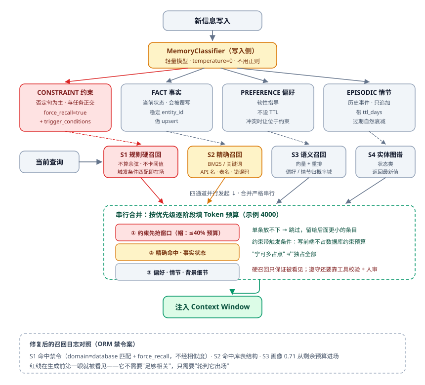
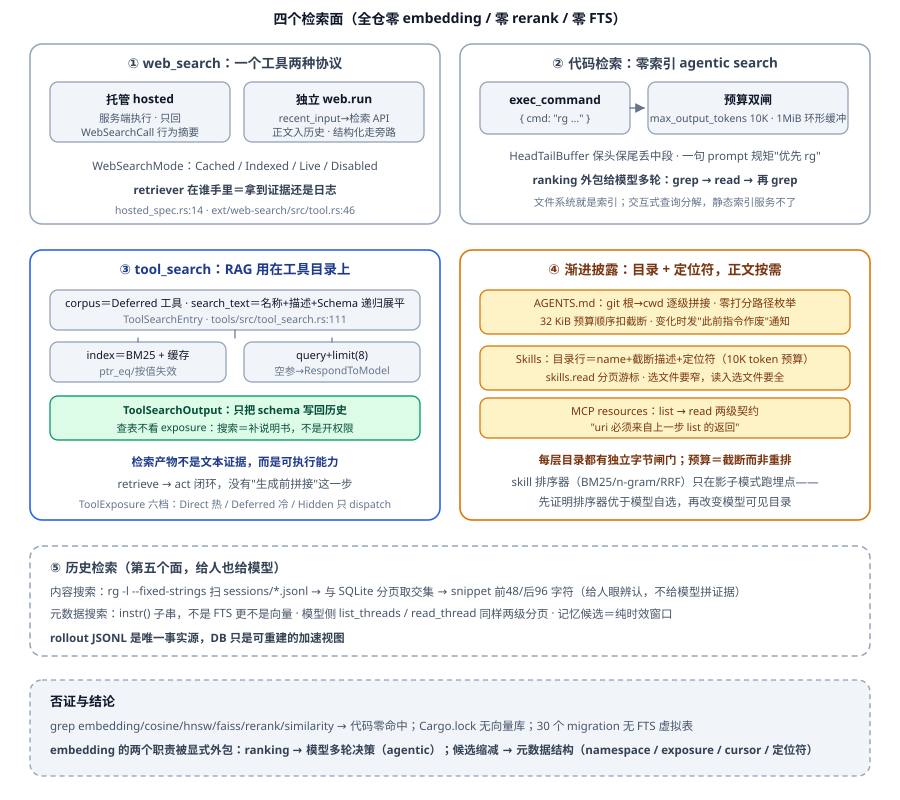

# 检索与 RAG：概率系统里的最小充分检索

聊检索，很多人张口就是一串术语："切块 + Embedding + 向量库 + Top-K + BM25 + Reranker"。这串词能证明你看过教程，证明不了你做过系统——生产里的检索问题，它一个也答不上来：

- 评审会上定死的"禁止使用 ORM"，你特意写进了向量库，六周后 Agent 照样导入了 ORM。它没删你的规则，它只是**没看见**。
- ChunkSize 到底设 500 还是 800？你说"网上经验都这样"，那 300 和 1500 为什么不行？答不上来，这个数就不是工程，是信仰。
- 召回率涨了 5 个点，答案准确率反而掉了。钱花在哪了？
- 用户问"这台电脑适不适合写代码，适合的话哪买便宜"，你的系统老老实实把两件事的证据一次全查了。后半截查询本来根本不该发生。
- 线上看板写着"检索正确率 92%"，用户却在排队点踩。到底哪个指标在撒谎？

这一篇把检索当成一条**知识供应链**来讲：写入侧要有批次和凭证，读取侧要分确定域和概率域，整条链路要在"最小充分"的目标下花预算。

---

## 一、完整链路：一条供应链，不是一次搜索调用

先把地图铺开，后面所有讨论都挂在这两排步骤上。写入侧七步：**采集 → 解析 → 清洗 → 分片 → 补元数据 → 向量化/建索引 → 入库校验**；读取侧八步：**召回 → 过滤 → 合并去重 → 融合排序 → 业务规则调整 → 充分性判断 → 上下文组织 → 生成**。

难的是其中三步经常被偷偷跳过。

- **解析是单行道**。解析一错，后面的切割和检索基本救不回来：条款、表格、代码注释被硬切开之后，模型看不出这段属于哪一章、哪一版、哪一条。OCR 的边界也得心里有数——它只把字认出来，没"读懂图"。流程图的节点、箭头的指向、统计图的走势，都得靠视觉模型先吐出一份结构化描述，才谈得上被检索。某文档处理厂商干脆把定位从"RAG 框架"改口为"面向智能体的文档处理引擎"，等于亲口承认解析层就是下游幻觉与断引用的源头。
- **入库校验**是最容易被省掉的最后一步。四查就够：文档解析是否完整、Chunk 是否异常、向量是否全部生成成功、索引是否可查。
- **metadata 是必需品不是选配**。只存 `doc_id + text` 叫"太薄"——企业检索真正要用的是：生效日期、产品版本、地区、权限域、源负责人、文档状态。配套的三件数据结构，思路值得直接抄：
  - **源文档登记表**：`doc_id / source_uri / owner / permission_scope / effective_from / effective_to / source_hash / status`——知识源先于知识被管理；
  - **Chunk 记录**：`chunk_id / doc_id / index_version / chunk_hash / text / context（补写的语境）/ page / section / 生效期 / tenant_id / permission_scope`；`chunk_id` 用 `hash(doc_id + parser_version + chunker_version + chunk_index + text_hash)` 稳定生成，切块可复现、文档未变可跳过重处理；
  - **IndexManifest（索引清单）**：corpus 版本、解析器版本、切块器版本、embedding 模型与维度、构建时间、chunk 数、`golden_set_passed`——**没过回归的索引不许切线上**，别名蓝绿切换、随时回滚。

### 1.1 玩具与生产的分界线

拿这五条判据量一遍自己的系统：

1. 写入侧是不是被当软件资产管理（可发布、可灰度、可回滚、可审计、可版本化），还是只有读取侧"喂几段相似文本"；
2. 能否从一段答案反查到"**哪一版索引里的哪个 chunk、第几页哪一条**"；
3. 机械真值（id、批次、金额、单号）是确定性绑定的，还是让模型从召回文本里"读"出来的——后者是执行型 Agent 最高频的事故源；
4. 管不管**下线**：废止规则、过期口径、权限收紧的材料还躺在索引里答题，是"新文档没生效"这类事故的经典根子；
5. 有没有评估闭环——没有的话，项目做得再复杂，别人也只会当成玩具。

落地次序也有讲究：**先治理，后调参**。顺序不能反——真实问题清单 + 正确证据表 → 知识源补 owner/版本/生效期/权限 → 定义 chunk schema、citation schema、index manifest → 建候选索引用 golden questions 回归 → 别名切换上线 → 接引用与 RetrievalTrace → 这之后才谈 Agentic RAG。

上线前自查：抽 50 条真实问题，人工看它们对应的原始材料入库后的形态——解析对不对、表格的行列关系留没留、chunk 能否追到页码条款号。这些问题答不上来，就还没到调 Top-K 的阶段。

## 二、Query Planning：先知道缺什么，再去查

### 2.1 要不要查、查什么

"查不查"分两层：设计期由开发者定死"这一步要不要查"（这层可以拉上产品、甲方对齐）；运行期交给 Agent 判"眼下这些信息够不够"。总纲就一句话：**让 Agent 缺什么就去查什么**。难点立刻挪到后半句——它怎么知道自己缺什么？四步模板可以直接套：

```text
1. 明确当前要做的判断（查询是手段，服务于某个判断或动作）
2. 推导该判断需要的证据（把"符合生产要求"细化成可查的点）
3. 区分已知与未知（已知的不再查）
4. 判断这个缺口是否值得查 —— 缺了不一定查：
   资源紧张、即将超时时可以不查，不查本身是一种降级
```

前提是目标已被识别（意图与 Goal Context 就绪）。拿用户原话直接检索，连代词都没消解，几乎不会有有效结果。

### 2.2 改写十二条

Query Rewrite 改的是表达，不改事实。十二条可以直接抄进 Prompt：

1. **保留硬约束**：预算上限、排除品牌、只能查当前租户，一个字不许丢；
2. **提取软偏好**："稳定一点"没法查，翻译成可查可比的指标；
3. **消除歧义**：多义词、缩写、黑话、同名实体；
4. **统一术语**：口语换成数据源里真实存在的标准字段与关键词；
5. **删除无关**：情绪、寒暄、重复；
6. **从"复述问题"转向"描述信息缺口"**：别问"这个框架怎么样"，改查稳定性、恢复能力、生产案例；
7. **补过滤条件**：租户/项目/环境/时间范围；
8. **禁止擅自补事实**：可以补已确认的信息，不能为了让 Query 显得完整，塞进没证据的实体、时间、结论；
9. **检查可执行性**：索引存在吗、字段支持吗、权限够吗；
10. **控制粒度**：一次查询围绕一个明确缺口；
11. **设置停止条件**：只对迭代式检索有意义；
12. **与输入规范化共用基本功**：消解和量化，两边是同一套。

十二条里真正拦住 Query Drift 的只有第 8 条。模型改写最顺手犯的错就是"帮你补个时间范围"，那个范围根本不存在，接下来每一步都在为它找证据，越查越偏。记死一句：改写只做**补齐已确认信息**，不做**美化到看起来完整**。另一条硬红线来自反馈侧：用户明示的否定条件与硬约束必须贯穿召回、排序与输出，不允许被软偏好覆盖。

原始 Query 和改写 Query 是**并存，不是替换**：改写不可逆，一个词换掉，可能正好吃掉某个只靠强语义信号连着的表达。所以原句自己占一路进候选池，和改写路一起做统一结构、去重与融合。

**HyDE**（假想文档）专治"表达差"。真实文档用陈述句写答案，用户用疑问句提问，这两句在向量空间里隔着整整一层表达。做法是让模型先生成一份"假想答案文档"，拿它去召回真实文档。两条纪律：假想文档**不是证据**，只用来定位相近材料；生成时别写具体数字、版本号、确定性事实，否则你虚构的细节会反过来污染召回。什么时候用？只有两种场景：输入含糊、信息量太少；用户表达和库存文本差异明显。

### 2.3 拆解、路由与查询空间

复杂问题怎么拆？5W1H 是现成的候选池，不是必须填满的表格。拿"这笔退款怎么还没到账"走一遍：What=退款单和它当前的状态，Who=用户、客服、支付渠道、银行，When=发起时间与渠道承诺时效，Where=卡在渠道还是卡在银行，Why=失败原因，How=流程执行到哪一步、各系统分别返回了什么。

拆完顺手做第二件事：**给每个子问题配一个数据源**（单号查订单系统、状态查退款记录、失败码查错误码文档、调用过程查日志与 Trace）。替代方法论有 MECE、因果链（故障定位）、时间线（订单/审批）、实体关系（复杂关联），备一两套就够。

路由的判据也很干脆：某种信息只能由特定来源提供时，**用规则直接绑定，别让模型在几十个源里自由猜**；只有"这条信息可能存在于多处"时，动态选路才值得做。

还有一个多数人没有的认知：**可查询空间不是固定的，它随执行不断变化**。还是那笔退款——查到渠道已经处理成功，下一轮的空间就得从退款域扩到支付域；冒出银行错误码，错误码文档和账户规则就得加进来；Agent 自己产出的可信中间产物（已确认事实、检查点结果、失败原因）也该回流进可查询空间。所以准确的说法不是"我有三个知识库"，而是"**我会按目标、已有证据与最新观察，动态收缩/扩展/切换查询空间**"。

索引多到一次放不下时，走"先检索索引、再检索数据"两趟：第一趟查的是 **Index Profile**（索引名、适合解决什么、不适合解决什么、关键字段、查询方式、时效性、权威性、所需权限、更新频率），召回方式和内容检索完全同构（关键字/向量/标签/按域分区）。候选索引数还能动态编排：窗口大给 10-15 个，窗口紧给 3-5 个。

Query Set 内部要**主动制造差异**，下一轮绝不许复读上一轮。五个方向轮换：加新实体关键词、加结构化条件、用上第一轮冒出来的新术语、查能验证当前假设的证据，以及最容易被忘掉的一条——**主动查与当前结论相反的证据**，防过早确认就靠它。去重发生在三处：候选合并、相似 Query 归并、高度重合的召回不全都送进精排（相邻 chunk 直接拼成一块，省掉 Overlap 带来的重复）。

## 三、入库与 Chunk：边界画在语义断点上

### 3.1 三种切法

三种切法各有各的账：

| 切法 | 优点 | 代价 |
| --- | --- | --- |
| 长度（+Overlap） | 稳定、易控、便宜 | 不懂内容，会把"定义+条件+案例"劈断；Overlap 缓解断裂但引入重复 |
| 语义（相似度阈值断开） | 块内主题集中 | 成本高、阈值不可移植；"语义相近"≠"业务上该收在一起" |
| 结构（标题/章节/列表/表格） | 保留逻辑关系，作者最推荐 | 吃解析质量——PDF 解析后层级经常丢 |

混合范式记一句就够：**结构定大边界、语义判内部边界、长度做最后兜底**。"语义切一定更好吗"？不一定：阈值不可移植、成本不可控，业务边界与语义边界还经常错位；有结构可依时优先结构。原则只一条：**不要按外观切，按它所表达的完整知识单元切。**

### 3.2 ChunkSize 的三步定法

报 500/800/1000 这类裸数字的人，会被一句"为什么不是 300 或 1500"问穿——那个数字确实答不了这个问题。正确流程三步：

1. **先量业务里的"最小完整知识单元"有多长**：制度里"适用条件+处理规则+例外"不可拆，拆了规则就作废；API 文档里方法说明、参数、返回值最好同块。初值从业务知识来，不从网上来；
2. **对齐用户问题粒度**：常问具体参数/错误码 → 偏小；常要方案解释/章节总结 → 偏大或上父子文档；
3. **测试集调参**：候选 256/512/800/1200，固定同一 Embedding、同一 Top-K、同一 Rerank 做对照；看"正确证据是否被召回、证据是否完整、重复多少、最终答案对不对、平均耗多少 token"，**不是看向量相似度数值**。

联动关系：块越小越需要更大 Top-K，块越大 Top-K 反而该降；ChunkSize 与 Overlap、Top-K、父子文档、窗口预算是一组互相牵着的参数——**选"多目标最均衡的一组"，不选"单指标最高的一组"**。

### 3.3 难切的三样：表格、图片、长列表

- **表格**：小表整表一块（带表名表头单位说明）；长表"表头+单行"键值化——别只存"手机 A、3999、有货"，检索确实命中它，可模型不知道哪列是价格、哪列是库存；写成"产品：手机 A；价格：3999；库存：有货"，让行脱离表格仍有完整含义。再切不下就表头+N 行一块、按业务实体切；跨页表格每块重复带表头。还有一招：让模型对表格生成一份自然语言"解读"独立成块，命中解读再回召原表。**要聚合/筛选/排序的大表根本不该进向量库**——相似度算不出 GROUP BY，落结构化库用 SQL 或专用工具查。
- **图片**：图只是补充时，图题图注附近正文绑成一块；要图本身可检索，就让视觉模型输出结构化描述供检索（流程节点、上下游、指标结论）。再往前一步：**原图与描述都存，文本负责召回，命中后把原图交给多模态模型当原始证据**；或原位留占位符+URL，展示时替换。

这三类内容背后是同一个更大的命题：**异构来源分路入库，命中后统一成证据再进模型**。日志带时间与级别，归时序/关键词索引——向量检索在日志上最没用；表格与指标归结构化库，那里的"检索"是查询不是相似度；PDF、网页才走 chunk+向量路。最后交给模型的是一张张统一格式的证据卡（来源、类型、时间、版本、定位符），模型负责的是**跨模态对齐**——把日志行的时间戳、表格里的行、PDF 里的条款对上同一条因果链。别把所有模态硬压进一个向量库："日志、SQL、PDF 一起进 Agent"的正确画面是多路检索加统一证据协议，不是一种 embedding 包打天下。
- **长列表**：按项分组但**每块重复携带标题**（只召回一项时，模型得知道它在解决什么问题）；按语义分类聚合再切；建父子（整表为父、单项为子）；每项都超长就每项一块。

两个通用增强。**Contextual Retrieval**：每个 chunk 前补一段短上下文再进 embedding 与 BM25，公开数据示例里 top-20 检索失败率 5.7% → 1.9%（语境化+重排，相对降约 2/3）。适合强章节结构（条款/合同/法规）、上下文依赖强的 PDF、版本敏感的制度；但短而自包含的材料（产品卡片、单条 FAQ）收益有限，还会增加预处理成本与索引体积，**先抽真实查询做 A/B，不要全量改造**。另一手 **late chunking**：长上下文模型先整篇嵌入、pooling 前才切块，块天生带跨段语义，文档越长增益越大。

## 四、父子文档与层次检索

经典矛盾：块小召回准但只剩结论、丢了前提；块大信息全但噪声多还吃窗口。父子文档把这两头拆开，机制六步：原文切大父块 → 父块切小子块 → **只对子块建向量** → 查询召回子块 → 顺 `parent_id` 找父块 → 注入父块给模型读。判据一句话：**子块解决"找得准"，父块解决"看得全"**——让最细的粒度去撞问题，让最合适的粒度去喂模型。

三项代价要讲出来才诚实：父块仍可能过大，命中一句就灌进整章；**父块重复**，Top-K 里五个子块指向同一父节点时必须对父去重，不是注入五遍；粒度问题也没被消灭，只是从一个变成两个——层次结构没有消灭取舍，它只是把一次取舍换成了两次。

### 4.1 父块打分：名次聚合与偏差控制

子块召回了，还得决定注入哪些父块、谁先谁后。最容易想错的做法是让父块直接继承最高分子块的那一分，它丢掉了最值钱的信号：**同一个父块底下一个子块命中和三个子块命中，能是一回事吗？**

正确做法是借倒数排名融合（RRF）的路子做名次聚合：`父块分 = Σ 1/(k + rank(子块))`，只看名次，把每个子块的名次折成分数再求和。

拿两个候选父块算一遍：设 k=1（头腰差距最陡的取值），甲父块的两个子块分别排在第 2 位和第 6 位，得分 1/3 + 1/7 ≈ 0.33 + 0.14 ≈ 0.48；乙父块只有一个子块，但它是第 1 名，得分 1/2 = 0.5。这时乙略占上风。可 k 一大，头腰差距被压平，甲的两票都逼近 1/k、加起来接近 2/k，而乙只有孤零零一票 1/k，**甲反超**。同一对候选，换个 k 结论就翻面——这就是 k 不能拍脑袋定的原因。回过头看那个错误算法：继承最高分的话，甲不管 k 取多少都只拿得到第 2 名那一份（k=1 时是 0.33），第二票白丢。

还得防"父块越大越占便宜"——它子块本来就多，命中几票很正常。三件套：每个父块最多取排名最高的 3 个子块求和、后面的子块加衰减、再叠加父块自身的相关分，外加长度惩罚与重复惩罚。

### 4.2 两层不够就分层，关键是"按问题选粒度"

真实文档是多层的：手册=文档/章节/小节/段落/代码片段/配置项；制度=制度/模块/规则/适用条件/例外。每个节点存：正文、**摘要**、标题路径、向量、父指针、子指针、相邻节点——标题路径让一句孤立事实也能自报家门（属于售后/退款/无理由退换）。每层同时存原文与摘要，同一知识就有多个粒度表达：问得宽召高层摘要，问得细召底层事实，要解释再从事实向上补。注意**物理结构 ≠ 逻辑结构**：目录树属于写作的人，检索层次属于提问的人——可以保留原章节，另建一套面向检索的逻辑层次。

那到底召哪一层？照问题类型查表：事实/参数型 → 段落级；解释/原因型 → 小节级；总结/概览型 → 章节或文档级摘要；对比/综合型 → 多层并行。判层可以用规则也可以让模型判（出现"整体介绍""总结一下"偏高层，出现具体参数名/错误码偏低层）。起手策略只有三种：

1. **始终底层起手**：简单稳定，缺点是总结型问题用事实块拼概括很吃力；
2. **先小后大逐步上扩**：召底层 → 判充分 → 不够找父节点 → 再不够继续上 → 信息充分或触预算即停。按需扩展，代价是每轮判充分要调模型；
3. **多层并行召回、统一重排**：适合复杂问题，成本最高。

实践中没人只用一种：默认底层起手，按问题类型、充分性与剩余窗口决定是否上扩；明显总结型直接高层起手。决定层次的六个信号：问题粒度、当前证据够不够、要事实还是要背景、剩余窗口、允许的延迟与成本、任务处于查询/解释/总结/验证哪个阶段。

## 五、混合检索、融合与迭代

### 5.1 为什么单路必漏

先看向量这一路怎么漏。用户问某个接口的超时怎么处理，比如 `create_refund_order`，库里那篇文档正文里就写着这个接口名。关键字那一路（BM25，经典的关键词相关性打分算法，倒排索引的标配排序）字面对上，直接命中；向量这边，整句被压成一个稠密向量，占主导的是"超时""怎么处理"这类通用信号，接口名是个极少见的词，几乎不占权重，于是召回回来三篇同样讲重试却没有这个接口的文档——语义上更像，答案上更错。错误码、商品型号、接口名、版本号这类要求逐字命中的内容，向量就是不稳，这是原理决定的，调参调不回来。

关键字的毛病刚好相反：精确，但换个说法就漏。文档写"退款"，用户说"原路返回"，字面零重合，BM25 靠词项对撞打分，一个词都对不上分数直接是 0——它不是排得靠后，是根本没进候选池；换成向量，这两句挨在同一片语义区域，一下就捞出来。两路失误的地方几乎不重叠，这才是混合检索真正的理由。第三条路图检索吃实体关系与多跳（这个账户关联了哪些商户、商户有没有同类投诉），这种链条向量和关键字都走不动，代价是图谱构建维护很贵，不是标配。

分工记一句：**向量吃语义、关键字吃精确、图吃关系**。任何单一检索器都在按自己的方式理解"相关"，所以任何单一检索器都会漏。多路（策略并行）与多源（数据源并行）在工程上是一件事：把不同通道的候选合并成一张列表。各路 Top-K 不必一致——向量噪声多，多召回一点交给重排筛；关键字命中集中，配额给少些没关系。**别为了配置表好看，给每一路设同一个 K**。

### 5.2 融合链路与 RRF

链路顺序是固定的，别自创：并行召回 → **硬过滤** → 合并去重 → 融合排序 → 业务规则调整。

硬过滤为什么排在排序前面？权限、租户、时间、用户明示的约束，管的是"能不能留"；排序管的是"留下来的谁在前"。用"分数置 0"冒充沉底是反范式——它还在候选池里占着名额，不如直接删。业务规则调整才是偏好层的事：官方文档优先于论坛、当前版本优先历史、实时库优先旧摘要、用户确认过的事实优先。

融合为什么首选 RRF（Reciprocal Rank Fusion，倒数排名融合）？看看各路递来的是什么：向量 0.82、BM25 13.6、图可能只有名次。这三个数摆在一排，就像把人民币、美元和一张排队号放上天平。硬归一到 [0,1] 也只是把汇率问题藏起来：两个平台各自的 8.0 不是同一个 8.0。**名次才是跨系统通用的硬通货**，所以 `Σ 1/(k + rank)` 只吃名次，分数一个不进公式。k 是口味旋钮：越大，头腰差距压得越平；越小，越把头几名当回事。

权重有两层含义，别混着说：一层控制某一路召回多少条，另一层控制它在最终排序里的话语权（这是 Weighted RRF）；权重不必是常量，可以随当前步骤和剩余窗口动态调整。

### 5.3 迭代式检索：两条刹车

该进循环的是复杂、多证据、根因型问题。根本原因是**第一次检索之前，你对问题的理解本来就不完整**，不看到第一批结果，你压根不知道缺什么。所以第一轮的目标通常不是找全答案，而是摸清地形：涉及哪些实体、可能的原因方向、已确认的事实、还缺哪些关键信息。

每轮结束先判充分性，六个问题挨个过：

- 问题各部分都有证据了吗；
- 当前结果能直接支撑结论吗；
- 是不是只有结论、没有原始数据；
- 证据之间冲突吗；
- 缺不缺时间、版本、对象限定；
- **继续查还能拿到有效信息吗**。

判定用结构化输出：`sufficient + known_facts[] + missing_evidence[]`——`missing_evidence` 就是下一轮的输入。每轮合并还要处理六件事：去重、相似降权、新旧版本冲突、跨源可信度、新结果是否真补缺口、目前覆盖了哪些证据。最后那件推出一个重要结论：**一条内容的价值不在于它有多相关，而在于它相对你已经拿到的那些有多新**。

退出条件分四类同时设：**效果类**（证据足以回答；或按最小回答原则先给最简答案再引导追问）；**边际类**（连续两轮没有新增有效证据）；**资源类**（可用源查完、到最大轮数、时间/token/调用预算见底）；**澄清类**（缺口没法靠检索获得，只能问用户）。

两条刹车怎么配合，拿 3 轮上限心算一遍。第 1 轮判下来 `sufficient=false`，`missing_evidence` 挂着两条缺口；第 2 轮换方向去查，新增了一批真正没见过的证据，判定翻成 `true`——立刻收工，第 3 轮压根不发，省下的是一整条链路的延迟和 token。换一种走法：第 2 轮还判不充分，可新增有效证据只剩一两条，第 3 轮又是零星一两条——边际类这时就该踩死，一轮只多一两条就别再查，带着写清楚的缺口去问用户。

防跑偏还有个锚：拿"待确认事实清单"当 Anchor，每轮检查填掉了哪些槽。轮数不是目标，**持续拿到有效新信息才是目标**；循环的进度条是新增证据数，不是轮数。

它和 Agentic RAG 别混着讲：迭代式检索是一个具体机制（没查够就继续查）；Agentic RAG 是系统形态（还决定要不要查、查哪个源、调什么工具、怎么验证证据、什么时候停），迭代只是其中一个部件。拓扑上更清楚：朴素 RAG 是"记忆×链式"的一次性流水线，加上"检索→评估→改写→再检索"这个回路就落到"记忆×循环"那一格，CRAG 与 Self-RAG 是这条回路的两个实例。

老实说：**一般 Agent 项目不建议默认上迭代式检索**。每多一轮，延迟和成本都翻一倍，还得养一套充分性判断陪跑，只有检索本身就是项目卖点时才划得来。讲方案时重点也不该是"我们查三次"，而是整套退出与循环机制。

## 六、分路召回：红线不是"不够相关"，是"没轮到它出场"

先看一起事故。某团队评审会上定死一条铁律："禁止使用 ORM，所有数据库操作必须写原生 SQL。"他们特意整理成一条记忆写进向量库，描述很清晰。六周后用户说："给报表模块写一个数据库访问层。"Agent 照样导入了 ORM。

翻召回日志才看得懂中间发生了什么：那天的候选里，用户画像 0.71、库表结构 0.63 命中（阈值 0.45），顺顺利利进了上下文；**而那条禁令，相似度只有 0.38，被挡在门外**。整条链路没报错，模型也没犹豫——它压根没看见规矩，谈不上违反。对 Agent 来说，用不用 ORM 根本不构成问题，它接到的任务描述就是"写数据库代码"。归因一句话：**保命红线是被概率静默淹没的，不是被谁删掉的。**



0.38 这个分数其实完全合理。embedding 把一句话编码成高维向量，里面装的是词语义信号的叠加。禁令的核心信号是"禁止"和"ORM"：前者几乎不带主题信息，区分不出是哪条规则；后者是专名，只与"数据库/SQL/映射"间接共现。任务描述的核心信号是报表、模块、写、访问、层。两句真正共享的强信号只有"数据库"这一个，其余彼此正交，余弦自然停在不高不低的位置。

**向量模型像一个只盯关键词的实习生**：翻了翻笔记，觉得"大概相关吧，但没到必须提醒的程度"就过去了。人类工程师听到"写一个数据库访问层"会立刻警觉——这个动作**触发**了那条禁令。人懂因果、懂规则会被哪个动作命中，向量只懂这两句挨得近不近。

调阈值救不了：调高到 0.6，0.38 的约束进不来、0.5 的偏好也进不来；调低到 0.3，连接池配置、备份策略一起涌进来，窗口被填满，禁令照样帮不上忙。阈值没有理论最优，跨领域跨模型还不可迁移。死结在于：**"该不该在场"这个问题，相似度这把尺子根本量不了**——约束类内容的召回是在场性问题，不是相似度问题。

### 6.1 两道防线：写入分类，读取分路

**写入侧**：`MemoryClassifier` 用轻量模型 + temperature=0，在记忆写进去的那一瞬间做四分类打标。别图省事用正则匹配"禁止/必须"——既不懂语义，也跨不了语言：

| 类型 | 特征 | 处置 |
| --- | --- | --- |
| CONSTRAINT 约束 | 否定句为主，语义与任务正交（0.38 那类） | `force_recall=true` + `trigger_conditions` |
| FACT 事实 | 当前状态，会被新事实覆写 | 稳定 `entity_id` 做 upsert |
| PREFERENCE 偏好 | 软性指导 | 不设 TTL |
| EPISODIC 情节 | 历史事件 | 只追加，带 `ttl_days` 衰减 |

**读取侧**是一条四阶段管线：**S1 规则硬召回**（约束必须在场，完全不算余弦、不卡阈值——触发条件匹配就无条件进上下文，这是整条架构的灵魂）→ **S2 精确召回**（API 名、表名、错误码必须命中）→ **S3 向量语义 + 重排**（偏好、情节）→ **S4 实体图谱**（状态类返回最新值）。查询并行、合并串行：四个通道同时发起，合并时严格按优先级逐阶段填 token 预算——**约束先抢窗口，剩下的才轮到偏好与细节**。

把那条禁令放回这条链路，它本该有的待遇是：写入打成 CONSTRAINT，`force_recall=true`，`trigger_conditions` 记着 `domain=database`；"写一个数据库访问层"这句话一命中 domain，S1 直接把它塞进上下文，全程没算过一次余弦，0.38 连出场机会都没有。

还有两个"但是"防矫枉过正。**无条件进入不等于无脑全塞**——约束自带触发条件（`domain=database`），写前端时它就不该占数据库那份预算；**约束也要设帽**，不超过预算的 40%，因为几十条同域约束真能把预算占满，Agent 只剩规矩没有事实，照样干不好活。"宁可多占点 token"不等于"独占全部 token"。

### 6.2 边界与归责

先划清哪些内容不该只交给向量：安全红线、组织规范、合规禁令是确定域，只有"必须在场"和"不该在场"两种状态；产品代码、合同编号、错误码、条款号是精确匹配域，差一个字符就不是同一个东西；批次状态、审批结果、本月数值是结构化状态，优先直接查业务系统。剩下的事实、偏好、情节这类"大概相关就够了"的软信息，才真的归概率域。**把确定域扔进概率筛子，就像拿尺子量温度。**

一条必须讲清的边界：**硬召回只保证规则被看见，不保证模型一定遵守**。所以预算、起送量这类不可突破的业务边界，还要在工具层补一道确定性校验，并把高副作用动作标记为低可逆、强制幂等、执行前等人审——记忆负责让规则进入决策上下文，工具校验与人审负责阻止不可接受的动作真正发生。

还有一个已知的新失效点，值得当思考题留给你：规则路依赖 `domain` 参数，而 domain 常常是召回前那一次 LLM 抽取的。还是那句"给报表模块写数据库访问层"——一旦模型把它判成"报表"而不是 database，database 触发条件下的所有约束就全部跳过，第一道防线形同虚设。兜底得按"抽错也不至于全废"来设计：多值宽口径注入、按动作类型而非名词触发、约束漏注入计入审计。

顺带一个反直觉数据，治治向量迷信：某长对话记忆基准上，简单文件系统方案 74.0%，复杂向量记忆方案 66.9%。窗口动辄二十万 token、条目又少于约 200 条时，把结构化文件直接塞进上下文让模型自己读，反而比向量截断更准——LLM 能理解"禁 ORM"与"数据库操作"之间的逻辑相关，向量库不能。**先用最简方案，规模撞墙再上复杂基建。**

## 七、性能与成本：最小充分检索

### 7.1 端到端视角

检索性能不等于"查询引擎多少毫秒"。用户感知的是"我问完，多久拿到靠得住的答案"，这笔账要算在全链路上：改写 500ms + Embedding 100ms + ES 200ms + 向量 300ms + Rerank 600ms + 充分性判断 500ms，一共 2200ms。你把向量从 300ms 优化到 150ms，省下的 150ms 摊到全链路不到一成，直觉里的"快一倍"端上根本感觉不出来。迭代式还是个放大器，一轮不够整条链路翻倍。

指标要盯四处：

- **分位数与长尾**：均值 800ms 好看，P99 可能 3s，用户"记打不记吃"；
- **木桶**：五个数据源四个 300ms、一个偶发 5s，傻等全部完成就被最慢的拖死——单源超时加部分结果可用是必须写的逻辑；
- **吞吐**：LLM Rerank 单看不慢，并发一上来它就是瓶颈；
- **单位答案成本**：每条正确答案摊掉多少钱。

一条红线：**性能不能脱离准确率**。Top-K 从 50 砍到 3、删改写、跳 Rerank 换来 3s→500ms，那叫功能缩水不叫优化。权衡要用"带预算的指标"来说：1 秒内 Recall@10 多少；2 秒预算下任务成功率多少；准确率下降不超 1% 时延迟能降多少；同准确率下调用次数能否减半。

基础优化先做完再谈高级：索引与 Mapping 按实际查询条件设计；高频过滤条件（租户/权限/时间/类型）提前建索引——**能先把一百万缩到一万，就别拿一百万做向量检索**；Query 别又宽又贵；相似 Query 合并；同一 Query 在同一任务里不重复 Embedding；Top100 只用 Top10 就别召回 100。还有一条原则：**在线延迟最好的解药，多半写在离线任务清单里**——切割、embedding、关键词、实体、标签、摘要，全部在入库期算好。

### 7.2 最小充分检索

主线思想就一条：**不要试图一次解决用户提出的所有事；找出当前最小的、可独立完成的目标，只检索解决它所需的信息**。"最小"是这个目标已经拆不动了；"充分"是它虽小，做完却能独立给用户产生价值，是一体两面。自检就一句：如果我只完成这一件事，现在能不能给用户一个有意义的结果？

拿开头那个问题走一遍："看看这台电脑适不适合写代码，适合的话哪买便宜"。天真的做法是把计划一次性铺满，配置、需求、评价、价格、优惠券、库存全查一遍，结果很可能只换来一句"不适合"。按最小充分来切，第一个目标就是"判断适不适合"，只查配置、需求、评价三类；结论若是不适合，价格、优惠券、库存**一次都不用查**——它们不是被优化掉了，是根本不该发生。代价也摆在明面上：用户要多等一轮才拿到价格。

反例对的是判据另一半。"查上个月订单，然后算退款率"——"查订单"看着像个目标，其实是中间步骤：查完就返回，用户手里多了一沓明细，退款率还是没有，等于什么都没解决。这种任务拆不出能独立交付的第一段，就该一次规划到位。**不要把过程步骤误认为用户目标。**

适用：探索式、多步骤、弱依赖的任务（推荐、旅行规划、简历优化、数据分析）。三类别硬套：拆不出独立目标的（用三年财报判断是否值得投资，光看第一年给不出结论）；用户明确要求一次性交付的（"完整竞品分析报告"，每个模块都停下来问要不要继续，纯粹毁体验）；强依赖的（合同审查、故障根因，缺了关键部分结论就会变）。两笔收益：**性能好**，很多后续检索根本没发生，最快的查询就是没发生的查询；**交互好**，用户更早拿到第一批结果，还能据此改需求。最后点破一处常见误读：它不是"少查一点"——少查会漏证据，靠多轮对话补回来更慢更贵；它做的是**缩小当前要解决的问题范围**。资源吃紧时它还是现成的降级路径：即将超时、且已经能回答首要问题，立刻中断迭代返回。

### 7.3 动态预算与缓存

预算不用复杂，Retrieval Budget 覆盖这几个核心维度就够：剩余时间、最大轮次、最大 Query 数、最大数据源数、最大召回/Rerank 数、剩余 token。剩下的是一上一下两件事。**升级阶梯**：简单问题单路直查 → 复杂点加混合与 Rerank → 第一轮不够才触发改写与迭代。**降级动作**：预算吃紧就减 Query、降 Top-K、砍数据源、跳过 LLM Rerank，用当前最好的结果完成回答。别预设固定策略——先走最便宜的路，不够再逐级升，每一步看一眼剩余预算。

缓存三层，一层比一层省事：

1. **结果缓存**：同 Query 加同过滤条件短时复用，召回和 Rerank 全省。两个坑：先用改写后的 Query 去查缓存，原话方差太大；key 用改写后查询的向量而不是改写文本，"解决方案"和"解决思路"这种字面抖动就能击穿它。命中回写、设过期。
2. **答案缓存**：FAQ、制度、产品说明这类稳定题，命中连生成一起省。它也最危险：问题一旦依赖实时数据、画像、权限、上下文，缓存就成了过期答案发射器。顺序不能反——**优先缓存检索结果，谨慎缓存最终答案**。
3. **复用入库期派生结果**：最便宜的一层，全部离线预计算，在线只取用。

总纲一句话：**能不查就不查，能少查就少查，能复用就复用；不够再逐步扩大范围。**

## 八、评估与反馈闭环

### 8.1 检索侧指标

检索侧常规指标先摆齐：Recall@K（有没有漏，最重要的一档，漏了后面全白做）、Precision@K（噪声水平）、Hit Rate@K（前 K 有一条正确就算中）、MRR（第一个正确结果排第几位）、NDCG（分级相关性乘以位置，管的是好东西有没有排在前面）、**证据覆盖率**（复杂问题必需证据被召回的比例）、**重复率**（Top-K 里高相似内容占比，防窗口被同类内容占满）。

一个可加的自定义亮点——**检索结果编辑距离**。把标准结果当目标列表，数一数实际列表最少走几步能变成理想：插入等于漏召回，删除等于噪声，替换等于部分相关，移动等于名次不对，合并等于两个重复块只供一份证据。每类操作的成本按业务定：缺必需证据记 3，误导模型的错误结果记得更高，移动一位记 1。同样是"差一点"，缺一条必需证据（插入，成本 3）和对的那条只是排得靠后（移动一位，成本 1）完全不是一个量级——**缺文档比顺序不对严重得多，所以成本不能全设一样**。医疗、金融该加重错误证据的惩罚，复杂问答该加重缺证据的惩罚。局限：一题可能有多组合理答案，要标注多组可接受结果。它是 Recall / MRR / NDCG 的补充，不是唯一指标。

### 8.2 测试集与线上信号

离线样本最小字段：用户问题、标准相关文档、标准 chunk、相关性等级；不同版本链路定期跑对比。线上没有标准答案，只能采间接信号：无结果率、追加检索率、重新提问率、引用采用率、用户纠错率、人工抽检通过率。**别盯着整体平均值**——最朴素的系统也不会难看得离谱，想往前挪一步得去挖长尾失败案例。评测手段分工组合：测试集管稳定回归；LLM as Judge 管语义化评估，它的"便宜"有三个前提——批量接口、低峰调用、用 mini 级模型；专家管校准，不是全量审，而是写评审规则、抽样审核、校准 Judge；用户反馈与 A/B 管真实收益验证。顺带一条经验：让 Judge 做 Pairwise（两份结果问哪个更好），比逼它回答"这份是 83 分还是 87 分"可靠得多。

### 8.3 指标涨了体验崩了

任何单一指标都能骗你。平均轮数从 3 涨到 5，可能是用户更愿意聊了，也可能是三轮本来能解决的事五轮还没解决；点击率涨了，也许只是新版本更爱推低价爆款。解法是**三组并看**：目标指标（下单转化）、过程指标（点击/加购）、**护栏指标**（退货率、用户纠正率），防止系统为了刷分把自己带偏。汇报时，"下单转化 +8%、退货率持平、用户纠正率 −12%"远比一句"满意度 +10%"可信。

同一指标换个业务，方向可能是反的：轮数在陪伴类是正向，放进客服就是负向。教育 Agent 更典型——只盯当下的满意度，它很快会退化成直接给答案，因为那样最讨喜；正确的看法是后续相似题的正确率、提示次数、独立完成率。有时候"用户当下觉得麻烦"，恰恰说明它在逼你思考。

业务指标要**反推**着定：别从"我能采到什么数据"出发，要从"用户为什么用我的 Agent"出发——他为什么来、觉得好用会做什么、觉得你蠢又会做什么。所以指标体系除了正向还必须要有**负向**，而且负向往往更值钱：用户懒得点赞，但被惹毛了会用行为投票。最后看漏斗，越往下越算数：点击≠喜欢≠准确，停留、收藏、加购、下单，越往下越接近真实目标。

检索链路的归因顺序（回答"召回率涨了答案准确率反而降"）：**没召回到→召回问题；召回到但被重排压了下去→重排问题；用的是过期版本→知识源问题；材料没问题、模型没采纳→推理/规划问题**。召回涨而答案降，最常见是重复率与上下文冗余上升（父块过大、相邻块未合并）——**进来的更多，但更脏**。

归因的工程前提是 Trace 记**决策链**而非调用链：每轮 Query、所用源与方式、召回结果、新增有效证据、已确认事实、未覆盖缺口、继续/停止的原因。RAG 型 Agent 优先盯**空结果率**（它在涨，说明 Query 构造、索引或策略坏了）与**证据覆盖率**，外加上下文遗漏率、约束丢失率、降级触发率。内容不全量永久保存（数据量与隐私），按抽样请求、异常请求、短期分级留存。

### 8.4 错误样本回流

值得优先回流的强信号：点踩、要求重新生成、直接说"不是这个意思"、同一个问题反复改问、多次 Replan、工具连续失败、Judge 明显低分、核心指标异常。这些还不够，得**主动按指标找异常**：正常三四轮就结束的场景里，某批用户平均跑到了十五轮，整批抽出分析——回流不是等用户告诉你哪里错了。

一条完整案例（可作模板）：用户对某品牌明明说了不要，结果还是被推了，下一轮立刻反问回来 → 保存输入/Context/工具调用/输出/反馈 → 顺着往下查，根因不在推荐算法，是那条硬约束在上下文压缩时被丢掉了 → 修 Context 管理 → 把 case 塞进测试集，此后每次改 Prompt/Context/模型都重跑。**回流最重要的价值：同一个坑尽量只踩一次。**

数据驱动迭代的完整表述：固定一个测试集，每次改 ChunkSize、路数、Top-K、RRF 权重、Rerank、迭代策略都重跑对比；只要指标下降，就把 Bad Case 归因到具体环节——测试→发现→改→回归→对比→再迭代。

至于更自动化的形态：让评估子 Agent 周期读纠正率、Judge 分数、Replan 次数，自动抽会话、聚类、归因、生成新的 Prompt 规则——**值得知道、生产慎用**。你连"怎么算好"都还没定义清楚，越自动化就越容易朝错误方向狂奔：只优化轮数，Agent 很快就学会故意一次不讲完；只优化下单率，它就偏爱低价爆款。现实形态是"部分自动化 + 人工决策"，两道保险一道都不能省：**护栏指标 + 人工审批**，System Prompt、工具权限、安全策略、资金操作的变更不许 Agent 自主改。

收口三件套：**入库有创新、检索有创意、评估有闭环**。三者齐备才算完整方案；缺了评测闭环，你做的所有"优化"都只是"改动"的别名。

## 九、踩坑清单

1. 把 RAG 当读取侧的"搜索调用"，写入侧没有版本、没有 owner、没有下线预案。
2. metadata 只存 doc_id + text，生效期/权限/版本全靠模型猜。
3. 让模型从召回文本里"读"金额和 id——机械真值必须确定性绑定。
4. ChunkSize 抄网上数字，被问"为什么不是 300"当场卡壳。
5. 表格行脱离表头入库（"手机 A、3999、有货"），检索命中也读不懂。
6. 把该用 SQL 查的大表塞进向量库——聚合筛选排序不是相似度的活。
7. 父子文档只对子块建向量就完事，五个子块命中同一父块注入五次。
8. 用"分数置 0"冒充过滤——越界的结果该被清场，不该被排到最后。
9. 强行归一各路分数再加权——不同货币没有汇率，用名次。
10. 迭代式检索不设退出条件，或把"查三轮"当目标——进度条是新增证据数。
11. 把安全红线和干活知识倒进同一个向量池，让余弦决定保命条款在不在场。
12. 约束硬召回不设帽：规矩挤光全部预算，Agent 只剩纪律没有事实。
13. 硬召回之后就不管了——被看见≠被遵守，工具层校验和人审才是最后一道。
14. 性能优化脱离准确率——砍链路换来的低延迟叫功能缩水。
15. 答案缓存一把梭——依赖实时数据/权限/画像的问题，缓存就是过期答案发射器。
16. 只看平均值不看 P99 和长尾失败案例。
17. 汇报只报检索指标不报任务成功率——证明不了系统做得怎样。

## 十、扩展阅读：Codex 如何在"零向量"下做检索

OpenAI Codex CLI（`openai/codex`，commit `44b857c`，2026-09-22）给本篇提供了一个极端样本：**全仓库没有任何 embedding、余弦相似度、ANN 索引或 rerank**（穷举核对：`grep -riE "embedding|cosine|hnsw|faiss|rerank|similarity"` 在 Rust 代码里仅命中"嵌入式宿主"语义的 5 处，与向量无关；`Cargo.lock` 无任何向量库；30 个 SQLite migration 里没有 FTS 虚拟表）。它的检索面是四类东西的组合：**托管搜索、agentic search、元数据检索、渐进披露**。路径以 `codex-rs/` 为根。



### 10.1 web_search：一个工具、两种回传协议

托管路径：`create_web_search_tool()`（`core/src/tools/hosted_spec.rs:14`）把 `WebSearchMode { Cached, Indexed, Live, Disabled }` 翻译成服务端开关，检索**在 OpenAI 服务端执行**；客户端流里只会收到 `ResponseItem::WebSearchCall { status, action }`（`protocol/src/models.rs:1190`）——它是"服务端替我干了什么"的**行为摘要**（query 或 URL），搜索结果本身不回客户端，也不进模型历史。独立路径 `web.run`（`ext/web-search/src/tool.rs:46`）才是标准三段式：query 侧用 `recent_input()`（`history.rs:19`，只取最近 2 条用户消息 + 其间 ≤1000 token 的助手文本）把上下文喂给检索后端；回传分两路——正文进 `FunctionCallOutput`（并打上 `contains_external_context()=true` 供审查），结构化结果**只走旁路**给 UI，不进模型上下文。对照本篇：**retriever 在谁手里，决定了你拿到的是证据还是日志**。

### 10.2 代码检索：零索引，把 ranking 拆成多轮廉价查询

全仓没有 `grep`/`search_files` 专用工具，代码检索完全等价于 `exec_command{ cmd: "rg ..." }`，约束只有一句 prompt（"搜文本/文件优先 rg，它比 grep 快得多"）。文件系统本身就是索引，**排序外包给模型的多轮决策**（grep → read → 再 grep），召回预算由 `max_output_tokens`（默认 10000）和进程侧 1 MiB `HeadTailBuffer`（保头保尾丢中段）兜底。为什么不上 embedding 索引？代码检索的 query 高度依赖上一步结果（"看这个函数被谁调用"），**静态索引服务不了交互式查询分解**。另有一条给人用的模糊文件检索（`file-search` crate，nucleo 子序列匹配，@ 提及补全）——人和模型各用各的检索面。

### 10.3 tool_search：把 RAG 用在"工具"这批文档上

这是全仓唯一真正的生产级检索器，值得一步步看它怎么跑起来。

**先决定要不要有它。** 两个条件同时成立才注册（`core/src/tools/spec_plan.rs:369-404`）：`search_tool_enabled = model_info.supports_search_tool && namespace_tools_enabled`（`:624`），并且注册表里**至少有一个**工具是 Deferred 且带 `search_info()`。谁会被成批转成 Deferred？MCP 工具（`core/src/mcp_tool_exposure.rs:89`）。所以这不是"给所有工具加个搜索"，而是**只给本轮没露面的那批工具加检索**。

**语料怎么拼。** 文档体是 `ToolSearchEntry.search_text`（`tools/src/tool_search.rs:111-173`），拼法有讲究：`tool.name` 原样进一遍，再把下划线换成空格**进第二遍**（`:150`，等于每个名字双写一次——因为模型会写 `web search` 也会写 `web_search`）；再加 `description`、schema 里各层 `description`、`properties` 键名、`items`、`any_of`，全部用空格 join。**`required` 列表不参与**（那段代码里根本没有这一支）——必填与否对"这个工具是干什么的"没有信息量。文档 id 就是它在 `search_infos` 里的下标（`core/src/tools/handlers/tool_search.rs:151-156`），命中后按下标取回。

**打分呢？** `bm25 = "2.3.2"`（`Cargo.toml:335`），`SearchEngineBuilder::<usize>::with_documents(Language::English, documents)`（`:158`）。这里必须说实话：**全仓没有一处 k1 / b / 字段权重 / 停用词的调参**，吃的就是 crate 默认值。对比之下，skill 侧手写了一套 BM25F（`K1 = 1.2`、`B = 0.75`、字段权重 `[8.0, 4.0, 1.0]`，`ext/skills/src/dynamic_skill_selector/fielded_bm25.rs:14-16`），**却只跑在影子模式**。所以"Codex 在检索上做了深度调优"这句话，对工具侧不成立，对技能侧是"调好了但还没敢用"。

**索引怎么不每轮重建。** `ToolSearchHandlerCache::get_or_build`（`:52`）按两类来源判失效：不可变 handler 比 `Weak::ptr_eq`，动态 MCP 工具按值比 `ToolSearchInfo`——描述变了就重建索引，没变就整份复用（`:107-122`）。这是**"文档语义变了才重建"**这个原则的一个很具体的实现。

**最关键的一点，也是最容易被写错的：`tool_search` 不激活任何工具。** 命中之后它只干一件事——把可执行 schema 作为 `ResponseInputItem::ToolSearchOutput` 写回历史（`core/src/tools/context.rs:240`），下一轮模型就会调了。为什么这样就够？因为查表那一步（`ToolRegistry::tool()`，`registry.rs:480`）**从来不看 exposure**，Deferred 工具一直都可以被分发。也就是说：

> 暴露面控制的是"**模型知不知道有这东西**"，不是"**系统允许不允许它执行**"。搜索是补说明书，不是开权限。

把这两件事分开建模，是这一节最该搬走的东西：权限面可以稳定不变，文档面按需增量披露——既省窗口，又不动安全边界。

对照表几乎逐格成立：corpus = 工具文档、index = BM25、top-k = `TOOL_SEARCH_DEFAULT_LIMIT = 8`（`tools/src/tool_discovery.rs:7`）、rerank 位 = 按 namespace 归并（`coalesce_loadable_tool_specs`，`tools/src/responses_api.rs:90`，注意它**只是合并同名命名空间，不是重排**）。唯一结构差异是：**retrieve→act 闭环，没有"生成前拼接"这一步。**工程红线也眼熟：空 query、`limit = 0` 一律走 `RespondToModel` 软错误（`:191-228`）——**retriever 的失败是对话内容，不是异常**。

### 10.4 渐进披露：每层目录都有独立预算闸门

这一节是"检索"最朴素的形态：**没有打分，只有目录、游标和字节预算**。

**AGENTS.md：零打分的确定性检索。** 起点是含 `.git` 的最近祖先（`DEFAULT_PROJECT_ROOT_MARKERS = [".git"]`，`config/src/project_root_markers.rs:5`），把"根 → cwd"的路径列表 `reverse()` 之后**逐目录**探测（`core/src/agents_md.rs:215-240`）；每个目录按 `AGENTS.override.md` → `AGENTS.md` → 配置里的备用文件名，取**首个存在的**（`:246-259`）。多个文件用 `--- project-doc ---` 分隔拼接。预算 `AGENTS_MD_MAX_BYTES = 32 KiB`（`core/src/config/mod.rs:250`）——**关键在于这是跨所有目录、跨所有环境的一份共享额度**：`remaining` 逐条扣减（`agents_md.rs:68-93`），装不下的那个文件被 `data.truncate(remaining)` 硬切（`:156-158`）。还有一条安全边界值得抄：**工程目录未被 trust 时，项目侧 AGENTS.md 一条都不读**（`:64-66`）。不对称的地方也得如实说：用户级那份指令文件**完全没有字节上限**（`codex-home/src/instructions/mod.rs:41-79` 只做文件名两跳与 `trim`）——项目侧防住的窗口爆炸，用户级没防。

**Skills：三段式披露。** 目录阶段每行只有 name + 截断描述 + 定位符，预算是一排硬编码常量（`ext/skills/src/render.rs:17-27`）：metadata 字符预算 8000、可配置上限 10000 token、单技能提示 8000B、描述截到 1024 字符、目录整体不超过上下文窗口的 2%。触发阶段**生产实现就是精确匹配**——`entry.enabled && entry.name == name`（`ext/skills/src/selection.rs:71`）再加一条路径匹配（`:82-95`），零打分、零排序。加载阶段走分页游标，单文件上限 `MAX_SKILL_RESOURCE_CONTENT_BYTES = 1 MiB`（`provider.rs:28`）。一句话：**选文件要窄，读入选文件要全。**

MCP 资源是同样的 list→read 两级跳转，`read_mcp_resource` 的契约里明写"uri 必须来自上一步 list 的返回"。

最有意思的是作者自己的克制：skill 侧那一整排选择器（fielded BM25F、字符 n-gram、RRF `k = 60`、多查询 views）**只跑在影子模式**，只出指标不改上下文；文件头注释写得坦白——"temporary and should be removed after evaluation"（`shadow_selection_experiment/mod.rs:1`），trait 文档也明说 "without changing the model-visible catalog"（`dynamic_skill_selector.rs:44`）。**先证明排序器优于模型自选，再上线检索。**这个决策顺序，比本篇任何一条技术选型都值得抄。

### 10.5 历史检索：ripgrep 扫 JSONL + SQLite 子串

跨会话"记忆"的检索栈：内容搜索用外部 `rg -l --fixed-strings --ignore-case` 扫 `sessions/*.jsonl`，命中路径集与 SQLite 列表分页取交集，snippet 只回填前 48 / 后 96 字符（服务人眼在 picker 里辨认，不是给模型拼证据）；元数据搜索是 `instr()` 子串匹配，不是 FTS 更不是向量；模型侧的 `list_threads / read_thread` 同样两级 + 分页。记忆候选的选取 SQL 干脆是**纯时效窗口**（`ORDER BY updated_at_ms DESC LIMIT`，`search_term: None`）。rollout JSONL 是唯一事实源，DB 只是可重建的加速视图。

### 10.6 对照与取舍

| 本篇观点 | Codex 的实现证据 | 照搬前先确认 |
| --- | --- | --- |
| 能用最简方案就别上向量 | 全仓零 embedding，词法 + agentic 撑起生产 | 它的"文档"是几十到几百条工具名与描述，短、干净、可控；换成上万篇长文档就不成立 |
| 分路召回：确定域走规则路 | 其实只有一路 BM25，分流靠"哪些工具是 Deferred"这个静态标签（`core/src/mcp_tool_exposure.rs:89`） | 别把 exposure 当召回策略——它是**曝光面**，不改变能不能执行（`registry.rs:480`） |
| 渐进披露 / P3 只挂 handle | Skills 目录预算 8000 字符、描述截到 1024 字符、加载走分页游标 | 目录阶段**零打分**，触发就是精确名字匹配——它赌的是"模型自己会挑"，你的用户不会挑时这套就漏 |
| 检索器失败该是对话内容 | 空 query、`limit = 0` 一律 `RespondToModel` 软错误 | 无前提，这条谁都能抄 |
| 不必每套系统都上 rerank | 唯一的"重排"是按 namespace 合并同名工具（`tools/src/responses_api.rs:90`），不是打分重排 | 候选跨来源时才需要真融合（RRF）；只有一路召回时 rerank 是空转 |
| 检索预算先行 | 每层各有独立闸门：源描述 512 KiB、模型可见输出 10 000 字节、AGENTS.md 32 KiB、单技能全文 1 MiB | 闸门必须各自独立——共用一份预算，总会有哪层偷偷吃光另一层 |
| 截断要诚实留痕 | 掐中间、保头尾，并前置 `Warning: truncated output (original token count: N)`（`utils/output-truncation/src/lib.rs:20`） | 无前提，这条谁都能抄 |

它没有做的同样清楚：**没有语义召回、没有融合排序、没有证据链管理**——因为编码域的知识源是文件系统与 git（天然带结构与新鲜度），不是十万份 PDF。换一个业务域（客服知识库、合规文档），这套"零向量"未必成立；但它会逼你回答本篇开头那个问题：**你的检索里，有多少复杂度其实只是"没人想清楚候选从哪来"的遮羞布？**

还有一句要补：**"零向量"是场景红利，不是普适结论。**Codex 敢这么省，是因为它的语料是工程师手写、数量可控的工具与技能条目。真正可抄的不是"我也别上向量"，而是它那个决策顺序——**先用最便宜的确定性方案跑通，把更聪明的排序器做成影子实验证明增益，再决定要不要上更贵的东西。**顺序对了，钱才花在能被证明有收益的地方。

## 总结

这一篇把检索拆成了三层：

- **供应链层**：入库是资产管理（版本、生效期、权限、manifest、回归），不是往库里灌文本；
- **概率层**：多路召回、名次融合、迭代补证、充分性判断——承认相似度是概率的，所以"该不该在场"绝不能交给相似度；
- **经济层**：最小充分检索 + 动态预算 + 三层缓存——最快的查询是没发生的查询。

三条判据带走：**切块边界画在语义断点上；确定域走规则路，概率域走向量路；一切优化以"带预算的准确率"计价**。

## 思考题

1. 用 1.1 的五条判据量一遍你现在的检索系统，哪条最没底气？
2. 你的系统里有没有一条"ORM 禁令"式的约束？按 S1-S4 分路架构，它现在走的是哪条路？
3. 给"查上月订单并计算退款率"做最小充分分解：第一个可独立交付的目标是什么？还是根本不该拆？
4. 写出你业务的三个护栏指标，并解释各自防哪种"刷分姿势"。
5. domain 抽取错误会让规则路整体失效（6.2 末）。给你最熟悉的业务设计一个"抽错也不至于全废"的兜底触发方案。
