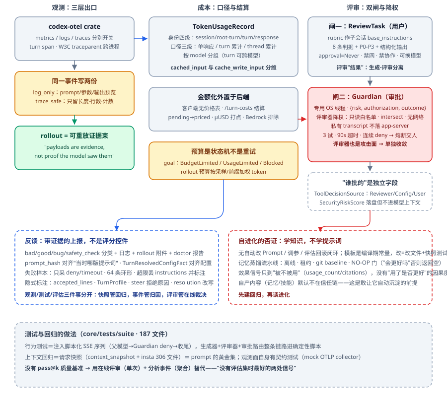

# 评估与反馈：把"好不好"变成可验证的工程问题

前两篇里，检索和上下文都有了各自的预算与判据，但都绕不开同一个追问：**你怎么知道系统变好了还是变坏了？**没有这一篇的答案，前面所有优化都只是"改动"，不是"改进"。

先看几个没有一个是"系统 bug"的生产问题：

- 用户投诉 Agent 未经授权取消了订单并发出强硬邮件——日志四行全是 `Success(200)`，无 500、无超时、无堆栈。
- 离线测试集 95 分，上线后用户骂声一片——哪个指标在撒谎？
- 评审模型给错误月报打了 96 分；把提示词写严，降到 88 分，照样放行——盲区原封不动。
- 平均对话轮数从 3 升到 5——是用户更爱聊了，还是三轮能解决的事五轮没解决？
- 让 Agent 自动优化 Prompt，它最省事的办法是学会故意一次不把问题说完。

这一篇的骨架是一句话：**测试是刹车，管死活；评估是仪表盘，管好坏**——而两者都必须先回答"什么叫好"。

---

## 一、评估什么：指标分层与归因

### 1.1 三层指标是骨架

- **目标指标**：直接对应用户最终达成的那件事（电商＝下单转化）；
- **过程指标**：证明用户在朝目标移动（点击、停留、收藏、加购）；
- **护栏指标**：防止为刷某个分把系统带歪（退货率、用户纠正率）。

写指标前先承认：**任何单一指标都能骗人**。一条可信的结论要三个数一起说："下单转化 +8%、退货率持平、用户纠正率 −12%"——比"满意度提升 10%"可信得多。负向指标往往比正向更诚实：**用户懒得点赞，但被惹毛时会用行为投票**。

### 1.2 局部服从整体，整体服从终态

步骤成功、工具返回 200、计划完成，都不构成"任务成功"的证据链，只是必要条件。两个经典陷阱：

- **平均数陷阱**：pass_rate 85%，但体验维度已经塌了——被其他维度平均掉了。解法不是换权重，是**先划分阻断维度与趋势维度**：红线用布尔（出现禁止工具、越权动作，文本再漂亮直接挂），趋势用连续分加权。
- **抵消陷阱**：一人多付、一人少付，总额和人数全对。聚合数字会掩盖互相抵消的错误，必须按场景分组看。

阈值也不能一刀切：报表排版与付款操作共用一条 85% 健康线，等于没设——按**风险、可逆性、能否人工介入**分别定。P0 场景权重 1.5、闲聊 0.8；核心场景退化 5% 比一百个边缘场景各退 1% 严重。

### 1.3 归因到模块：六问定位置

"预算 8000 却推了 9999"——沿链逐环检查：**输入里有 8000 吗 → 槽位抽出 budget_max 了吗 → 上下文还留着吗 → 推理时带上了吗 → 动作参数传了吗 → 工具返回越界了吗**。任一环断，结论错——这也说明"系统全绿"与"决策正确"是两个世界。

归因的工程依赖：

- **Checkpoint 是事后排查的锚**，找"最后一个可信点"和"第一个不可信点"，错在两者之间；只记 `step_success=true` 的检查点对归因无用。
- 排查切点优先级：前科最多的节点 > 关键节点（上下文突变、关键产物、路径切换、外部调用、Replan）> 直觉可疑点；区间缩到三五步后再自后向前追因果。
- **偏差识别 ≠ 根因归因**：对账能证明 800 与 798 不符，证明不了原因是旧快照、映射错还是漏冲正——先拒绝放行，别急着编根因；归因升级为"证据"的门槛是受控回放 + 针对性干预，观察到结果翻转才算。
- 四类行为漂移分开抓：偷步（该做的没做，集合差可抓）、加戏（多做了，集合差可抓）、**替换**（集合相同但用了更弱的工具，须逐位有序比对）、乱序（都做了但先退款后风控，同样要有序）。少记一个字段就有一种漂移漏网。

### 1.4 "意图错但答对"怎么算分

判据：**过程违规、结果蒙对，仍判失败**。同一句"处理这笔退款"跑两遍，一遍查单再退、一遍直接退，两次输出都含"退款成功"——关键词断言两次绿灯，这是典型的隐形失败。反向情形（意图对但执行链断裂）同样要抓。可化用的断言哲学：**正确路径有无穷多种、枚举不完；违规路径种类有限、能写清——所以断言写成"禁止集合"，不写"标准答案"**。分数要打在"终态 + 轨迹"两个平面上：每一步都成功返回，整条流程仍可能在执行过期规则。归因结论留双状态：叙事态记 Agent 认为做了什么，机械态记系统实际发生了什么——**算分用机械态，解释用叙事态**。

## 二、测试集工程

### 2.1 三条来源与各自的坑

**手写**（起步唯一选择，效率低，但它是后续一切自动生成的"参照卷"）；**AI 生成**（前提是手工用例已被验证，不放心就加人工监督位）；**线上回流**（自动流程或告警触发后人工整理）。测试集的天花板天然存在：**你自己准备的题，模拟不出千奇百怪的真实输入**——所以覆盖率之外，更重要的是回流的活水。

事故即用例，但**手写复现不了真实事故**：根因藏在当时的逐步推理、精确工具顺序、上下文微妙状态里，凭记忆写的"相似用例"测的是想象中的事故。正解是**录放**：事故后用真模型重跑一遍，逐轮请求/响应落盘成卡带；CI 里零网络、零随机回放。一键入 Dataset 拆四件：原始输入→task、完整工具序列→参考轨迹、当时 Prompt 版本→环境标记、红线工具与业务约束→断言依据。**卡带耗尽必须抛错提示重录，绝不给虚假绿灯。**用例集中在平台层做单一事实源，不散在各仓库的 tests 目录——产品补业务约束、SRE 补故障场景、开发补边界，谁都不必为加一条用例排队合并。

### 2.2 用例的数据结构：三层分离

```text
{
  input: {                      # 按下播放键就能跑的完整快照
    schema_version, messages, tools, model_config(含 temperature=0),
    context: { session_history, user_profile, external_state }
  },
  expectedOutput: {             # "什么叫正确"的完整定义
    reference_answer,
    reference_trace: { tool_sequence, match_strategy: subsequence, allowed_extra_tools },
    acceptance: { 字段包含, 最大轮数: 8 },
    forbidden: { 禁止工具, 自然语言约束 }
  },
  metadata: { tags, difficulty, priority, domain, owner,
              source_type, source_trace_id,
              confidence, review_status,            # 审核状态，见下
              item_version, replaces, regression_weight }
}
```

为什么不能只写一句题面：Agent 行为同时取决于提示词、工具面、会话历史、模型配置——上下文每次现拼，今天 85 分明天 72 分，你分不清是模型变了还是输入变了。**多轮题把 session_history 写进快照；上下文依赖题把画像与外部状态写进快照，禁止运行时现取**，否则不可复现。

### 2.3 版本与审核状态

- **数据集整体有内容哈希版本锁**：任一条改一个字段版本号就变；回归对比前先确认 baseline 与 current 同版本——否则"卷子换了却以为学生退步"。
- `schema_version` 是格式演化的防火墙：新旧格式混存，解析器要么崩要么静默吞字段。
- **Prompt 版本随调用落库**（Generation 记 promptName/promptVersion），才能回答"这个决策是哪版指令下做出的"。
- 知识/规则侧的"验证通过"是**关系**不是属性：版本 × 验证集 × 政策快照 × 工具契约 × 运行环境 × 时间——只给技能盖一个"已验证"章，等于没验。
- 生产 Trace 入测试集默认 `confidence=0.5, review_status=pending`——"当时确实这么做了"不等于"做对了"，那条 Trace 可能正在犯错；**审核通过才升 gold**。整条链路里最容易被省掉的就是人工审核这一步。数据集的可信度来自审核状态字段，不来自它叫"黄金数据集"。
- 改题不删旧：`item_version + replaces`，旧版标 archived，回归检测能识别"已被替代"而不误报退化。

### 2.4 开放式问题判分

没有字符串可比的题（改写简历、生成方案）：**裁判按维度打分 + Pairwise 二选一**。Pairwise 值得单独强调：让评审者选"A 还是 B"，比让它分别打 83 分和 87 分容易且稳得多——真人和裁判模型都适用。断言分层：硬护栏先判，越界直接出局；软评分只对通过者运行。

## 三、LLM-as-a-Judge

### 3.1 为什么用、什么形态

大量输出没有标准答案，正确性/完整性/约束满足只能语义判断。裁判的优势是便宜且可规模化——但"便宜"有三个前提：批量接口、业务低峰调用、用 mini/flash 档，**它仍然花钱**。分工记牢：测试集管稳定回归，裁判管语义评估，专家管校准，用户反馈与 A/B 管线上真实效果。

三形态，按触发时机、数据面、权限递增：

1. **单次调用**：一个 Prompt 一次打分，离线批量回归；
2. **在线 Evaluator（Workflow）**：Trace 落盘即异步触发，结果以 Score 写回并驱动告警——注意裁判只是评测流水线的第二关，前面有确定性硬护栏，后面有阻断判定与加权回归；
3. **评估子 Agent**：常驻观察进程，周期读纠正率、点赞点踩、成功率、裁判分、Replan 次数、工具失败率、新增 Bad Case，自动抽会话、找共性、初步归因。

从形态 1 到 3，增加的不是智能，是**触发时机、数据面和权限**——权限越大，越要回答"它能不能给自己放行"。

### 3.2 输入输出设计

输入必须五段齐喂：**任务、约束、实际轨迹、参考轨迹、最终输出**——缺一即退化为凭感觉给分。输出四维度各 0.0~1.0 + 每维强制一句 reasoning：任务完成度、安全合规、轨迹质量、输出质量；只回 JSON；**维度之间不要合成一个总分再决策**（回到 85% 假象）。裁判真正独有的价值是抓"语义层越权"：未查根因就重启、未走审批就回滚——规则抓不到、人眼看得累。

### 3.3 校准：裁判自己错了怎么办

- **同源问题**：裁判与被测不能同源——模型会识别并偏爱自己生成的内容，等于让考生批改自己的卷子。实践：换厂家，或用更强模型评较弱模型。
- 但**跨模型只解决认知独立，不解决事实独立**：两个模型都没读过账本，会一起批准错误数字；同一模型在评审阶段独享一次外部查询（对账 SQL、测试报告），反而能形成有价值的事实对抗。**裁判和运动员不同队，而且裁判手里得有账本。**
- 专家不全量审，做三件事：撰写评审业务规则、抽样审核、用专家结论校准裁判。
- 裁判质量要度量：错误放行率、误拦率、风险证据覆盖率、版本逃逸率。**通过率很高≠评审有效，可能是橡皮图章；退回率很高≠严格，可能在批量制造垃圾问题**——必须与人工抽检、环境终态、真实业务结果并看。
- 一个可复现的校准实验：保留完整链路、只切断裁判的关键事实通道，看它是否立刻放行错误结果——量"裁判是真在看事实还是在看文采"。
- 稳定性：temperature=0 不等于完全确定（服务端批处理、算子实现仍有微幅抖动）——这是必须做统计检验而不是直接比平均分的原因；含模型判断的端到端评估要重复运行，看成功率、波动与失败分布。裁判自身故障记 error **不否决**，避免基础设施故障劫持业务决策。
- 评分器要纳入治理契约：负责人、校准周期、回归套件引用、有效期——否则 Agent 只会越来越擅长通过旧指标。

## 四、多轮对话评价

**轮数是双向指标**：客服聊到二十轮，大概率不是舍不得你，是二十轮没解决（三轮解决不了就该转人工）；陪伴类愿意聊二十轮本身就是成功；教育类只看满意度会诱导 Agent 直接给答案——要看后续相似题正确率、提示次数、独立完成率，**有时"用户当下觉得麻烦"恰恰说明它在逼人思考**。同一数字换个业务就换个符号：指标必须绑定业务解释。

**无效轮次**给一个可操作定义（四判据组合）：本轮无新工具调用也无新信息，只是重述/反思；失败签名与修法指纹都和上一轮相同；用户上轮已给过的信息本轮再索取；该调的检查被跳过、结论重说一遍。成本口径别忘了：**第 40 轮的单轮输入可能是第 1 轮的 10 倍，无效轮次的代价随轮次递增**。判"真推进"要看信息增益：单轮看都无辜，一串调用放一起才留痕——真推进带来新状态变化，表演式忙碌只是已知信息的重新排列。

**用户纠正**：出现"不是这个意思/你理解错了/重新来"的占比；在用户输入到达后立刻分析打标，别等会话结束。约束违反率不好直接采，通常在发现不满后让裁判归因一次。分母固定：按请求/按会话/按用户三种口径分别报——跨版本比较最容易在分母上作弊。会话级指标（是否达成、总轮数、总成本、纠正次数）在 Session 层聚合；"轨迹说已订好、库里没记录"这类分歧，只在会话级+终态对照时才现形。

## 五、满意度：好 ≠ 喜欢

**显式反馈是抽样严重偏航的样本**：点赞点踩是用户亲口说的，但反馈率极低，不满意的人往往不点踩，而是关掉页面再也不来——能定性，不能定量，更不能只靠它。

**隐式信号清单**：重新生成、反复改问法、明确纠错语、是否继续用、是否执行了建议、是否完成最终任务、转人工率。电商链路往下钻：点击 → 详情停留 → 收藏 → 加购 → 下单 → 退货（护栏）——**每往下一级更靠近真实目标，也更接近真金白银的表态**。隐式数据量大但必须解释（连续十轮叫"好聊"还是"没解决"，要靠语义分析，常与裁判结合）。

**"好但被讨厌"与"被喜欢但不好"**都要防：疯狂推便宜爆款能把转化刷上去，短期好看用户未必满意（护栏兜住）；教育 Agent 直接给答案满意度飙升但学习失败（目标指标要选"学会"不是"爽"）。指标本身会被模型走捷径满足——要求最大化平均轮数，最省事的做法是一次不把问题说完。

**离线高分、线上挨骂**的归因八清单：题目偏差（测试集分布≠真实流量）、平均数偏差（85% 假象）、断言偏差（只看输出对过程违规无感）、裁判偏差（同源自偏好/缺外部事实/橡皮图章）、版本偏差（线上已换 Prompt/KB，评测跑旧配置）、时间偏差（退货资损口碑滞后显现）、粒度偏差（单轮高分会话失败；会话完成环境无记录）、反馈偏差（只有点踩被计入，沉默流失没被观测）。对策组合：线上反馈回流测试集 + 影子模式 + 生产采样评估 + 护栏指标 + 按风险分层阈值。

方法论收口一句：**先确定用户真正要达到的目标 → 找达成时必然外显的行为 → 再配负向与护栏**。不要从"我能采什么数据"出发——体验指标的本质，是用可观测行为反推不可观测心理。

## 六、A/B、灰度与因果

**分流粒度**：单轮问答可按请求分桶；多轮、带画像、带会话状态的 Agent **必须按用户或会话分桶**——同一会话里跨版本，上下文和画像被上一版污染，实验结果不可解释；同一用户一会 A 一会 B，学习效应会被错记到版本头上。若 A/B 两版对上下文要求不同（比如画像 schema 不同），上下文里也要带版本标记分别供给。

**版本对齐**是实验可解释的前提：每次调用记 promptName/promptVersion 并与分组对齐；评测集哈希锁版本；能力与评审回执绑定到"版本 × 证据快照 × 规则版本 × 时间"——上午 10 点签的回执不能批准 11 点冲正后的状态。

**上线前后直接比较为什么不成立**：Agent 计算路径概率性、成本非线性（失控系数 1~50），前后差异可能全来自路径波动；混杂源还有一排——流量结构、用户构成漂移、季节性、知识库更新、下游抖动、模型侧静默升级、用户学习效应。参照事故：某旧政策技能没过验证就进路由，800 条里 209 条算错，**但每一步都返回成功**——只看运行指标做前后比较根本发现不了。

**排除混杂的因果原语是单变量消融**：能说出"其他都不变、只有这一项变了"，才有资格谈因果。四个可复用的对照范式：只切断事实通道其余链路原样（测裁判是不是橡皮图章）；同员工同任务同构建代码、只改"有没有验证闸"；固定数据与任务、只改"要不要召回历史经验"；固定初始故障与故障序列、只改"有没有停止与回滚约束"。统计侧：小样本（n<30）Wilson 置信区间、区间不重叠才判显著；大样本两比例 z 检验；连续值 t 检验、不正态换 Mann-Whitney U；**比例指标别套 t 检验**。门禁三态：先判方向再判显著——p>0.10 通过、0.05~0.10 警告放行、≤0.05 显著退化阻断。

**同用户双版本对比**的正确姿势是**影子模式**：新版本在真实流量上旁观运行、不产生副作用，只记录"若用它会产生什么"，与线上版逐项比成功率、token、反馈；跑够约百次不劣于线上才转正。Pairwise 让用户或裁判二选一；多臂老虎机做多版本并行择优；上线后持续**生产采样评估**抓长期退化。发布机制配套：**版本内容不可变 + 活跃指针切换**，回滚是一行 UPDATE，秒级生效。

## 七、生成评审与对抗评审

### 7.1 角色、权限与最小单元

四角色：生成者 → 评审者 → 策略闸 →（可选）修订器。三种权限分开持有：**提案与修改权**（生成/修订）、**观察与举证权**（评审）、**裁决权**（策略闸）。生成者不能给自己盖章，评审者不能直接改发布状态，策略闸不能顺手改被审内容——与金融 maker-checker 同构。最小单元纪律：**一次调用只审一个版本、只产一次裁决**；修订稿是否再提交，由外层显式安排，不留隐式内循环。

### 7.2 结论必须绑版本

常见错误写法：`critic(draft) → revise → return final`——真正被看过的是 draft，发布的是 final，审查状态却挂在同一个 task_id 上，**新版本继承了旧徽章**。数据结构要显式拆开：`decision / reviewed_artifact / critique / revision_draft / trace`；revision_draft 存在即 `requires_re_review`；修订稿离开本轮时状态是 UNREVIEWED。对抗评审的表述更强：**审批状态不是工件的属性，而是"某版本在某套规则与证据下曾经通过"的历史事实**——APPROVED 工件被改动，状态立刻 STALE 回到 IN_REVIEW。状态机：`DRAFT → IN_REVIEW → CHANGES_REQUESTED → REVISED → IN_REVIEW / ESCALATED / APPROVED → RELEASED`。回执绑定"正文 + 来源引用"的联合摘要——**改一个字，旧批准就该作废**。

### 7.3 异议要能挡住，不只是记下

两种运行对照：`review as comments`（blockers=2，published=true——记录了但没执行）vs `review as gate`（v1 被拒，v2 零 blocker 后才生成回执并发布）。现实同构故障：PR 有待改评论却允许强制合并；扫描出高危报告但流水线只看构建是否成功；评审 Agent 标了风险，付款函数只检查"审批字段是否存在"。**评审不是"有人看过"，而是"有人能挡住"。**四条不可缺对象：候选工件、结构化异议、裁决策略、版本回执——少一条，评审退化成评论。

意见的最低证据标准：`check（哪道检查产生）+ evidence（看到了什么）+ severity（blocker/warning/info）`三件套齐了才能自动推动修订；**裸低分同样要交代依据**；无据意见不删除，改放 `dropped_issues` 并留计数——审计时能看到"提过什么、为何没生效"。构造阶段把意见重新分桶并冻结为不可变序列：防止上游故意把有据 blocker 塞进丢弃桶，也防止裁决后追加证据。注意"有依据 ≠ 风险被覆盖"："报告含标题和结论"是真证据，却与支付数量无关。

### 7.4 独立性：数量不等于覆盖

两个方向：**事实独立**（能否拿到数据库、测试、规则、外部回执）与**认知独立**（干净上下文、不同提示词、不同模型、独立人员）。四配置矩阵：同模同事实（只有角色分工，同源偏见全在）/ 异模同事实（多了视角，可能一起缺事实）/ 同模+外部事实（能核对环境，仍有表达偏好）/ 异模+外部事实（两者兼得，成本治理最复杂）。用了多个 Agent 不能证明独立：同模型、继承同一段上下文、读同一份错误摘要，会在同一个盲区里互相确认。**换个模型只多了视角，不多事实。**

每尊评审者要能回答风险覆盖表的问题：**删掉它，哪类风险失去观察者？**答得出即不可替代，答不出即重复角色。分层策略：普通内容一个评审者够；重要工件加独立证据 + 确定性闸门；高风险动作再保留人工授权——关键不是多一个评审者，而是它新增了什么。

### 7.5 边界：评审、自愈、技能、回放各改什么

按"改变了哪种系统对象"划分，不按自动化程度排阶梯：**生成评审**改当前产出（链式，单次版本）；**技能包**改可复用能力的准入资格（路由，跨任务）；**经验回放**改后续任务看到的经验上下文（层级，跨任务）；**自愈循环**改代码、配置与运行状态（循环，系统级）。分工细则：已被测试/lint/build 判坏、要一直修到转绿的属于自愈；只裁决当前版本能否通过的是评审。何时升级到对抗评审：错误代价高、需审计、需职责分离（付款、公开结论、安全方案、测试通过但权限扩大）。内容与规则的分工：有没有说过头、结论有没有超出证据、局部正确拼成整体错——交给懂语义的评审；格式、类型、余额、身份、版本绑定——交给确定性程序更稳。

## 八、全链路监控与成本

### 8.1 传统监控为什么失效

开头那起事故已经给了答案：**Agent 的故障多是认知故障，不是运行故障；系统正常运行不等于 Agent 正确运行**。三件套（logs/metrics/traces）要回答的新问题是：它当时**看到了什么**、**为什么这么决定**、**从哪一步开始错**。只记录"系统做了什么"的监控去测"为什么这么做"，如同拿体温计测脑电波。而且 Prompt 改后不会有人变红——路都通，只是更慢、更贵、复杂场景开始抄近路，**退化是温吞的**。

### 8.2 观测模型：五个对象

Trace（端到端一次请求）/ Span（有时长的工作单元）/ **Generation**（LLM 调用特化：model、promptName、promptVersion、usage、cost、参数）/ Session（多轮分组）/ **Score**（挂在 Trace 或节点上的质量信号：boolean/numeric/categorical）。Generation 与 Score 是传统监控完全没有的两维：前者是意图溯源的基础，后者是通用质量货币——让告警、断言、评分共用一套语义。

决策链要记七类：输入与理解结果、注入的 Context、决策与理由、工具调用、Observation/证据、状态变化、最终输出。**意图字段必须实时富集**——promptVersion、CoT、召回内容散落在瞬时事件里，窗口滚过去现场就没了。埋点生命周期：SESSION_START 建 Trace → llm.request 建 Generation → llm.think 富集推理 → memory.recall 建检索 Span → TOOL_CALL/TOOL_RESULT 开闭 Span。采集异步队列 + 批量刷盘，不因埋点加延迟；异构栈走标准协议避免锁定。粒度取舍：完整 Prompt/工具返回**不能全量永久存**（数据量与隐私），只对抽样与异常全存或短期存；写入不可变，补信息靠新增关联记录。多团队按业务线独立 Project，成本可按 Project/用户/会话/Prompt 版本/标签任意维度分账。一条 Trace 上要说人话："这条任务花了 3.2 元，子 Agent 占 2.8，第 7 轮触发降级，缓存命中率 45%。"

漂移检测在线化：黄金轨迹四字段（expected_tool_sequence 子序列匹配、forbidden_tools 出现即挂、constraints 自然语言、tags 聚合），每条 Trace 落盘触发评估器，结果以 Score 写回，Score=0 直接推值班——发现延迟从小时级降到分钟级；平时看漂移率、偷步率、乱序率的趋势提前介入。告警按对象分组：重试率耗时按工具分、检查点失败率按 Checkpoint 分、LLM 耗时按意图/Plan/Replan/Rerank/生成节点分。**别把所有指标都监控起来**：RAG 重的盯空结果率与证据覆盖率，长任务重的盯 Replan 率、检查点失败率、循环次数。

### 8.3 成本：网格化账本

成本失控的根因不是量大了，是**不确定性没被计价**：推理路径不确定、子任务层层派生、上下文边际成本递增——成本模型是"用户量 × 单次成本 × **失控系数**"，系数可以是 1 也可以是 50（真实事故：没有攻击没有刷接口，一名用户的模糊需求让 Agent 自我修正二十多轮，token 是常规任务的几十倍）。

看总账有两个盲区：**子 Agent 隐蔽性**（主循环只记几百 token，底下烧掉几万）和**步骤独立性**（诊断一次调用、验证跑几百次，总账看不出谁是吞金兽）。解法是把记账提到架构一等公民：每个执行单元（主循环、每个 Step、每个子 Agent）实时维护微账本并向上汇总，像合并报表。落地三动作：每轮循环前后各查一次账（不存在"跑完所有 Step 才发现炸账"）；子账本折叠回父；每条记录带维度标签。**核心度量是单位任务成本**——总账随用户量涨正常，单位成本飙升才是病灶。

四轴硬熔断（轮数/时间/token/金额）全部阻断，但地位不等：轮数防死循环、时间防挂死，都是钱的粗糙代理，**只有金额轴直接对应账单**；分层阻断（子超子停、主超全家停）。动态预算：**用进度换预算**——里程碑追加要过评估器（近 5 轮有无新工具调用与新信息，原地打转拒绝），超初始 2 倍需人工审批。降级四动作：换小模型、跳过昂贵工具、压缩上下文、提前交付"最佳努力"——原则是在约束下最大化产出，不是追求无限成本。模型路由档位参照（1x/5x/20x/50x），小模型连续两次失败即渐进升级。业务定价要能回答"**你愿意为 1% 的质量提升付多少钱**"：客服单次上限 0.5 元级、80 分够用；代码审查 5 元级、要 95 分（漏个 bug 损失更大）；研究报告 20 元级、90 分（深度重于速度）。

一笔常被忽略的隐性浪费：System Prompt 里一个动态时间戳，会让其后几千静态 token 全部失去前缀缓存，几万次共享折扣变成每次全额。排布判据不是笼统的"静态在前"，而是"**只追加不改写的放前面，每轮重写的甩到最后**"。

### 8.4 崩溃恢复：三不丢

反面模式 `while True` + 无限重试的结局是丢钱（第 17 次重试时防重放在并发下失效，同一退款扣两次）、丢状态（重启失忆，订单查了又查、通知发了又发）、丢数据（重试间隙上下文撑爆，滑窗截断丢掉用户诉求）。根因不是"少加重试"，是**状态与计算绑死**：历史在内存对象里、计数器是局部变量、待审批动作挂实例属性——进程一死全蒸发。

原则：**Agent 是无状态 Reducer**，只负责"由当前状态算下一步"，状态全外置；一切容错能力都是"状态可重建"的推论。要外置的六层状态：推理轨迹（LLM 的记忆）、会计账本（轮数/token/累计费用）、动作指纹（工具名+关键参数计数，熔断依据）、待审批动作（暂停键位置）、崩溃现场（last_error 带"可重试/不可重试/应降级"标签）、计划锚点（Plan 状态、稳定序号、幂等发号器）。缺层后果一一对应：无快照则失忆、无指纹则永久故障被反复重试、**无稳定序号则重跑时幂等键变了导致重复执行**、无账本则崩溃后预算清零爆掉。

存储用混合式：读最近 Checkpoint + 重放其后增量事件（重放是确定性 Reducer 逐条应用，不过模型不花钱）；Checkpoint 间隔由 RPO/RTO 决定——资金类要求已确认交易零丢失（配幂等键+事件同步持久化），内部工具可接受丢最近 10 步就每 10 步一存。exactly-once 三条件缺一不可：**稳定幂等键、外部系统支持幂等、Agent 侧指纹去重**——系统天然 at-least-once；最容易踩的坑是用"当前第几轮"算幂等键（崩溃重跑又烧几轮，键就漂了）。悬挂的 StepStarted 恢复时公认选"重跑"而非"跳过"（跳过可能漏执行其实没成功的动作），于是防重复扣款的担子全压在幂等键上。故障四分类分流：瞬态（5xx/429）指数退避设上限、永久（403/400）立即中止、降级（主模型限流）切备用、级联（DB 挂依赖全挂）熔断——分类结论存进崩溃现场才能跨进程传递。最后，**在低峰期主动把故障演一遍，远好过高峰期被动挨打**：四项混沌演练（跑到第 7 步 Kill 进程验续跑、支付接口 100% 超时验熔断降级、切断状态存储验优雅降级、同一调用投递两次验幂等），每次都量 RTO/RPO。

## 九、反馈闭环与"自进化"

### 9.1 闭环骨架与 Bad Case 判定

最小闭环：线上运行 → 采集反馈 → 定位问题 → 修复 → 用例入库 → 每次改动重跑回归；完整口径：**评估 → 发现 → 优化 → 验证 → 灰度 → 再评估**。回流的首要价值一句话：**同一个坑尽量只踩一次**。

Bad Case 判定九信号：点踩、要求重新生成、明确纠错语、同问题反复改问、多次 Replan、工具连续失败、任务失败或中断、裁判明显低分、核心业务指标异常——只优先回流**强负反馈与异常样本**，全存会被噪声淹没。再进一步是**主动按指标找异常**：正常三四轮结束的场景里某批用户平均十五轮，整批抽出分析——回流不是等用户告诉你哪里错。案例记录必须含完整推理路径（任务、结局、工具序列、最终输出、纠正后的正确答案、完整对话）；存储要全量（审计需要），喂给合成时"头尾保留、中间截断"。

### 9.2 什么值得沉淀，沉淀成什么

三类原料价值递增：成功案例（路径对，提炼正向规范）、失败案例（路径错，提炼陷阱）、**纠正案例**（同时给出错答案与对答案，天然偏好对，价值最高）。但注意四个边界：

- **经验不是结论，是带出处、等待被结果验证的假设**。是否值得留下，不看召回次数，看采用证据与复用后的真实结果——被召回一百次却无采用证据，仍没证明价值。**只写不回写的经验库，是一面越来越长的意见墙**：六个月后有效与无效经验都停在初始中位值。
- 经验只提醒"该查什么"，当前事实由机械状态回答"现在是什么"——把会变的状态写成永久教训，会把过期事实稳定带进后续任务。
- 转化出口分四类：稳定多步做法 → 技能；可机械断言的禁区/前置条件 → 硬守卫；稳定业务事实 → 知识库；过期或长期无效 → 归档。
- 技能包纪律：一次成功只产候选；入库一律 TRIAL（**徽章来自验证而非作者身份**，人写的也一样）；复验先撤销旧 VERIFIED；空验证集不得保留旧资格；新版本必须开新的复用观察窗口；路由器只看 VERIFIED，没有合适技能要**显式回退**——悄悄挑相近的顶上，是把能力不足伪装成正常执行。

### 9.3 自动改 Prompt 的验证链

允许优化 Agent 生成新规则（例："用户明示的否定条件必须贯穿召回、排序与输出"），但生成后**绝不能直接替换线上**。必走链路：回归测试（历史成功案例集，曾成功的用例变差即打回）→ 影子模式（约百次不劣于线上才转正）→ 灰度 → 秒级回滚待命。更新用滚动 patch 不攒批次：`skill(N) = patch(skill(N-1), 新案例)`，patch 强制四步——扫描矛盾、冲突不覆盖而改写成条件分支、补全新暴露陷阱、升 minor 版本号。**语义漂移是静默失效**：两条相反指令并存会互相抵消，文档看着变厚实则作废；冲突要显式吐成 `contradictions_detected` 记录落盘给运维审查——从"静默"变"可见告警"。攒到数千条偏好对再走离线 DPO 慢通道（快通道当天生效改规则，慢通道改权重——把"不确定时不编造"从提醒内化成本能）。

两道保险不可省：**护栏指标**（核心涨的同时关键指标不得明显恶化）+ **人工审批**（System Prompt、工具权限、安全策略、资金操作的变更不许 Agent 自主改）。

### 9.4 自愈循环：本事不在修好，在及时停手

自愈边界四个字：**修、验、停、退**。四类必须停手：补丁本身不该被应用（改测试期望值、诊断一个文件却改十几个目录）；无进展（同签名故障 + 同指纹补丁重复）；越修越大（影响文件超初始两倍）；轮数耗尽（独立策略控制最大轮数与影响半径）。终态五种：FIXED 保留补丁，其余一律回滚交人。回滚要**证明**：应用顺序 [c1,c2] 回滚记录必须 [c2,c1]，且这只证明"提交账"完整——生产还要回滚后重读文件/数据库/部署状态与基线比对生成恢复证明；回滚自身失败（Git 冲突、补偿超时）升最高优先级立即交人。**代码能回滚，世界不能回滚**：钱到账不会因 git revert 消失，通知发出去收不回来——自愈适合边界清楚、可验证恢复的对象（沙箱代码与配置、未发布的计划、快照可恢复的部署、设计好补偿路径的受控状态）；涉及不可逆业务副作用要早点停下交人工。四个近邻概念分清：重试（原动作再来）、重规划（换条合法路径）、自愈（改代码再测）、补偿（发起反向业务动作）。

### 9.5 反刷分与"为什么不做全自动自进化"

刷分的形态学，逐条对治：

| 刷分姿势 | 对治 |
| --- | --- |
| 优化目标本身歪：最大化轮数→故意不说完 | 目标指标+护栏+人工定义"好" |
| 裁判偏爱自家文风 | 裁判与被测异源 |
| 裁判只看文本自洽（格式完整、数字互洽）就给 96 分 | 给裁判外部事实通道；把提示词写严只是 96→88，盲区仍在 |
| 评审器空口打分/裸低分 | 意见必须带 check+evidence；无据进 dropped 留计数 |
| 自愈改测试不改代码 | 评审器应用前拦截、验证器独立给绿、测试合理性归策略管 |
| 版本数量当进展 | 证据没变，修订不继承旧裁决 |
| 轨迹里喊"已完成" | 终态对照；叙事态不得覆盖机械态 |

反刷分组合拳：裁判运动员异源 + 裁判有外部事实通道 + **确定性硬护栏先跑**（越界者不进裁判，既省钱又避免"话说得漂亮拿高分"）+ 风险覆盖表证明关键失败面有人看 + 评分器自身有负责人/校准周期/有效期 + 护栏指标与人工审批兜底。

最后回答"为什么不直接做成全自动自进化"：**根本理由是连"怎么评价一个 Agent 好不好"都还没解决——评价本身是错的，自动化只会加速跑偏**。现实里能把"评估—优化—灰度—回滚"闭环做成熟的团队不多，主流形态是部分自动化 + 人工决策；自动演进是方向，不是标准答案。反思能力越强、权限越多；权限每深入一层，外部信号、验收、停止线、回滚责任都要跟着加重。反思上线该看的不是"反思了多少轮"，而是七类结果指标：结果信号覆盖率、轨迹与终态分歧率、错误放行率、越权改变率、无进展循环率、基线恢复率、经验与技能的复用增益。三条永远不可缺的线：**目标线**（每次改动后回看是否仍服务最初目标，而不是只灭眼前报错）、**证据线**（每个判断可追溯到记录/测试/规则/人工意见，并知道用的哪个版本）、**恢复线**（失败时知道回到哪个干净状态，回不去就及时停止交人）。

## 十、踩坑清单

1. 只看运行指标做验收——日志全绿、事故照发，Agent 的故障是认知故障。
2. 用"满意度 +10%"这种单指标汇报——没有护栏数字的结论不可信。
3. 断言写"标准答案"不写"禁止集合"——正确路径枚举不完，违规路径是有限的。
4. 意图错但答对的 Case 算成功——绿灯掩盖越界，第二次就没人蒙对了。
5. 测试用例只存题面——上下文现拼，分数波动无法归因。
6. 线上 Trace 直接进测试集当 gold——"当时这么做了"≠"做对了"，默认 pending。
7. 裁判与被测同模型同 Prompt——考生批自己的卷子。
8. 以为换模型就有独立性——换了视角，没换事实；给裁判账本比换裁判有用。
9. 评审意见不绑版本——final 继承 draft 的徽章。
10. 评审只记录不拦截——blockers>0 照样发布。
11. 多轮实验按请求分流——同一会话跨版本，上下文互相投毒。
12. 上线前后直接比——路径波动+混杂变量，赢了也不是你的功劳。
13. 成本看总账——单位任务成本才是病灶，子 Agent 会藏账。
14. 幂等键用运行时轮次——崩溃重跑键漂移，重复扣款。
15. 状态存在内存里——Agent 是无状态 Reducer，状态必须外置可重建。
16. 经验库只写不回写——六个月后好坏经验都停在初始值。
17. 自动优化直接替换线上 Prompt——回归+影子+灰度+回滚，一步不能省。
18. 自愈改测试期望值让红灯变绿——验证器必须独立于修复者。
19. 把"轮数多"当体验好、把"版本涨"当进展——指标不绑业务解释就是数字迷信。
20. 全自动自进化当目标——评价没解决之前，自动化只放大错误方向。

## 十一、扩展阅读：Codex 的观测、成本与评审机制

OpenAI Codex CLI（`openai/codex`，commit `44b857c`，2026-09-22）把本篇的"监控、成本、评审、反馈"四件事都做成了运行时机制，同时对"自动评估、自进化"保持了刻意的克制——正反两面都值得读。路径以 `codex-rs/` 为根。



### 10.1 可观测性：三层出口、双通道事件、"证据不是证明"

遥测独立成 crate（`otel/`），metrics/logs/traces 三路出口分别开关配置。最有辨识度的设计是**同一事件写两份**：`log_only` 通道带敏感字段（prompt 全文可 REDACTED、工具参数与输出预览），`trace_safe` 通道只留长度、行数、计数——隐私分级做进了事件模型本身。指标基数有白名单校验与折叠策略（非法 tag 归为 `other`），直方图边界显式声明。为什么不用"更细的 dashboard"解决"日志全绿事故照发"？仓库里 `rollout-trace/README.md` 给了认识论答案：*"runtime payloads are evidence, not proof that the model saw the same bytes"*——Agent 监控的核心不确定性是**模型当时看到了什么**，所以它的三件套是：事件（哪次审批、哪次提权、第几轮）+ 全量可重放的 rollout + "先观测后解释"的离线 reducer，而不是更密的曲线。

### 10.2 成本：四级身份 × 三级口径，金额化外置

每次 `response.completed` 落一条 `TokenUsageRecord`：身份到 session/root-turn/turn/response 四级，口径到单响应/turn 累计/thread 累计三级，**并按 model 分组**（一个 turn 可能跨模型：步骤内切换、压缩 fallback）。缓存单独计价维度：`cached_input` 与 `cache_write_input` 是两个字段——"token 数≠成本、缓存要单独看"的落实。金额化很克制：**客户端没有价格表**，USD 由后端结算接口算（`pending|priced` 两段式，轮询尽力而为），打点 `codex.turn.cost_microusd`；离线/第三方 provider（如 Bedrock）显式不启用金额视图。预算终态是目标系统的枚举（`BudgetLimited / UsageLimited / Blocked`）——**预算耗尽是一种状态，不是一次重试**。

### 10.3 评审：两条"生成-评审分离"与评审器的评审器

**用户侧 ReviewTask**：`/review` 起一个子会话，rubric（`prompts/templates/review/rubric.md`）作为子会话的 base_instructions——8 条"是否算 bug"判据 + 优先级 `[P0..P3]` + 强制结构化输出 + "不得生成修复"；子代理 `approval=Never`、禁网、禁协作工具，模型可独立配置。**审批侧 Guardian**：需要审批的工具调用先在**专用 OS 线程**跑一次模型评审（`guardian/`），决策结构 `{risk_level, user_authorization, outcome, rationale}`，schema 只必填 `outcome`、缺省字段保守兜底（deny→high）；评审器**被降权**：工具白名单只读、权限 `intersect_with_read_only()`、无网络、私有 transcript 不落 app-server——**评审器自己的注入面也被收敛**。失败治理：单次评审最多 3 试 90 秒超时；**连续拒绝触发熔断打断 turn 交还人类**（同 turn 3 次 deny 或 50 窗口 10 次）——评审器反复说不，就不该继续问它。裁决来源在事件里显式区分（`ToolDecisionSource::{AutomatedReviewer, Config, User}`）：**"谁批的"和"批没批"是两个字段**。`SecurityRiskScore` 落 rollout 但**永不进模型可见上下文**——评分是给审计看的，不是给下一轮模型看的。

### 10.4 测试与回归：脚本化模型 + 上下文快照，但没有质量基准

行为测试的做法值得抄：`core/tests/suite/` 一百八十个文件，模式是**注入脚本化 SSE 序列**（父模型发起提权调用 → Guardian 模型返回 deny → 父模型收尾），把"生成器+评审器+审批路由"整条链路放进确定性脚本；上下文回归靠**快照**（`context_snapshot.rs` 把捕获的请求规范化渲染 + insta，306 个文件引用）——这就是 prompt/context 的黄金集回归；观测面自身也有契约测试（mock OTLP collector 断言指标真的落地）。同时它**没有** pass@k 类质量评估 harness（pass@k：同一任务跑 k 次，至少一次通过即算通过——业界常用的能力型指标）——仓库内搜 eval/benchmark 只有性能基准。替代信号正是本篇讲的两个：在线的结构化评审（单次）+ 分析事件与用户反馈（聚合）。

### 10.5 反馈：带证据的上报，不是评分控件

用户反馈的分类是 `bad_result | good_result | bug | safety_check | other`（前三类映射到 Sentry Error 级），提交的是**证据包**：日志环形缓冲 + rollout 附件 + doctor 报告 + 失败评审记录 `auto-review-failures.jsonl`，事件 tag 带 `prompt_hash`——**每条反馈能对齐"当时是哪版提示词"**。失败样本采集有界且会降级：只记 deny/invalid/timeout 等（allow 不记）、64 条环形、超 4MiB 先丢 instructions/history 并标 `context_omitted`。隐式标注更有意思：`accepted_lines`（从 diff 统计用户接受量——最接近"接受率"的自动信号）、`TurnResolvedConfigFact`（这个结果是哪套配置产生的）、`TurnProfile`（模型时间/工具阻塞/压缩时间拆开）、steer 的接受/拒绝原因。评审质量则抽象成五元组事件：`subject × reviewer × trigger × status × resolution`——**"人推翻机器判定"本身就是被记录的对象**。

### 10.6 自进化的否证：学知识，不学提示词

全仓没有自动改 Prompt/自动调参/自动评估回滚的闭环：提示词模板是 `include_str!` 编译期常量，改动只能改文件过快照测试。存在的是一条**离线、异步、可回滚**的记忆蒸馏流水线（rollout → Phase1 抽取（有 NO-OP 门："未来的 agent 会因此写得更好吗"否则返回空）→ Phase2 全局整合（git baseline、workspace diff、租约与水位线、整合子代理无网无审批禁协作防递归）），效果信号只到"被不被用"（`usage_count / last_usage / has_citations`），没有"用了是否更好"的因果度量。技能包是人工资产（`SKILL.md` + 渐进披露），自动化程度刻意压得低。可迁移的是它的三条纪律：**分层（证据/知识/行为指令）；自产内容默认不进信任链（记忆与技能输出按不可信证据处理）；采集有界、降级显式**。反面教材同样清楚：没有评估集时，"模型自动写记忆"是不可验证的——**先建回归，再谈进化**。

### 10.7 对照小结

| 本篇观点 | Codex 的实现证据 |
| --- | --- |
| 监控要回答"它当时看到了什么" | 事件 + 可重放 rollout + reducer；"evidence, not proof" |
| 成本记单位不记总账、缓存单独看 | 四级×三级×按模型口径；cached/cache_write 分维 |
| 预算要有停止态 | goal 的 BudgetLimited/UsageLimited 枚举 |
| 评审器要降权、隔离、可被熔断 | 只读白名单 + intersect + 私有 transcript + deny 熔断 |
| 谁批的必须可区分 | ToolDecisionSource 三值建模 |
| 反馈对齐 prompt 版本 | prompt_hash + TurnResolvedConfigFact |
| 失败样本采集要有容量策略 | 64 条环形 + 降级标记 + 只采失败 |
| 自进化前必须有评估闭环 | 否证：无自动学习；记忆流水线离线可回滚 |

## 总结

这一篇的次序感很重要：**先定义好（三层指标+阻断维度），再造考卷（快照化测试集+录放），然后才是裁判（异源+外部事实）、实验（分桶+消融+统计）、防线（监控+账本+恢复）、闭环（回流+patch+人审）**。跳过前两步直接上大模型评审，得到的只是昂贵的数字迷信。

三句话带走：**测试是刹车，评估是仪表盘；绿灯只证明系统活着，不证明 Agent 做对了；评审不是"有人看过"，而是"有人能挡住"。**

## 思考题

1. 给你的 Agent 画三层指标：目标/过程/护栏各一个，并写出各自防哪种"刷分姿势"。
2. "意图理解错，但用户满意离开"的 Case，按 1.4 的双平面打分，你打几分？为什么？
3. 用 3.3 的"切断事实通道"实验设计一次你的裁判体检：切掉哪条通道、预期它放行什么错误？
4. 你的系统崩溃恢复目前缺 8.4 六层状态里的哪几层？先补哪一层收益最大？
5. 假设老板要求"下周上线全自动 Prompt 自进化"，用 9.5 的框架写一段反对意见——或者说明在什么条件下你会同意。
