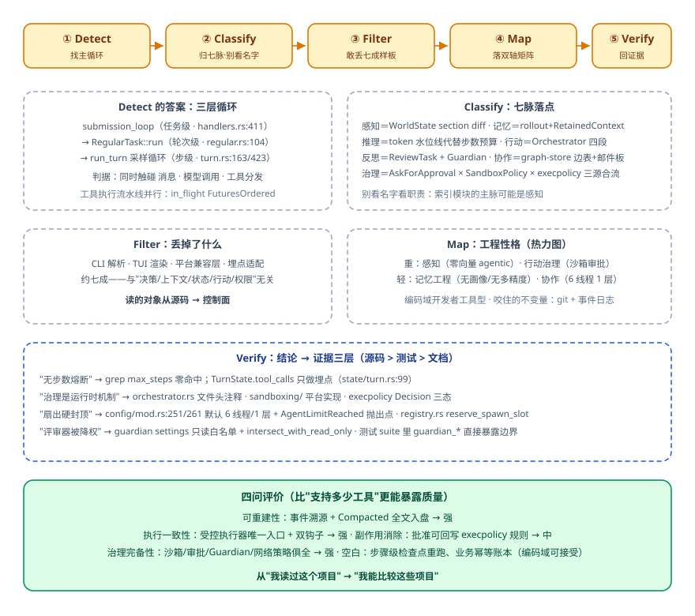

# 项目深挖与工程表达：把系统讲出深度，把源码读出判断

这一篇只回答两个问题：**别人怎么读懂你的系统，你怎么读懂别人的系统。**

前面几章攒下来的都是"做了什么"，这一篇要的是"为什么这么做、放弃了什么、怎么证明"。差距不在嘴上。判断一个讲 Agent 项目的人水平高低，从来不是听他名词堆得多密，而是看他能不能答上四句话：这个设计在哪个格子里、错误沿什么路径传播、你放弃过哪条路、放弃的代价是什么。四句里有一句含糊，对方就知道你其实没做过。

---

## 一、先立坐标系：范式之变与双轴框架

### 1.1 三代工程的分工

讲 Agent 架构，第一件事是把它跟"会写代码"分开。三代工程各管一摊，一条判据链就能说清：**第一代管"代码怎么组织"，第二代管"服务怎么在不靠谱的网络里活下来"，第三代管"模型怎样被约束着去行动"。**别把这三代当历史分期，它是三次工程权力的移交——权力先交给对象结构，再交给服务边界，最后把一部分决策交给模型，由外部结构把边界收回来。

GoF 设计模式没有死，只是**失重**了——还在那儿，仍然有用，但撑不住新的问题了。它默认四条前提：单进程、共享内存、同步调用、失败即异常。分布式把这四条逐条换掉了（网络分区、异步消息、部分失败、CAP 取舍）；Agent 又往前走了一步：**结构性决策从设计期搬到了运行期，做决策的人从架构师换成了模型。**下面四个经典模式，断点各不相同，各自都很有代表性：

| 模式 | 断在哪 | 替代件 |
| --- | --- | --- |
| Singleton | 状态不再全局共享：上下文有上限、会被压缩、每轮重置 | 分层记忆货架 |
| Factory | 动作空间在运行期是开放的：今天部署明天挂上新工具 | 按意图匹配工具描述（语义路由） |
| Observer | 推送既贵又不可靠：全推给模型，什么都没想窗口先烧完 | 模型自己决定看什么、何时看、看多深 |
| Strategy | 切换的决定权易主：修一个 5xx 的七步里没有一次策略注入，每个箭头都是运行时画的 | 策略选择搬进模型脑子里，工程负责给它边界 |

这一代新添的不可靠性有三种，得一种一种看：**输出不确定**（同一个输入跑十次，十个结果——传统重试假设幂等，模型重试可能凭空引出一条新分支，所以熔断器和幂等键要重装）、**行为不确定**（轨迹在设计期根本枚举不完）、**环境不确定**（世界不会停下来等它）。把不确定性当边缘情况打补丁，治不了这类系统；只能默认它会漂、会偏、会失控，在这个前提之下**设计结构**。

于是工程师的活变了。过去主要写功能逻辑，现在更多是**设计边界条件**：模型在什么上下文里思考、能看到什么、能调什么、什么条件下必须停、做错怎么被拉回来、做过什么由谁留痕。这一整层有个名字：**Harness——在模型思考之前、之中、之后立边界、留痕迹、做审计的结构**。再硬一点的定义是：Agent 架构 = 在高不确定性下设计有界资源的分配。嫌它绕，就记口语版：**模型负责花钱，外部结构负责管账。**token、上下文、工具调用、墙钟时间、用户信任、不可逆动作的风险，全是钱；模型天生擅长生成可能性，天生不擅长节制。

有条分界线随时可以拿来检查自己：发现错误时只改提示词，是让它"这一次别犯"；改这层结构，是设计一种机制让它"以后都没机会这么犯"。这就是工程和调参的分界。

### 1.2 双轴框架：给任何系统一个可讨论的地址

表达一个系统，最没信息量的说法是"我们用一个 agent workflow"。这话摆出去，没人知道你在解哪类问题，也没人知道你会怎么失败。换成坐标系：**纵轴认知功能**（感知/记忆/推理/行动/反思/协作/治理——它在解决哪类问题），**横轴执行拓扑**（链式/路由/并行/编排/循环/层级——能力与信息怎么流动）。完整名字必须写成"功能 × 拓扑"，这样才有唯一地址，才有可讨论的工程后果。两轴必须正交：不正交就退化成一张分类表，够不上坐标系。总纲一句话：**功能决定问题类型，拓扑决定错误传播路径。**

七脉各自是一种资源预算，缺哪一脉，就在哪一类资源上失控——所以这七条同时是体检表：

- **感知**管注意力：看到太多等于什么都没看到；
- **记忆**管连续性：每次都像初见，就没有成长；
- **推理**管不确定性：全部深度思考一遍是浪费；
- **行动**管可逆性：**推理错了可重答，行动错了要补偿，甚至不可补偿**；
- **反思**管校正：价值是把错误尽早暴露，不是让模型显得聪明；
- **协作**管分工：把上下文、工具、目标、责任切开，不是让一群程序聊天；
- **治理**管信任：**能力越强、治理越不能弱，强能力没有边界就是强事故**。

六式对应的也不是流程图，是**六种错误移动方式**，所以每一条都该问"错会往哪儿跑"。链式跑的是级联：链越长，中间格式越重要，上游偏了下游不纠正，反而把错包装得更漂亮。路由跑的是误派：分类器质量决定一切，而路由的价值在降低平均成本与风险，不在抬高上限。并行跑的是误聚合，**关键在合并而非扇出；没有好的合并，只是把噪声并行化**；编排跑的是误分解。循环跑的是误复合：核心不是循环，是停止条件、评估信号、每轮改动幅度，缺了会越改越忙、越忙越偏。层级跑的是误放大：父上下文泄漏、权限继承过宽、低层失败雪崩。说到底一句：**选拓扑就是选错误如何移动。**

用法上有一张十分钟出第一版架构的三步卡：① ASSESS，对七脉逐条打 None/Light/Heavy；② ROUTE，判主拓扑——低协作短任务走链式/路由，中等复杂多步骤走编排/循环，多专家宽任务走并行/层级，**高风险动作要治理优先，选路由/链式/层级**；③ SELECT，每个 Heavy 至少落一个模式，第一版控制在 3~7 个，超过 7 就先合并降级。目标是**最小可行的稳定组合**，不是把矩阵塞满；第一版就塞满的人，一般是不舍得删。

评审桌上最常听到的一句是"感觉不够稳"。这话没法执行，你得把它翻译回工程项，翻译成一句别人能接话的话：**"某功能 × 某拓扑缺少某个约束"**——比如"推理×循环没有停止条件""治理×路由没有审批门""协作×层级没有子代理隔离"。为什么要这个句式？功能、拓扑、约束三样一齐摆出来，对方立刻能反驳你也能补你，"那停止条件你写在哪"是个能答的问题。你要是只说"我们循环里加了保护"，没格子也没地址，聊完谁都不会记住。

顺着这个句式，评审五问就是当场要过一遍的全部动作：七脉状态各是什么？每个 Heavy 落在哪个拓扑——说不清就是还没设计，在堆能力？主要错误传播路径是哪一种——这一条直接带出测试策略？哪些格子是**刻意留空**的、理由是什么——没做长期记忆，是不需要还是忘了，空格也是设计判断，这张图追求可信度不追求覆盖率？v1→v2 的升级路径？

最后一条硬约束，随时提醒自己不炫技：**Compound Error 公理**——单步 95% 听着很高，连跑 10 步约 60%，20 步只剩 36%。多一个节点多一个出错点，多一轮循环多一次偏航机会。所以任何模式落地前都问同一句：**它是在减步数、提单步、加校验，还是让系统更早失败？四条都不沾，它大概率是装饰。**

## 二、项目叙事：三问、主线剧情、取舍与证据

### 2.1 评价标准已经迁移

市场筛人的逻辑，已经从"会不会用"变成了"能不能讲清一个 Agent 项目"：意图怎么理解、任务怎么规划、工具怎么调、上下文怎么管、效果怎么评。演示级项目、只套了一层接口的项目，现在打动不了人；听的人要的是四件事——**真实场景、复杂链路、评估指标、失败处理**。

最大的风险是只会背概念。规划、循环、检索、记忆都背得滚瓜烂熟，一问到"项目里为什么这么设计、哪里会失败、怎么评估、怎么兜底"就露馅。赌对方不懂、随便包装，遇到懂行的几轮追问即穿。靠谱路径是反着用：**以能否讲清为验收**去补做，至少讲清**解决什么问题、用了哪些组件、为什么这么设计、哪里会失败、如何评估、下一步怎么迭代**六件事。哪一条卡住，哪一条就是你还没做的部分。

### 2.2 主线剧情法

把想展示的技术点全部融进**一个足够具体的业务场景**。场景复杂度决定叙事能挂多少东西，它是主线，输入规范、意图识别、上下文、记忆、检索、评估都是支线。选场景的判据：听的人能自己想到"这里面要分很多步"。推荐系统天然合格；"问答"就不行——对方默认你检索一次就搞定了，你的复杂度无处安放。

叙事的合法性来自**运行时决策**。对方一定会追问那句："为什么不写死成流程？"

你手上的线索可以是同一句用户输入——"推荐一条裤子"。就这一句，走法能岔成六条：

- 画像齐全 → 直接检索候选；
- 画像不全、用户愿意答 → 先追问一轮；
- 画像不全、用户不愿意答 → 用历史和同类偏好出保守候选；
- 接口调不通 → 切缓存或者备用源；
- 候选全部违反硬约束 → 退回检索，而不是硬塞进排序；
- 中途追加"不要某品牌" → 更新约束，让已经生成的候选失效重算。

六条摆完，结论不用你说：**只有执行到某一步、拿到新的观察，才知道下一步怎么走。**写死流程的人不是没想到分支，是不敢承认分支枚举不完。

讲的时候记得把两轮之间的差异点出来：第二轮因为画像已经加载，上面某一条会被直接跳过——"自主决策"的"自主"二字就落在这个跳变上。最后身段放软一点，补一句"赶进度时，固定流程落地更快"，进可攻退可守。

每站只给结论句 + 留钩子，别一口气讲满。讲规划时说"**规划不是一个步骤列表，而是一个能被检查和纠偏的运行时对象**"，然后停住——他真想深挖，会顺着这句问你"那怎么纠偏"，那时再展开，比你一口气全讲完有效得多。讲失败恢复时提"对强依赖外部工具的步骤先做最小化试探"，不主动展开整套协议；讲隔离时给一句理由——"不同业务域需要的规范、上下文、工具差异太大"。钩子是让对方掌握节奏，不是让你背稿。

### 2.3 主动暴露取舍

技术栈按层次排，不要平铺；关键词的准入条件只有一条：**确实用过，且能说明它解决了什么问题**。项目叙事其实只回答三问：**发现什么难题、设计了什么机制、改善到什么程度**，其余都不用提。给自己的准入线也是三条：做得过的、能解释决策过程的、能说明数据口径的。第三条最严——数据口径说不清的那句就别写，写出去就是把把柄递到对方手里。

"取舍"怎么说才像真做过？拿执行机制的分层当范例，六档一层层摆出来：简单任务直接执行、确定性业务走固定流程、复杂任务才规划拆解、局部步骤按观察动态选择、失败时局部重试或重规划、高风险动作交人确认。

摆完必须补那句关键的话：**这六档存在的意义，是每一档都在回答"为什么不全选最高档"。**只报最高档，等于承认自己没算过成本。

多智能体同理——先讲隔离的真实收益（每个子代理只拿自己那块上下文和工具集），再讲**什么时候不该上**：复杂度没到那个地步时，多 Agent 是负资产。

### 2.4 把指标与错例讲进故事

容错三类是必讲项，一类一句就够：接口调不通（本质是降级）、数据不全（甚至用一轮循环补齐）、新用户无偏好（兜底策略）。受控重规划讲四件套：**失败点、根因点、回滚点、重规划起点**——而且失败点与根因点必须是两个点，因为**Agent 看到的报错通常不是病根**。

这个区分只能靠错例讲出来，完整模板走一遍：最终推荐全部超预算，被用户当场怼回，这是失败点。往回倒，根因既不在检索也不在排序，而是更早提取价格偏好时**错把电子类目的偏好当成了服装类目**。于是回滚到上次确认画像的检查点，然后分账：可复用的是品牌/尺码/颜色偏好，需失效的是候选集/排序/最终推荐。请注意这里做的是什么——不是把计划全丢重来，是先找被污染的状态，再决定哪些复用哪些失效，只重跑受影响部分。你要是一句"我们重跑了一遍"带过，对方立刻判断你只做成功路径。进阶一句：给每个关键中间结果记依赖，上游失效就级联标脏。

证据池按角色挑，别一律报总盘子：整包项目报日均请求与峰值、复杂任务成功率、工具成功率、首字与总时延、成本下降、人工处理量下降、转化；只做过的单模块就老实报模块级的数——意图 Top-1 与拒识准确率、检索 Recall@K、事实错误率。简介里放 **2~4 个最有业务价值的数**，堆多了反而像掩饰。

连可观测这一句也要真实，别说"我们有完善监控"这种话。就这么讲：一条链路跟踪把意图、计划、动作、观察、上下文变化、检索证据、重规划串起来，采集任务成功率/工具成功率/重规划率/用户纠正率。这句的作用不在显摆，是让对方知道**这不是黑盒**——哪一次跑坏了，你都能把它调出来看。

叙事自检十问，讲完自己过一遍：

1. 用户要完成什么任务？
2. 最初用了什么方案？
3. 在哪里失败？
4. **用什么数据证明失败**？
5. 为什么选现在这套架构？
6. **放弃过哪些替代方案**？
7. 当前方案增加了什么成本与风险？
8. 工具失败或用户改需求时如何恢复？
9. 怎样评测它真的变好了？
10. 重来一次你会改什么？

第 4 问和第 6 问最常卡住人，因为多数材料到这两处只剩形容词。收尾纪律同样重要：自己记录被追问了什么、哪里含糊、哪些判断缺数据——**发现自己在哪欠缺，才是从"会背概念"到"具备设计能力"的分界线。**

## 三、架构分层表达：每层对应一类失控

讲架构最容易的失败，是画了张"好看的图"——四色方块、箭头整齐，看完谁也不知道它防了什么。有辨识度的讲法是：**每一层对应一类失控源**。

**入口—编排—能力—基础**四层，逐层给那句"它管什么失控"：入口层把模糊自然语言收敛成离散控制信号（任务类型、品类、预算、时间窗、置信度），一句话完成"模糊到精确"；编排层负责推进、回退与断点——**不是从头再来，而是按状态机回到最后断点**；能力层是可选资产池，谁被调用要经过准入；基础层持有事实、账本与观测。

再深一层是三平面（这段最有区分度）：**叙事平面**装自然语言与推理产物，负责发散；**控制平面**装离散信号（对或错、是这张单不是那张单），负责收敛并驱动分支；**调度平面**装工作区、编排器与节点状态。为什么非要把它们拆开？**参数的记录与传递不能完全交给模型：确定性的值必须由程序机械掌控，每个参数带可审计来源（谁生成、何时、传给了谁）**——你越让它自主循环，这些痕迹越是审核依据。分层松紧的取舍标准一句话：**让计划活在代码里，让创意活在上下文里**——交易支付的路径钉在代码，科研探索的灵活性留在上下文与技能沉淀；哪层该硬，由动作的可逆性决定。

四层各自怎么讲，套路其实一样：先把真实问题说清楚，再给那句结论。

- **网关怎么讲**：真实问题不是"能接几个平台"，那是采购看的数；适配器之下还有会话绑定、身份、记忆作用域与权限域。统一入口的理由句就一句："**否则每接一个平台，就把主循环污染一次。**"这句一出口，对方知道你不是只写过转发。
- **编排层怎么讲**：先把"一轮处理"与"一次模型推进"分开命名，不这么干，治理代码就没有落点。分开了，三个挂载位才存在：请求成形前可检查本轮是否允许开始、请求阶段可改写最终请求、一轮将自然结束时可决定是否再推一步。**这比在主循环里不断加分支清晰**——分支堆到第十个，连你自己都不敢动它。
- **能力层怎么讲**：工具的本质定义是"把意图翻译成可控的外部动作"，所以六段公共管线要连着说（前置门岗 → **不可被后续推翻的终局闸门** → 包裹执行 → 后置检查 → 内容终稿 → 归一化结果），再补那句"工具是手术刀，管线是手术室制度"。准入与许可还得分离：推荐器说"合适"不等于批准了数据库访问。顺带一句**允许拒选常常比继续调排名更重要**——第一名只说明它比另两个好，不说明它能完成任务。
- **基础层怎么讲**：账本的选择就是架构主张，版本控制/事件日志/状态存储/协议历史/网关会话，五种答案五种性格。"**模型可见即必须入日志**"要成为运行时不变量；再补一句让对方点头的话：没有黑匣子，就不能放心授权。

可观测从哪句开讲？第一句就给判据：**这类故障通常是认知故障，不是运行故障**。日志全绿、没有 500、没有超时、没有堆栈，任务确实完成了——但做错了。先把这句说出来，对方才知道你为什么要给一个"没报错"的系统做观测。

评估回归同理，开场判据是**总分假象**：通过率 85% 很好看，拆开看体验维度早已崩，被平均掉了。这一句讲完，整套体系存在的意义就不必解释了——它就是别让你被平均分骗。至于流水线，顺序本身就是设计：硬护栏先跑 → 软评分只给过线的 → 阻断维度负责翻盘 → 加权回归做门禁 → 影子模式验上线 → 生产采样盯长期。顺序摆错最典型的就是软评分先跑：注定被拦下的样本，你也花钱给它打了一遍分。

## 四、源码论证：逆向五步法与工程地图

### 4.1 为什么需要方法论

读源码之前，先认三个坑，它们各自对应一种自欺。**README 幻觉**：它告诉你能做什么，不会告诉你主循环在哪、状态怎么传。**关键词漫游**：搜 agent/tool/memory，几百个文件每个看两眼，**以为在逆向架构，其实在源码景点打卡**。**从入口钻到底**：大型项目约七成是配置、日志、类型定义、序列化、兼容层，顺着调用栈走，很容易钻进一条漫长而不关键的支路，还觉得自己读得很深。

三个坑的根因是同一件事：缺"预期框架"。逆向第一原则因此是：**先知道这类系统理论上长什么样，再去源码验证它实际什么样。**五条理论预期先背下来——有主循环、有上下文管理、有工具注册与调度、有状态或事件记录、有治理边界（**只要能行动，就必须回答"它被允许做到哪一步"**）。有了这五条，问题就从"这项目有多少功能"变成"**它把模型放进了一个怎样的运行时**"。

### 4.2 五步：Detect → Classify → Filter → Map → Verify

- **Detect 找主循环**：先接受一件事——心脏往往不是 README 里最显眼的概念。手上能用的线索只有词：搜三族词（工具调用/动作/观察、循环/步骤/轮次/会话、消息/上下文/历史/状态），再从入口方向与模型调用方向交叉定位，两条线交汇的那处才可疑。判据很硬：真正的主循环同时触碰消息、模型调用、工具分发三件事，只碰一件的都是配角。产出别贪，一张不超过 10 框的粗图就够。
- **Classify 归七脉**：找到主线**先停手**。不停手的下场很具体——一钻调用栈，人就困在序列化函数里出不来了。然后逐一问每个组件在管哪一种资源。**别看名字看职责**：名字叫"索引"的模块，如果它实际决定哪些代码结构能进上下文，那它的主脉是感知、副脉带记忆；事件系统表面是日志，实为把状态变成可追加可回放的一串——既是记忆也带治理。名字是作者的修辞，职责才是架构。
- **Filter 主动丢七成**：这一步最反直觉的能力是**敢于不读**。判据一句话：**这个文件会不会改变 Agent 的决策、上下文、状态、行动或权限？**不会，它就是样板代码，划掉，不必心虚。做完这步，你读的对象就从源码转到**控制面**。
- **Map 落矩阵**：贴标签不够，要逼自己把功能、拓扑、失败模式三件事一次说清。差别在这里：说"某框架有事件日志"，这只是事实，换谁讲都一样；把它落进矩阵，就变成三个能吵的工程判断——解的是记忆问题（状态来自事件串而非散在内存）、也解治理问题（可审计可回放）、拓扑是只追加链式，好处是错误不会被悄悄覆盖，代价是日志膨胀与回放成本。产出是热力图：横看一个框架的偏好，竖看一个模式的工业普及度。效果句就那句：**从"我读过这个项目"升级为"我能比较这些项目"。**
- **Verify 回到证据**：证据分三层——源码最强（权限模块、沙箱管理器、事件存储、分发器）；**测试常被低估**，沙箱怎么限动作、子代理怎么传上下文、记忆何时写入，测试里往往写得比实现还明确；官方文档用来确认产品语义。达标句式长这样："它很重治理，因为在沙箱提供方、权限策略、事件存储三处都把治理做成了运行时机制"——注意"很重治理"后面，跟着的是三个能翻开看的位置。**产品解读可停在概念层，工程论证必须回到代码层。**

### 4.3 工程地图与选型五问

八个产品横切出**五个共同地基**：主循环／上下文管理／工具注册与执行／状态账本／治理边界。地基摆好，生产门槛五问就是照着它们逐个问人：主循环清楚吗？上下文是显式机制还是靠提示词硬撑？工具有没有结构约束、权限与失败处理？状态能否恢复、回放、审计？高风险动作的边界在哪？**五条答不上，就不具备进生产条件。**这五问拿去问别人也省力——每问一句，对方就得给机制，光给形容词过不去。

三种工程性格（开发者工具型重感知行动治理、个人助手型重记忆行动治理、重执行/多智能体型重协作与可观测）再次验证没有万能架构。**好的运行骨架不必大，但必须咬住一个关键不变量**：有的抓 Git（一切修改可 diff、可回退、责任留在版本控制），有的抓语言服务（**搜索告诉你字符串在哪，语言服务告诉你符号真正指向哪**），有的抓事件账本，有的抓插件树。咬住哪根都行，一根都不咬就是没骨架。

### 4.4 第三种读法：全插件化运行骨架

有一类实现把模块化纪律搬进了 Agent 运行时，它的三层读法值得单独学一遍：**组合层——怎么装起来；执行层——一次任务怎么走；记录层——发生的事记在哪**。

- **组合层**：没有不可替换的中心内核——模型适配、工具注册表、会话日志、主循环都是地位平等的插件，只剩极薄的装配内核（加载、卸载、依赖）。加载顺序由依赖决定，而不是由配置行序决定。难的不是加载，是**卸干净**：给每个插件一张生命周期"施工单"，定时器、连接、文件监听都得显式登记清理。配置三件套：Bundle（成套积木）/ Profile（这次启动用哪些）/ Patch（换模型、关插件、切沙箱），任何一层可按条目 ID 替换前层，一条命令打印真正要启动的插件树。
- **执行层**：把"一轮完整处理"与"一次模型推进"显式命名，权限、注入、路由、压缩、恢复、停止策略各挂各的位置，不用挤在主循环里。工具公共管线六段见第三节；终局闸门的语义就一句："这里拒了，后面的监听器不能改回允许。"
- **记录层**：会话是**类型化、只追加的事件日志**，模型历史从日志投影而非另存一份。不变量"模型可见即必须入日志"是这么落的：请求前把重新派生出的消息与即将发送的结构比对一遍，某插件塞了上下文却没写日志，**这次请求直接失败**。听着狠，但比事后查"模型为什么这么答"便宜。压缩的正确做法也在这一层：给旧账做摘要索引、追加带替换语义的新节点——**改的是当前工作视图，不回头篡改已发生的事实**。

评价任何运行骨架，有四问比"支持多少工具"更能暴露质量：**可重建性**（这一轮模型看到的完整内容能否从持久化事实重建）、**执行一致性**（所有工具是否走同一条受控路径）、**副作用消除**（插件卸载或升级失败时，已注册的副作用能否清理）、**治理完备性**（生产配置能否证明关键权限、审计与停止条件确实挂上了）。四问都在问"出事之后呢"，答不上就是骨架没咬住。

四问毕竟是脑内推演，把阅读变成判断的最后一步是动手：打印实际启动的插件树 → 挂一个声明依赖工具注册的插件 → 替换一个策略插件，观察工具调用与日志随之变化。走完这一遍，"**新能力应该挂在哪一层**"就从架构图上的抽象问题，变成你能亲手验证的判断。

## 五、学习路径与反向提问

### 5.1 四层学习模型

**工具层**：会调模型、写提示词、接一次工具。天花板是"把错误当边缘情况修"——做演示谁都能做，再套一层固定流程也不算真正的工程能力。**工程层**：能说出并搭出五条地基（主循环、上下文、工具调度、状态账本、治理边界），懂得把关键约束做成闸口与运行时检查。**业务层**：能定义"什么算做好了"——指标口径、失败分类、归因回流、灰度验证。**架构层**：能给系统定坐标、为空格给出理由、画出 v1→v2 升级路径、论证放弃过哪条路及其代价。

怎么知道自己是哪一层？四句判据各是一次升级：从"读过这个项目"到"能比较这些项目"；从"知道一个功能"到"理解一个设计"；从"这次别犯"到"以后都没机会这么犯"；从"感觉不够稳"到"某功能×某拓扑缺某个约束"。能把右边那半句说出口，你就已经站在升级后的那一层。建设顺序与学习顺序同构：**先跑通内圈（能用），再加反思（可靠），最后加协作与治理（能上线）**——顺序反了得到的是错误涌现，不是智能涌现。

### 5.2 "在试错中长出直觉"的具体含义

体感的前提，是真的把一个系统跑起来过，最好还出过事。没见过它几十轮自顾自跑、成本一路往上烧，你看那段循环保护代码大概只会觉得"不就加个计数器"；真出过一次事故，再回头看那几行，心情完全不同。所以**看不懂往往不是基础差，是还没被坑过**——这甚至是好事，说明学费还没交。

缩短学费的办法不是多读文章，是直接去看代码：先在脑子里建立"工业级框架长什么样"的概念，再回头读论述，视野不一样。选材料上**标本优于大楼**：一个两万行、十几个包的大而全框架，被作者往回收，重写为内核十来个文件、运行时零第三方依赖、几十个离线可跑测试、十来个小例子。理由很直白：想让人看懂一个框架怎么来的，最好的办法不是给他一座走进去会迷路的大楼，而是给一个**小到能从头读完的标本**。

有条件就给仓库配一个演练场：一条命令起本地页面，一侧是完整事件流时间线——节点何时开始、状态怎么变、哪里停下来等审批、几个代理怎么委派接力。第一次看到那条时间线往前走，很多抽象就不再是名词了。

两条不变原则收尾：**别太相信模型，该有的护栏一道都别省；想真正 hold 住一个系统，就得看得懂它最内核的那几根梁柱。**读代码确实比"让 AI 去分析吧"繁琐，但它的价值就在于主动制造思维摩擦，靠做具体的难事保住判断力。输出还会反哺理解：把自己讲明白的过程中，你会发现某些"曾经觉得天经地义的做法"站不住脚，于是回头改代码——**讲不清即没懂**这条判据，双向成立。

### 5.3 "最近一年主动学了什么"：用闭环回答

对方问"最近一年你主动学了什么"，答"我看了 X 门课"基本等于没答——课是别人喂的，看不出你的判断力。强得多的答法是讲一个**完整的学习闭环**，六步走完，顺便它也是可复用的方法论：先从**只读型选择**这类低风险判断开始试验（不拿付款、删除做实验）；保留三个对照版本（现有规则／只输出简短结构化判断的生成模型／新判断组件），给同样的材料与同样的候选；先回放历史定位，再让完整任务跑下去看结局；记录输入、问题与候选版本、调用了谁、返回什么、程序采用了哪个、最终执行了什么、测试是否通过；把"**选错之后发生了什么**"当主要指标——同样是选错，多读两个文件和漏掉关键证据生成错误补丁，代价天差地别；最后明确淘汰条件，试验成功就留，不如规则或原模型就换回去，并把它当**随时可替换的组件**接入。

这套讲完，最值钱的部分还在下一句：这类试用逼着你重新审视整条流程——**这一步到底在判断什么，谁来做最合适，模型、判断型小模型，还是确定性程序**？能算准、能检查的事，没必要绕一圈去问模型。

要是手上确实没有这样一次试验，那就答"我学会了一个检查动作"：四问评价法（可重建/执行一致/副作用消除/治理完备）、选型五问、评审五问、"减步数/提单步/加校验/早失败"拷问。只报名字不算数，当场用它判一个系统给对方看——**把判断力挂在具体的提问清单上，比挂在名词上可靠。**

### 5.4 反向提问：问什么显得你懂

别把反问当礼貌环节。你问出哪一类问题，就说明你在哪一层思考——好的反问本身就是一次设计评审。备用清单，按你担心的东西分：

- 怕它停不下来 → 停止条件类："这个循环的停止条件、评估信号与每轮改动幅度分别是什么？"（写不出来它还不该上线）
- 怕事后查不到 → 账本类："有没有状态账本？失败之后怎么回放？"
- 怕他是堆功能不是做设计 → 空格类："哪些格子是刻意留空的——不需要、被别处覆盖，还是没时间？"
- 怕模型越权 → 判断/许可分离类："模型的判断和程序允许的动作是分开的吗？谁能否决、能否被下游推翻？"
- 怕扩展污染主流程 → 挂载位置类："新能力进来应该挂在哪一层？挂了之后日志与审计会怎么变？"
- 怕准确率只是感觉 → 错误预算类："这条链路主要靠缩步数、提单步、中间校验还是尽早失败来兜？"
- 怕资源没管住 → 失控源类："这个系统最容易失控的是哪类资源——输入太多、历史太杂、判断不稳、工具权限太大，还是缺审查？"
- 前面都问完了 → 兜底："重来一次你会改什么？"

这八问的好处是问完就有结论：他答得上的，你白赚一次讲解；答不上的，你至少知道这套架构不该照抄。

## 六、踩坑清单

1. 用名词坐标讲系统（"我们用了 RAG 加 ReAct"）——名词越响，听的人越无法定位你在解哪类问题、错误往哪跑。
2. 把"支持多少工具、接了多少模型"当架构质量——四问（可重建/一致/撤销/治理）一个都答不上。
3. 讲项目只讲成功路径不讲失败点——没有失败处理的叙事，默认被判为演示。
4. 数据口径说不清的数字写进材料——一个经不起追问的数，毁掉全部可信度。
5. 用模型自动算风险分当安全边界——安全要的是清晰、可审计的规则，不是连自己都解释不清的评分。
6. 让模型在自然语言里复制传递确定性参数——目标没偏，任务照样失败。
7. 读源码从入口顺调用栈钻到底——七成时间是配置与胶水，景点打卡式逆向。
8. 归因时看名字不看职责——"索引"模块的主脉可能是感知。
9. 热力图落完不回证据——没有 Verify 的逆向是讲故事。
10. 把别人的工程性格当通用规律——编码域能零向量，你的十万份 PDF 不行。
11. 学习路径倒着走——内圈没跑顺就上多智能体，得到的是错误涌现。
12. 复盘只记"对方爱听什么"，不记"我被追问在哪断的"——这是唯一一次免费的盲区检测，错过就没了。

## 七、扩展阅读：用五步法把 Codex 再走一遍

收官之际，把前六篇散落在各章的 Codex 源码笔记按本篇方法论重排一遍——这本身就是"逆向五步法"的一次完整示范。仓库：`openai/codex`，commit `44b857c`（2026-09-22），路径以 `codex-rs/` 为根。

每一步都按同一个格式讲：**这一步在问什么 → 我实际做了什么动作 → 看到什么 → 不这么做会错在哪**。

### Detect：心脏到底在哪

问的是"谁在真正决定下一步"。能用的线索只有词，所以搜三族：工具调用/动作/观察、循环/步骤/轮次、消息/上下文/历史/状态。

三条线交汇出来的是这三层：`submission_loop()`（`core/src/session/handlers.rs:411`）消费 `Op`；`RegularTask::run()`（`core/src/tasks/regular.rs:40`）在 `:104` 自己还有一个 loop；`run_turn()`（`core/src/session/turn.rs:163`）的主 loop 在 `:423`。按判据复核一下——消息、模型调用、工具分发三件事都碰的只有 `run_turn`，其余两个都是它的宿主或前置。

这一步的收获全在"外环"上。README 会让你以为有个叫 agent loop 的东西，仓库里**根本没有这个名字**；而真正的两条设计意图写在细节里：`handlers.rs:416` 的注释说除了 `Op::Shutdown` 没人能跳出最外层循环，也就是**会话没有正常结束，只有被关掉**；`regular.rs:123` 把第二轮起的输入置成空 `Vec`，也就是**中途插话不需要重开一次提交**。只看 README 或者只跟一遍调用栈，这两条一条都拿不到。

### Classify：按职责归脉，别看名字

找到主线之后先停手，逐个组件问"它在管哪种资源"。这一步最容易翻车的地方是**按名字归类**，三个现成的反例：

- `agent-graph-store` 听着是一张通用 Agent 图，实际只有四个方法、只存单向的 thread-spawn 父子边（`agent-graph-store/src/store.rs:17-60`，状态只有 `Open|Closed`），底下就是 SQLite 一张 `thread_spawn_edges` 表。它是**协作的账本，但强度远低于名字给人的预期**——真正决定能不能 spawn 的是内存里的 `AgentExecutionLimiter`（`core/src/agent/control/execution.rs:18-21`，一个 `AtomicUsize` 加一个 `OnceLock`）。
- `RetainedContext` 听着像"压缩后保留的上下文片段"，实际源码注释写明是 **model-invisible 的宿主事实账本**（`history/src/lib.rs:125` 的注释、`history/src/retained_context.rs:138-139`：事实活到指令边界被回滚为止，压缩不让它过期）。所以它归**治理**脉，不归记忆脉。归错了，你就会把"承诺"当"参考材料"去压缩——那正是第 3.2 节列的事故。
- mailbox 听着像消息中间件，其实是一个 `Mutex<VecDeque<...>>`（`core/src/session/input_queue.rs:83`）加一个两值的相位枚举 `MailboxDeliveryPhase`（`core/src/state/turn.rs:49`）：turn 一开始收子邮件，一旦给用户看过终结输出就切 `NextTurn`，晚到的邮件留在队列里**不许延长已经展示完的答案**。一个枚举值，管的是"用户的注意力边界"——这是治理，不是协作。

顺带一句关于并发：**上下文与历史层没有 `RwLock`**，那里是 `tokio::Mutex` + `Arc<Vec<...>>` 的写时复制。`RwLock` 确实在用，但用在两处别的地方——工具并行门（`core/src/tools/parallel.rs:49`，可并行的取读锁、不可并行的取写锁）和 thread 常驻门。二手资料把它写成"上下文的并发控制"，就是没读调用点。

### Filter：敢丢，并说清丢的是什么

判据还是那一句：**这个文件会不会改变 Agent 的决策、上下文、状态、行动或权限？**不会就是样板代码。丢掉的是 CLI 解析、TUI 渲染、各平台兼容层、埋点适配。

"约七成"这个数要诚实标注：**它是按文件数量级的估计，不是精确统计**。讲的时候这么说是可以的，被追问"你数过？"就答"按目录量级估的，判据是这条"——比咬死一个数字体面得多。这步做完，读的对象就从源码转到了控制面。

### Map：落矩阵，性格自己浮出来

**感知：极重，而且是"零索引"的重。**全仓搜 `embedding / cosine / hnsw / faiss / vector_store / rerank` 在 Rust 代码里命中为零（`Cargo.lock` 里检索相关依赖只有 `bm25`、`nucleo`、`nucleo-matcher` 三个）。代码检索压根没有专用工具——没有 `grep`、没有 `read_file`，模型想搜就自己 `exec_command{ "rg ..." }`（注册面见 `core/src/tools/spec_plan.rs:1066-1074`）。**文件系统本身就是索引，ranking 被拆成一串廉价的多轮查询**。这个判断只有落到代码上才敢讲。

**行动治理：重到夸张。**一次工具调用要过审批需求判定（`core/src/tools/sandboxing.rs:195`）→ 沙箱选择（`sandboxing/src/manager.rs:322`）→ 执行 → 升级判定四道（`orchestrator.rs:326-494`）；审批来源还有优先级：Hooks → Guardian → 用户（`core/src/tools/approvals.rs:500-502`）；沙箱有五种落法（`protocol/src/sandbox.rs:10`）；网络策略分三层生效；评审有超时 90 秒与连续拒绝熔断（`ext/guardian-reviewer/src/lib.rs:41`、`circuit_breaker.rs:3-7`）。

**记忆：出乎意料地轻。**三套压缩实现的取舍高度一致——assistant 消息、工具调用与输出、reasoning 全部丢弃，只回捞 user 类消息加一份摘要（`core/src/compact.rs:672`、`compact_remote_v2.rs:556`），预算写死为常量（`COMPACT_USER_MESSAGE_MAX_TOKENS = 20_000`，`compact.rs:60`）。没有用户画像，没有多精度索引，没有语义召回。

**协作：这一格必须分两栏写，否则一定讲错。**仓库里有两套多 Agent 实现：V1 面窄（四个工具、无路径编址、默认 6 线程 1 层，`config/mod.rs:251`、`:261`），V2 面重（路径编址 `AgentPath`、LRU 驱逐式常驻槽位、mailbox 相位机、role 裁剪）但**特性开关默认关闭**（`features/src/lib.rs:1316-1320`），而且真实版本还由**模型目录**决定（`models.json` 里 6 个标 v2、2 个标 v1、2 个 null）。所以"6 线程 1 层"这句只对 V1 成立，V2 是每会话 4 槽、root 占 1、实际能 spawn 3，且完全不查深度（`config/src/config_toml.rs:719-720` 原话 "Ignored by V2"）。

关键不变量也浮出来了：**它押的是"git 工作区里一切可重做"**。所以没有幂等账本，`apply_patch` 也没有 dry-run 与回滚（`apply-patch/src` 里 grep `dry_run|rollback|revert|undo` 在非测试代码零命中），只在 `AppliedPatchDelta` 里保留被覆盖的旧内容（`apply-patch/src/lib.rs:293-308`）备手工还原。一句话就能把三格串起来：**能重做的场景，才敢把记忆做轻、把幂等省掉、把治理做重。**

### Verify：每条结论钉在一个可翻开的行号上

证据分三层，这里各给一条真实的：

- **源码**："循环没有步数熔断"——`max_turns` / `max_tool_calls` / `max_iterations` 在 `core/src` 与 `protocol/src` 零命中，`TurnState::tool_calls` 唯一读者是打点（`registry.rs:532` → `tasks/mod.rs:668`）。
- **注释与测试**：`turn.rs:609` 那句 "as long as compaction works well…, we shouldn't worry about being in an infinite loop" 直接把设计依据写在你脸上；otel 两通道是否互斥不用推理，`otel/src/provider.rs:669-681` 有两条断言替你固化了。
- **反直觉的一条**："沙箱失败会自动免沙箱重试"这句话在默认配置下**不成立**——`orchestrator.rs:374` 的 `wants_no_sandbox_approval(policy)` 对默认的 `OnRequest` 返回 false（`sandboxing.rs:331-338`），denial 直接回给模型。想验证到这一步，光读模块注释是不够的，注释里那句 "retry with an escalated sandbox strategy on denial" 反而会误导你。

还有一个只有逐字读 enum 才会发现的错：`ReviewDecision` 是 8 个变体（`protocol/src/protocol.rs:4136-4171`），真名带 `Approved` 前缀——`ApprovedForSession`、`ApprovedExecpolicyAmendment`、`ApprovedMcpPolicyAmendment`；很多二手文章写成 `ForSession` / `ExecpolicyAmendment`，还漏了一个。**不亲自打开那个 enum，就会一直抄错。**

### 五步走完，再拿四问量一遍

| 四问 | 判定 | 支撑证据 |
| --- | --- | --- |
| 可重建性 | 强 | 事件流 + `CompactedItem.replacement_history` 内联整份新历史（`history/src/lib.rs:230`），重建可倒序早停（`rollout_reconstruction.rs:103-105`） |
| 执行一致性 | 强 | 所有工具走同一个 `ToolOrchestrator::run` 入口 + pre/post 双钩子 |
| 副作用消除 | 中 | 会话级授权只活在一个内存 map（`core/src/state/service.rs:71`），不落盘、不传子 agent，key 还含 execpolicy 指纹（规则一改即失效）；真正跨会话的是 execpolicy 规则文件 |
| 治理完备性 | 强，但**审计面有洞** | 审批链俱全，可是 `ExecApprovalRequest` / `GuardianAssessment` 这些事件被标成 transient、**不写 rollout**（`rollout/src/policy.rs:141-183`）；想事后追责只剩 otel 和 TurnItem 投影 |

最后一行值得停一下：**治理做这么重的系统，自己的审批留痕竟然是不全的。**这恰好是第 4.2 节让你动手验证的原因——"支持多少权限档位"和"出事之后能不能查清是谁批的"是两件完全不同的事，前者翻配置就知道，后者必须翻落盘策略那几十行。

对照第 4.4 节的四问，Codex 依然是"把治理做成运行时机制"的标准样本；只是这个样本也提醒你：**再重的治理，也会有自己没照到的那面墙。**

## 总结

这一篇没有引入新的机制，它做的是把前面几章立起来的机制**放回坐标系**：每个模块解哪类问题、错误沿什么路径走、缺了哪格会怎样失控。表达能力不是话术，是设计能力的投影——**你能不能给系统一个唯一地址，并说清它隔壁住着什么、为什么没住进去。**

三句收尾，各管一件事——花钱、吵架、长本事：**模型负责花钱，结构负责管账；共同语言的价值不是让大家背得一样，是让大家吵得更准；会背概念和具备设计能力之间的分界线，是你被追问后记录下来的那份盲区清单。**

## 思考题

1. 给你最熟的一个 Agent 系统标坐标：七脉各打 None/Light/Heavy？哪个 Heavy 找不到对应的拓扑落点？
2. 用"三问 + 十问"各过一遍你的项目介绍：哪一问你现在答不出数据？
3. 挑一个你正在用的开源 Agent 框架，按五步法写一页纸：主循环在哪、它咬住的是哪个不变量、四问评价哪一问最虚。
4. "让计划活在代码里，让创意活在上下文里"——你的业务里哪三条流程该钉进代码？哪两个环节该留给模型自由？
5. 从 5.4 清单里挑两个问题，明天去问你们系统的作者（或者问你自己）；把答不上的那一条写进下一步的学习计划。
