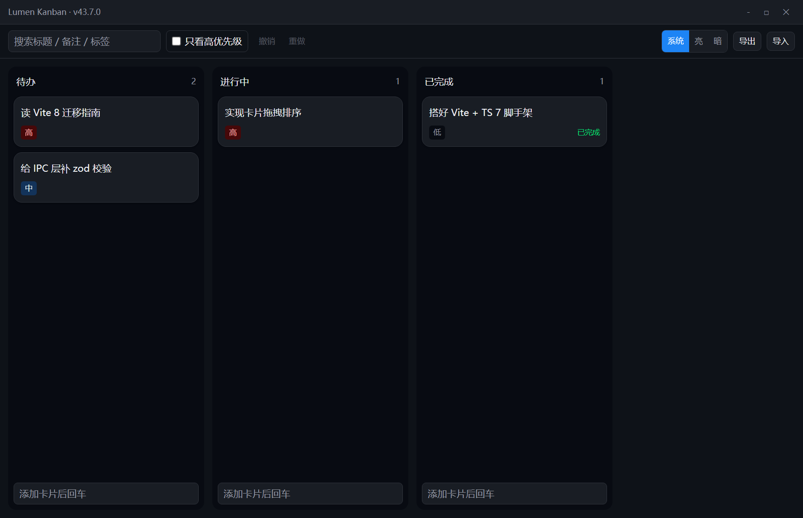
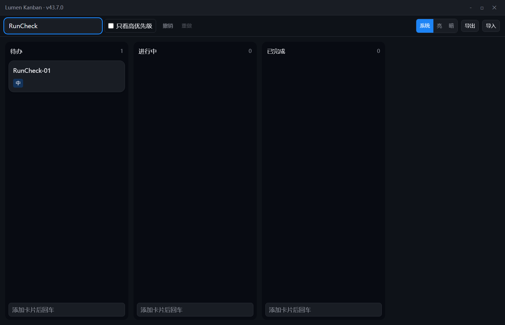
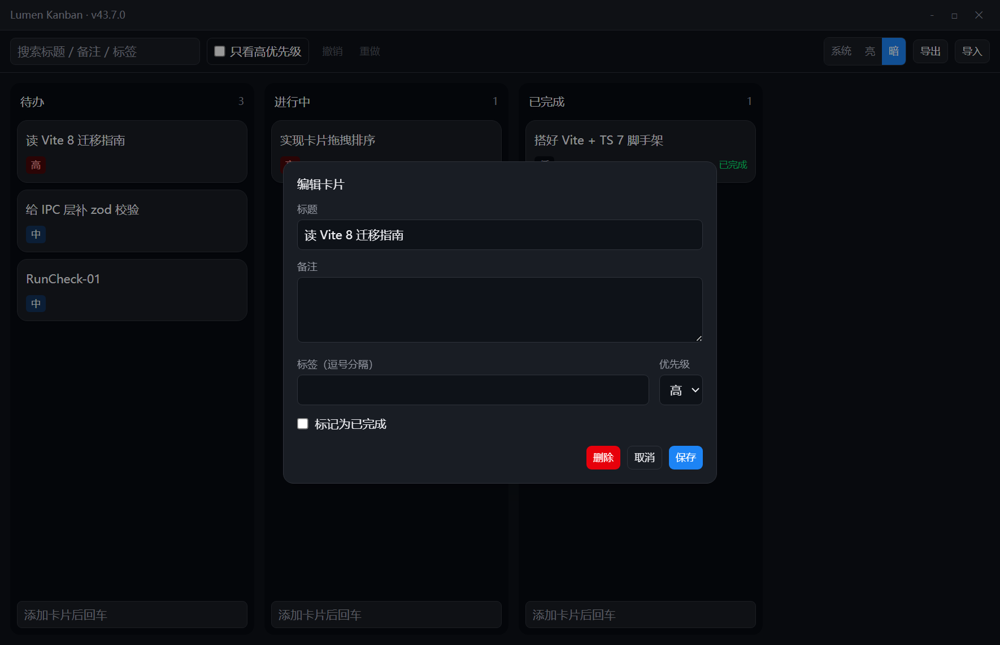
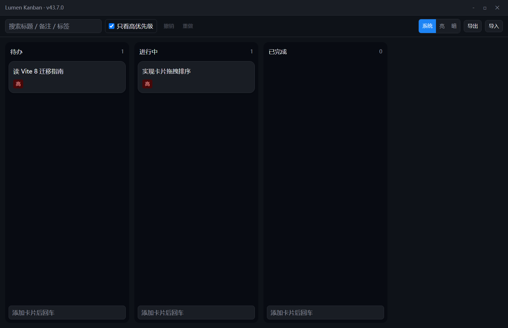

# Lumen Kanban · 离线优先桌面看板

一个用于系统学习现代前端的可运行项目：**React 19 + TypeScript 7 + Vite 8 + Tailwind 4 + Motion 13 + Zustand 5 + Dexie 4 + Electron 43**。

代码是教程的配套案例，文档在 [`docs/`](./docs)，每一条命令与输出都经过实测。

---

## 快速开始

```bash
npm install          # added 405 packages
npm run typecheck    # 0 error
npm run lint         # 0 warning 0 error
npm test             # 9 passed
npm run build        # 444 modules
npm start            # 启动桌面应用
npm run capture      # 自动化端到端验证：走一遍核心路径并截图到 screenshots/
npm run e2e          # Playwright 驱动真实 Electron 应用的端到端测试（6 个用例）
```

**环境要求**：Node ≥ 22.12（实测 22.22.2），Windows / macOS / Linux 均可。

运行效果（`npm run capture` 实拍，见 `screenshots/`）：

| | |
| --- | --- |
|  |  |
|  |  |

---

## 文档

| 文档 | 内容 |
| --- | --- |
| [00 · 总览](./docs/00-总览：你要做出什么.md) | 需求、阶段路径、版本矩阵、关键决策与取舍 |
| [01 · 环境与工程地基](./docs/01-阶段0-环境与工程地基.md) | Vite 8 / TS 7 配置逐条解释 |
| [02 · 布局与主题令牌](./docs/02-阶段1-布局与主题令牌.md) | Flex/Grid/容器查询、Tailwind 4 CSS-first、三态主题 |
| [03 · TypeScript 数据建模](./docs/03-阶段2-TypeScript数据建模.md) | Result、可辨识联合、strict 配置、与 Java 的差异 |
| [04 · React 组件与交互](./docs/04-阶段3-React组件与交互.md) | 状态驱动、六个高频坑、组件分层、组件测试 |
| [05 · Dexie 本地数据层](./docs/05-阶段4-Dexie本地数据层.md) | schema/迁移/事务/批量/liveQuery/搜索取舍 |
| [06 · 状态管理与 Zustand](./docs/06-阶段5-状态管理与Zustand.md) | 状态分层、useShallow、persist |
| [07 · Motion 动效](./docs/07-阶段6-Motion动效.md) | 进出场/layout/性能/无障碍 |
| [08 · Electron 桌面化与发布](./docs/08-阶段7-Electron桌面化与发布.md) | 进程模型、安全基线、IPC 契约、打包 |
| [09 · 排错手册](./docs/09-排错手册.md) | 按症状查病因，均为本项目真实报错 |
| [10 · 交付与验收清单](./docs/10-交付与验收清单.md) | 端到端流程、功能验收表、下一步 |
| [11 · 撤销/重做 与 E2E + CI](./docs/11-撤销重做与端到端测试.md) | 命令模式、Playwright 驱动 Electron、GitHub Actions |

---

## 已实现的能力

- 看板 / 列 / 卡片增删改，拖拽排序（列内 + 跨列）
- **撤销 / 重做**（命令模式，上限 50 步；Electron 走菜单快捷键、浏览器走键盘）
- 搜索（标题/备注/标签）、只看高优先级筛选
- 亮 / 暗 / 跟随系统三态主题，刷新保持
- 数据导出 / 导入 JSON（主进程文件对话框 + zod 校验）
- 自定义标题栏、应用菜单、`Ctrl/Cmd + N` 新建卡片
- 单元测试 18 项、端到端测试 6 项、三平台 CI

---

## 目录结构

```
src/
├── shared/      跨进程共享：类型、IPC 契约、zod schema
├── main/        Electron 主进程（Node）
├── preload/     隔离世界：contextBridge 白名单
└── renderer/    React 应用
    ├── api.ts       同一接口的两套实现（Electron / 浏览器）
    ├── db/          Dexie schema、迁移、操作
    ├── store/       Zustand（只放 UI 状态）
    ├── features/    按业务域组织
    ├── components/  无业务通用组件
    └── lib/         纯函数
examples/        可直接运行的最小示例
tests/           Vitest（fake-indexeddb）
```

---

## 三条最重要的架构约定

1. **业务数据只住在 Dexie**，UI 状态只住在 Zustand —— 不要把数据抄一份进 store
2. **渲染进程永远不碰 `fs`**，一切原生能力走 IPC，且主进程侧用 zod 校验入参
3. **跨边界的失败用 `Result` 而不是异常** —— 异常跨进程会丢失类型与堆栈
